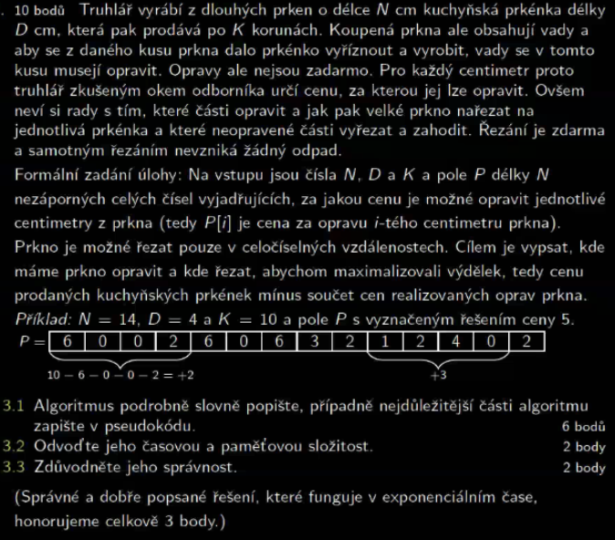

<a id="implication-dp.1"></a>

!!! Warning "Poznámka k riešeniam"
    Riešenia sú work in progress, mali by byť správne (väčšina je otestovaná v pythone), pokiaľ sa vám niečo nezdá, môžete dať vedieť. Chcel som ich sem ale dať, aby aj skoršie termíny mali aspoň nejaké myšlienky, ako úlohy riešiť.

!!! Implication  "Nejdelší cesta v matici"

    ### Nejdelší cesta v matici {#implication-dp.1}
    - Na vstupu je **NxN** matice **Mat**, kde každý prvek má určenou hodnotu. Prvky $Mat[0][0]$ a $Mat[N][N]$ mají hodnotu 0. Zbytek náhodné celočíselné hodoty (záporné, nulové i kladné).
    - Navrhněte algoritmus, který nalezne posloupnost prvků začínající na $Mat[0][0]$ a končící na $Mat[N][N]$, kde jejich součet je největší. Napříč maticí se dá pohybovat pouze směrem doprava ($Mat[i][j+1]$) a nebo dolů ($Mat[i+1][j]$).

    ??? Proof "Řešení"
        Ak sa nachádzame na ľubovoľnom políčku $x, y$, vieme, že cesta s najväčším súčtom z tohto políčka buď musí pokračovať o políčko doprava ($Mat[y][x + 1]$), alebo o políčko dole ($Mat[y + 1][x]$). Jedna z týchto ciest môže mať väčší súčet, vyberieme si teda tú. Celkový súčet hodnôt na ceste, ktorá nám takto vznikne, bude teda:
        
        $$h(x, y) = Mat[x][y] + max(h(x + 1, y), h(x, y + 1))$$
        
        Toto sa rekurzívne dá popísať nasledujúcim pseudokódom:
        ```python
        longest_path(M, x, y):
            # Ukoncovacia podmienka
            if x == n - 1 and y == n - 1:
                return 0

            right_path, down_path = 0, 0
            # Kontrolujeme, ci sme in bounds
            if x + 1 < n:
                right_path = longest_path(M, x + 1, y)
            if y + 1 < n:
                down_path = longest_path(M, x, y + 1)

            return M[x][y] + max(right_path, down_path)
        ```

        Časová zložitosť takéhoto riešenia bude exponenciálna, vzhľadom na to, že v každom políčku máme dve rozhodnutia. Na memoizáciu by stačilo vytvoriť si maticu, v ktorej si ukladáme už vypočítané dĺžky ciest, aby sme nemuseli rekurziu volať vždy. Kód sa zmení iba tak, že si pridáme memoizačnú tabuľku (memo), a vždy si vypočítanú hodnotu na konci do nej uložíme. Na začiatku funkcie môžeme potom kontrolovať, či už hodnotu vypočítanú nemáme. Toto by vpodstate len znamenalo pridanie `memo[x][y] = M[x][y] + max(right_path, down_path)` na konci funkcie, a `if memo[x][y] != undef: return memo[x][y]` na začiatku.
        
        <br />
        Dôkaz korektnosti by sa dal robiť indukciou od pravého dolného políčka memoizačnej tabuľky. Vieme ze toto pole je vyplnené správne (má hodnotu 0). Pre hocijaké pole inde v memoizačnej tabuľke potrebujeme, aby bolo vyplnené pole vpravo a dole, čo už buď platí, alebo sa rekurzívne vyplní. Hodnotu v danom poli v memoizačnej tabuľke potom vypočítame ako `M[x][y] + max(memo[x + 1][y], memo[x][y + 1])`, čo ale bude najväčšia suma cesty od políčka $x, y$. 

        *Túto logiku je možno vidno viac v iteratívnom riešení, ktoré postupne napĺňa memoizačnú tabuľku od políčka n, n:*

        ```python
        max_cesta():
            memo := tabulka n x n naplnena 0
            for i = n - 1 ... 0:
                for j = n - 1 ... 0:
                    m = 0
                    # vyber vacsie policko z toho lavo/dole
                    if i + 1 < n: m = max(m, memo[i + 1][j])
                    if j + 1 < n: m = max(m, memo[i][j + 1])
                    memo[i][j] = M[i][j] + m
            return memo[0][0]
        ```

        <br />
        Časová zložitosť závisí na veľkosti memoizačnej tabuľky, keďže pre každé políčko robíme iba konštantý počet operácií. Teda v tomto prípade $\mathcal{O}(n^2)$.


<a id="implication-dp.2"></a>
!!! Implication "Kuchyňská prkýnka"

    ### Kuchyňská prkýnka {#implication-dp.2}
    
    { align=center }

    ??? Proof "Řešení"
        Problém treba, ako skoro vždy v DP, preformulovať na rozhodnutia, ktoré môžeme v nejakom n-tom centimetri prkna spraviť. Buď môžeme v n-tom centimetri začať rezať prkno, alebo môžeme tento centimeter vynechať, a pokračovať pozretím sa na $n + 1$ centimeter. 

        <br/>
        Označme si $T(n)$ sumu, ktorú môžeme od n-tého centimetra získať. V prípade, že v n-tom centimetri začneme rezať, bude sa cena rovnať:

        $$T(n) = K - P[n] - P[n + 1] - P[n+2] ... - P[n + D - 1] + T(n + D)$$

        teda cene jedného prkienka, mínus ceny opráv daných centimetrov, plus cena prkienok ktoré vieme vytvoriť od $(n + D)$-tého centimetra. Ako však už bolo spomenuté, daný centimeter môžeme aj vynechať, teda cena by bola $T(n) = T(n + 1)$. Keďže máme dve možnosti, budeme si opäť vyberať tú, ktorá vedie k maximálnej cene:

        ```python
        rezanie(i):
            if i + D > N: return 0 
            cena_rezanie = 0
            if i + D <= N: # mozeme rezat iba ak nam zostava > D centimetrov
                cena_rezanie = K - suma(P[i] ... P[i + D - 1]) + rezanie(i + D)
            cena_skip = rezanie(i + 1)
            return max(cena_rezanie, cena_skip)
        ```

        Memoizovalo by sa do 1D pola, ktoré by sme postupne napĺňali maximálnou cenou, ktorú môžeme od i-tého centimetra získať. 

        ```python
        memo = pole dlzky N naplnene undef
        rezanie(i):
            if i + D > N: return 0 
            if memo[i] != undef: return memo[i]
            cena_rezanie = 0
            if i + D <= N: 
                cena_rezanie = K - suma(P[i] ... P[i + D - 1]) + rezanie(i + D)
            cena_skip = rezanie(i + 1)
            memo[i] = max(cena_rezanie, cena_skip)
            return memo[i]
        ```

        V tomto prípade je celkom intuitívne aj iteratívne riešenie. Pre i-tý prvok nám totiž stačí vedieť hodnoty $memo[i + 1]$ a $memo [i + D]$ (pokiaľ je $i + D < N$). Môžeme teda napĺňať pole odzadu (počítať najlepšie miesta na rezanie odzadu, a potom ich spájať dokopy, vpodstate tak ako pri NRP)
        ```python
        rezanie():
            memo = pole dlzky n naplnene 0
            for i = N - 1 ... 0
                cena = 0
                if i + 1 < N: cena = memo[i + 1]
                if i + D < N: cena = max(cena, K - suma(P[i] ... P[i + D - 1]) + memo[i + D])

            return cena[0]
        ```

        Vzhľadom na to, že pri každom poli v memoizačnej tabuľke strávime konštantný čas, bude zložitosť záležať iba na veľkosti tabuľky, teda $\mathcal{O}(n)$

<a id="implication-dp.3"></a>
!!! Implication "Převoz piva"

    ### Převoz piva {#implication-dp.3}
    Pepa převáží pivo ve městě. Všechny domy jsou na jedné přímce. Každý dům má označeno kolik si objednal piva a kde sa nachádzí v jednoprvkové souřadnici. Vozík váží ~ 20 piv, při pohybu k domu se počítá celková únava podle: celková váha $\times$ ušlá vzdálenost. Ze startu (pozícia pivovaru je zadaná) má vždy ve vozíku všechny potřebná piva (nemusí se tedy řešit, že vezme prvně pár piv a pak se bude vracet pro další). Při návštěvě domu vyloží všechna potřebná piva. Je třeba najít posloupnost návštěv domů tak, aby celková únava byla nejmenší. Pepa se zároveň musí vrátit zpátky do pivovaru.
    ??? Proof "Hint"
        V každom momente sa stačí pozerať na najbližší pravý a ľavý dom.
    ??? Proof "Řešení"
        Dôležité je si uvedomiť, že kedykoľvek prejdeme okolo domu, chceme vyhodiť pivá, ktoré daný dom chce (pretože načo ich budeme ďalej vláčiť, minieme len viac energie). Problém sa teda transformoval na binárne rozhodnutie. Pôjdeme najprv do domu ktorý je nám najbližšie naľavo, alebo napravo? V danom dome pivá vyhodíme, a pýtame sa rovnakú otázku. 

        <br/>
        Pre lepšiu predstavu sem dávam pseudokód rekurzívneho riešenia, je to už ale dlhšie:
        ```python
        H := pole pozicii domov # zoradene !!!
        C := pole počtu piv, ktore i-ty dom chce

        beerstuff(closest_left, closest_right, our_position, weight):
            # closest_left a closest_right su indexy domov, ktore su nam najblizsie vlavo a vpravo
            # akonahle nejaky dom prejdeme, napriklad vlavo, mozeme dat closest_left--, a vpodstate sa tvarit, ze closest_left uz neexistuje.
            # musime vsak pritom posunut our_position na H[closest_left]
            
            if closest_left == -1 and closest_right == n: # presli sme vsetky domy
                return (starting_position - our_position) * weight # musime sa vratit na start

            left_cost = inf
            # ak mozme ist dolava
            if closest_left != -1: 
                left_cost = (our_position - H[closest_left]) * weight + beerstuff(closest_left - 1, closest_right, H[closest_left], weight - C[closest_left])

            right_cost = inf
            if closest_right != n: 
                right_cost = (H[closest_right] - our_position) * weight + beerstuff(closest_left, closest_right + 1, H[closest_right], weight - C[closest_right])

            return min(left_cost, right_cost)

        find_cheapest(starting_position):
            left := find index of closest house to the left of starting_position
            right := find index of closest house to the right of starting position
            return beerstuff(left, right, starting_position, sum(C) + 20) # + 20 pre vahu vozika
        ```

        Memoizácia by tu už bola trochu komplikovanejšia. Potrebovali by sme memoizačnú tabuľku veľkosti $n \times n \times 2$, pre všetky kombinácie closest_left, closest_right a our_position. Pre our_position naozaj potrebujeme iba 2 prípady, buď začíname v closest_left alebo closest_right (rekurzívne volania budú vždy z pozície nejakého domu, konkrétne closest_left alebo closest_right, pozri pseudokód). Pri vyťahovaní vzdialenosti z memoizačnej tabuľky by sme potom potrebovali niečo ako:
        ```python
        if memo[closest_left][closest_right] != undef:
            go_left_cost = weight * (our_position - H[closest_left]) + memo[closest_left][closest_right][LEFT] 
            go_right_cost = weight * (H[closest_right] - our_position) + memo[closest_left][closest_right][RIGHT]
            return min(go_left_cost, go_right_cost)
        ```

        Počítame teda koľko nás stojí dostať sa do ľavého/pravého domu + koľko sa unavíme odtiaľ. Pre každé políčko v memoizačnej tabuľke však stále robíme iba konštantý počet operácií, a tabuľka je rádovo veľkosti $n^2$, dostávame časovú zložitosť $\mathcal{O}(n^2)$.
        

<a id="implication-dp.4"></a>
!!! Implication "Převleky oblečení"

    ### Převleky oblečení {#implication-dp.4}
    > OCR Tohle fakt nepřečetlo

    { align=center }

    ??? Proof "Řešení"
        > Na konci načrtnem aj myšlienku vracanie priradenia prevlekov, niekedy to v zadaní chcú.

        <br/>
        Budeme postupovať podobne ako u prkien, len s dvoma polami. Najprv si zoradíme policajtov a prevleky podľa veľkosti, od najmenších po najväčších. Následne budeme prechádzať policajtov zľava doprava, a buď im prevlek $q$ priradíme, alebo nie. V pseudokóde asi takto:
        ```python
        Policajti := pole velkosti policajtov, zoradene
        Prevleky := pole velkosti prevlekov, zoradene

        prirad_prevlek(p, q): # kde p je index policajta, q index prevleku
            if p == Policajti.length: return 0
            if q == Prevleky.length: return +inf # niekto nema prevlek

            # ak nedame policajtovi p prevlek q, pozerame sa na q + 1.
            napadnost_skip = prirad_prevlek(p, q + 1)

            napadnost_noskip = prirad_prevlek(p + 1, q + 1) # dame policajtovi p prevlek q
            if (Prevleky[q] > Policajti[p]): napadnost_noskip += (Prevleky[q] - Policajti[p])
            if (Prevleky[q] < Policajti[p]): napadnost_noskip += (Policajti[p] - Prevleky[q])^2

            return min(napadnost_noskip, napadnost_skip)
        ```

        Možno je tu dôležité vysvetliť, prečo môžeme prechádzať polia zľava doprava, a nemusíme skúsiť každý policajt s každým prevlekom. Intuitívne to akosi dáva zmysel, myslím, že by tu stačil argument typu: Ak máme nejakého policajta $V[i]$, a nejaký prevlek $P[j]$, tak buď platí:

        1. $V[i] > P[j]$ - vieme z kódu, že máme možnost preskakovať obleky. Povedzme, že existuje nejaký index $k$, keď prvý krát od ľava je $V[i] < P[k]$. Od indexov $j$ do $k$ však musí nápadnosť klesať (blížime sa k nulovému rozdielu). Od $j$-tého do $k$-tého indexu sa teda nachádza najoptimálnejší prevlek pre daného policajta, a ten rekurzívnym sledom skipov aj vyskúšame.
        2. $V[j] < P[j]$ - na druhej strane, ak nám nastane toto aj v prípade keď sme žiadne obleky nepreskočili, vieme, že preskočením obleku, teda dostaním sa na nejaký index $k > j$ len nápadnosť zvýšime. V kóde však skúsime aj možnosť priradiť tento oblek danému policajtovi, teda skúšame aj minimálny.

        Memoizácia tohto príkladu vyžaduje vytvorenie tabuľky veľkosti $|V| \times |P|$. Pre každý index $p, q$  si budeme pamätať minimálnu nespokojnosť ak priradíme $p$-tému policajtovi prevlek $q$. V každom rekurzívnom volaní sa opäť volá konštantný počet operácií, opäť teda časová zložitosť $\mathcal{O}(|V| \times |P|) = \mathcal{O}(n^2)$.
        
        <br/>
        Vracať prevleky by bolo v rekurzívnom riešení asi treba tak, že si postupne prebubleme rekurzívnymi volaniami nejaké pole, do ktorého si použité prevleky zapisujeme. V iteratívnom riešení by to však išlo jednoduchšie, a myslím si, že aspoň myšlienka je zaujímavá. Tabuľku by sme mohli napríklad vypĺňať od posledného policajta a prevleku, a v poslednom stĺpci memoizačnej tabuľky budeme teda mať nápadnosť posledného policajta $p$, ak mu priradíme prevlek $q$. Pre ďaľšieho policajta odzadu minimalizujeme teda jeho vlastnú nápadnosť pre prevlek $q$ + minimálnu nápadnosť ďalšieho policajta, ktorý si vyberá z prevlekov $q + 1$ až $|P|$. Pre predstavu for loop:

        ```python
        for p = Policajti.length ... 0:
            for q = Prevleky.length ... 0:
                if p == Policajti.length: memo[p][q] = vypocitaj napadnost policajta Policajt[p] s prevlekom Prevlek[q]
                min_napadnost_dalsieho = inf
                for k = q + 1 ... Prevleky.length # dalsiemu policajtovi mozeme priradit az q + 1. prevlek
                    min_napadnost_dalsieho = min(min_napadnost_dalsieho, memo[p][k])
                memo[p][q] = vypocitaj napadnost policajta Policajt[p] s prevlekom Prevlek[q] 
                                + min_napadnost_dalsieho
        ```

        Tu by sme si v zvlášť v tabulke ukladali, aký prevlek sme priraďovali ďalšiemu policajtovi (teda niekam by sme ukladali ešte index k). Tak by sme mohli spätne zostaviť kombinácie policajt-prevlek.


<a id="implication-dp.5"></a>
!!! Implication "Kabely"

    ### Kabely {#implication-dp.5}
    { align=center }  

    ??? Proof "Řešení"
        Formálne sa problém pýta na to, ako dokážeme za čo najlacnejšiu cenu vyplniť vrcholy v strome tak, že žiadne susedné konektory nie sú rovnakého typu. 
        
        <br/>
        Pozrime sa na problém trochu zúžene. Majme nejaký vrchol $V$, a priraďme mu konektor $A$, a teda cenu uzla s konektorom $A$. Ignorujme teraz na chvíľu vrchol $V$. Ten bol spojený s vrcholmi $U_1, U_2, ... U_d$ kde $d = deg(V)$. Vpodstate sme ale takto vytvorili $d$ postromov smerujúcich preč od $v$, na ktorých môžeme riešiť rovnaký problém (teda hľadanie sady uzlov s najmenšou cenou), iba s podmienkou, že  $konektor(U_1), konektor(U_2), ... konektor(U_d) \ne A$. Riešime teda rovnaký problém, ale už nie pre vrchol $V$, ale pre $U_1, U_2, ... U_d$. Celková cena bude potom 
        
        $$cena_A + cenapodstromu(U_1) + cenapodstromu(U_2) + ... + cenapodstromu(U_d)$$

        <br/>
        Samozrejme je možné, že výberom konektoru $A$ sme sa cenovo zle obmedzili, a keby vyberieme napríklad konektor $B$, tak dostaneme menšiu cenu. Hľadáme teda opäť minimum cez všetky konektory, ktoré môžeme vrcholu $V$ priradiť.

        ```python
        s := strom, v tomto pripade ho pre jednoduchost reprezentujem tak, ze s[v] vrati susedov v
        k := pole konektorov
        c := ceny konektorov, c[k] je cena konektoru k
        # Predchodca je vrchol, z ktoreho volame toto rekurzivne volanie
        # Tomuto vrcholu sme uz priradili konektor, nechceme sa do neho vracat
        # Obmedzenie je typ konektoru, ktory sme pouzili na predchodcovi, ten teda nemozme priradit sebe
        # funkcia vracia zoznam priradeni konektorov vrcholom v podstrome, ktory teraz skumame
        cena_podstromu(vrchol, obmedzenie, predchodca):
            # ak je vrchol list, prirad mu najlacnejsi mozny konektor
            if s[vrchol] = [predchodca]: 
                if c.najlacnejsi != obmedzenie: return [vrchol: c.najlacnejsi]
                else return [vrchol: c.druhy_najlacnejsi]

            min_cena = inf
            min_konektor = undef
            min_konektory_ostatnych = []
            for konektor in {k - obmedzenie}: # skusme dat nasmu vrcholu vsetky konektory, okrem obmedzenia
                celkova_cena_v_pre_konektor_k = c[konektor]
                konektory_susedov = []
                for sused in {vrchol.susedia - predchodca}: # nechceme volat rekurziu pre predchodcu
                    zavolaj cena_podstromu(sused, konektor, vrchol)
                    cenu pre podstrom od suseda pripocitaj do celkova_cena_v_pre_konektor_k
                    # podstromy su disjunktne
                    konektory_susedov.append(vratene pole konektorov z riadku 21) 
                    
                if celkova_cena_v_pre_konektor_k < min_cena:
                    min_cena = celkova_cena_v_pre_konektor_k
                    min_konektor = konektor
                    min_konektory_ostatnych = konektory_susedov

            return min_konektory_ostatnych + [vrchol: min_konektor]
        ```
        
        Túto funkciu môžeme následne zavolať na ľubovoľný vrchol s obmedzením nastaveným na undefined. Tu by sa možno zišiel nejaký dôkaz, ja by som ale jednoducho povedal, že táto rekurzia skúsi všetky možné kombinácie, a teda aj tú optimálnu.

        <br/>
        Keď už sa rozprávame o optimálnosti, asi by sa oplatilo použíť nejakú memoizáciu. Memoizačná tabuľka bude mať teraz 2 rozmery, jeden budú vrcholy, a druhý budú konektory. Do tabuľky si uložíme, aká je minimálna cena podstromu od daného vrcholu, ak má vrchol **obmedzenie** na daný konektor. 

        <br/>
        Tu je asi dôležité zmieniť, že pri volaní funkcie `cena_podstromu` na nejaký vrchol $v$ bude vždy `predchodca` rovnaký. Prečo? No medzi naším počiatočným vrcholom a vrcholom $v$ môže existovať iba jedna cesta (graf je strom), a teda predchodca na tejto ceste bude vždy rovnaký. **Memoizačná tabuľka bude ale vyzerať rôzne podľa toho, z akého vrcholu začneme**.

        <br/>
        Časová zložitosť je tu ajtak trochu horšia, pre každé políčko v memoizačnej tabuľke totiž vykonávame $k \cdot deg(v)$ operácií, rádovo $\mathcal{O}(k\cdot V(T))$. Vzhľadom na veľkosť tabuľky dostávame celkovú časovú zložitosť $\mathcal{O}(k^2\cdot V(T)^2)$

        <br/>
        *Ešte jedna vec, nemusíme si v memoizačnej tabuľke predávať celý zoznam konektorov. Ak sa nad tým zamyslíme, pre každý vrchol si musíme iba pamätať, *aký typ konektoru mu priradiť, pre každé obmedzenie*, a zároveň cenu podstromu pri takomto obmedzení. Pri rekonštrukcií riešenia si pre iniciálny vrchol $V$ teda vyberieme konektor, ktorý vedie k najmenšej cene (najmenšie číslo v stĺpci vrcholu $v$), a potom rekurzívne sa v tabuľke pozrieme na stĺpce všetkých susedných vrcholov, spýtame sa, aká je ich hodnota pri tomto obmedzení, a aký konektor pre tento vrchol vybrať (toto, ako som spomenul, ukladáme tiež do tabuľky), čo nám dovolí sa rekurzívne pozrieť na jeho susedov a spraviť to isté.*
        
