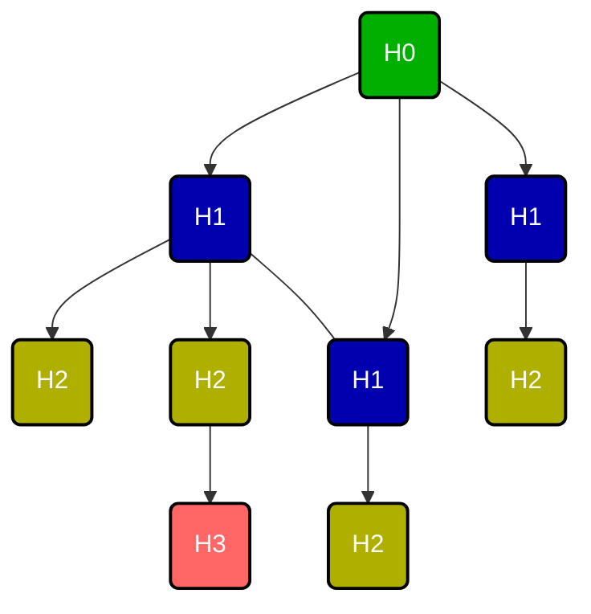

### Motivace

- Uvažujme topologii počítačové sítě popsanou jako souvislý graf, jehož hrany představují komunikační kabely mezi směrovači.
- Ke každému směrovači mohou být připojeny koncové počítače.
- Chceme **minimalizovat počet** komunikačních kabelů tak, aby počítačová síť zůstala funkční, tedy aby libovolný počítač mohl 
komunikovat s libovolným jiným počítačem díky tomu, že lze postavit mezi nimi komunikační propojení složené z 1 či více směrovačů.
- Problém, které konkrétní kabely zvolit pro toto minimální řešení, je problém konstrukce **kostry grafu** (angl. *spanning tree*) sítě.
- Pokud navíc požadujeme, aby byl minimální součet délek použitých kabelů, dostaneme problém **minimální kostry**.

---

!!! Definition "Definice 3.4 (Kostra grafu)"

    ### Kostra grafu {#def-3.4}

    Nechť $G = (V, E)$ je souvislý graf. Podgraf $K$ grafu $G$ nazveme kostrou grafu $G$, pokud $V(K) = V$ a $K$ je strom.

!!! Implication "Pozorování"

    - Nesouvislé grafy nemají kostru, kostru má každá souvislá komponenta.
    - Kostra souvislého grafu je tedy souvislý podgraf nad stejnou množinou vrcholů s nejmenším počtem hran.
    - Souvislý graf s kružnicemi má více různých koster

---

### Jak najít kostru souvislého grafu?

- Tato úloha se může řešit stejně efektivně jak prohledáváním grafu do hloubky tak prohledáváním do šířky.
- Ukážeme si jednoduchou modifikaci algoritmu BFS.
- Předpokládejme, že máme ověřeno, že vstupní graf je souvislý (minulá přednáška).

**Vstup**: Souvislý graf $G$  
**Výstup**: Seznam hran nějaké kostry grafu $G$

### Jak je třeba BFS modifikovat?

Pro odpověď si stačí připomenout hladiny v BFS

!!! Implication "Pozorování"

    Hrany do předchůdců tvoří kostru.

!!! Theorem "Věta 3.4 (o správnosti algoritmu BFS_kostra)"

    ### Věta o správnosti algoritmu BFS_kostra {#theorem-3.4}

    Nechť $G = (V, E)$ je souvislý graf.  
    Potom hrany do předchůdců v **BFS** tvoří nějakou kostru grafu $G$

??? Proof "Důkaz Věty 3.4"

    1. Označme $H$ graf na množině vrcholů $V$ s hranami do předchůdců (podle pole vyplněného algoritmem **BFS**).
    2. Víme, že každý vrchol kromě počátečního vrcholu má právě jednoho předchůdce. Tedy $H$ má právě $n − 1$ hran.
    3. Protože po hranách do předchůdců je možné se z každého vrcholu dostat do $s$ (tedy pro každý vrchol v existuje v $H$ sled z $v$ do $s$)
    a protože složením sledů vznikne sled, je graf $H$ souvislý.

    

