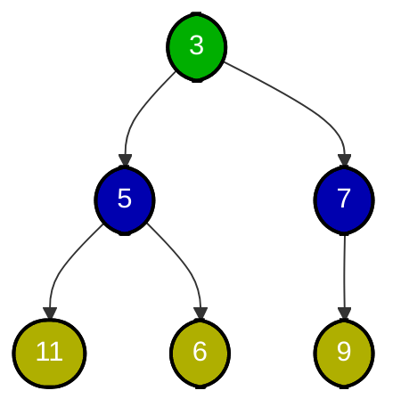

## Zakořeněný strom, Binární strom a halda

!!! Definition "Definice 4.1 (Zakořeněný strom)"

    ### Zakořeněný strom {#def-4.1}
    - **Zakořeněněný strom** je strom $T$, ve kterém je jeden vrchol $r \in V(T)$ označen jako kořen
    - Leží-li $u$ na (jediné) cestě z $v$ do kořene, pak $u$ je **předek** $v$ a $v$ je potomek $u$. Pokud je navíc $\{u,v\} \in E(T)$ hrana, říkáme, že $u$ je **otec** $v$ a $v$ je **syn** $u$.
    - Vrcholy rozdělíme podle vzdálenosti od kořene do **hladin**: v nulté leží kořen, v první jeho synové, atd.
    - **Hloubka zakořeněného stromu** $T$ je počet jeho hladin.

!!! Implication "Pozorování"

    Všechny $v \in V(T) − \{r\}$ jsou potomci kořene $r$ a kořen $r$ je předkem všech ostatních vrcholů.

!!! Definition "Definice 4.2 (Binární strom)"

    ### Binární strom {#def-4.2}
    Strom nazveme **binární**, pokud

    - je zakořeněný
    - každý vrchol má nejvýše dva syny
    - u synů rozlišujeme, který je **levý** a který **pravý**.

!!! Definition "Definice 4.3 (Binární minimová halda)"

    ### Binární minimová halda {#def-4.3}
    **Binární minimová halda** je datová struktura tvaru binárního stromu, v jehož každém vrcholu $x$ je uložen jeden **klíč** $k(x)$ a která splňuje tyto dvě vlastnosti:

    1. **Tvar Haldy:** Strom má všechny hladiny kromě poslední plně obsazené. Poslední hladina je zaplněna od levého okraje směrem k pravému.
    2. **Haldové uspořádání:** Je-li $v$ vrchol $s$ a jeho syn, platí
    
    
$k(v) \le k(s)$

!!! Implication "Pozorování"

    Na cestě vedoucí z libovolného vrcholu do kořene tvoří klíče **nerostoucí** posloupnost. 
    V kořeni je tedy globální minimum ze všech klíčů.
