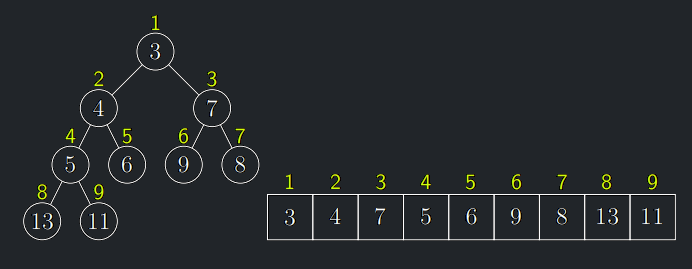

* Reprezentace pomocí dynamicky alokovaných spojových struktur je zbytečně komplikovaná.

* Očíslujme (oindexujeme) vrcholy po hladinách shora dolů a na nich zleva doprava (číslujeme od 1 do $n$):

{ align=center }

### Vztahy indexů v haldě

!!! Implication "Pozorování"
    Má-li vrchol $v$ index $i$, pak

    - jeho levý syn má index $2i$
    - jeho pravý syn index $2i + 1$
    - jeho otec má index $\lfloor i/2 \rfloor$
    - výraz $i\ mod\ 2$ udává, zda je v připojen k otci levou či pravou hranou, tj. zda je jeho levý či pravý syn.

!!! Implication "Důsledek"
    Haldu lze tedy jednoduše reprezentovat v poli a pohyb po stromu realizovat výše popsanými operacemi s indexy.
