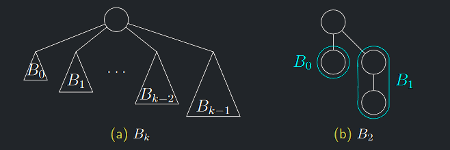
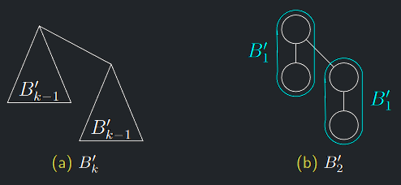
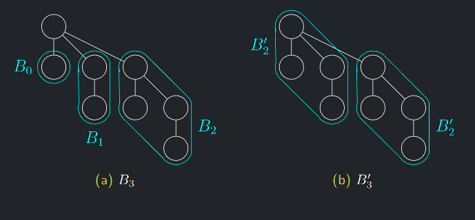

### Binomiální minimová halda

- Pro přehlednost zkracujeme jako **BH**. Podporuje stejné operace jako binární halda.
- Navíc je schopna rychle provádět operaci sloučení dvou hald, která má u binární haldy lineární složitost
  (sloučit dvě binární haldy velikostí $m$ a $n$ má složitost operace **HeapBuild** haldy velikosti $m + n$).
- Binomiální halda patří do rodiny tzv. **mergeable heaps**.
- Další dobrou vlastností je vynikající amortizovaná složitost operace vkládání.
- Nevýhodou jsou násobně vyšší paměťové nároky než u binární haldy.

---

### Složitosti operací na binomiální haldě

| Operace       | Komplexita                | Popis                                      |
|---------------|---------------------------|--------------------------------------------|
| BHInsert      | $O(log n), \Theta^{*}(1)$ | Vloží do BH nový prvek.                    |
| BHFindMin     | $O(1)$                    | Vrátí minimum množiny prvků BH             |
| BHExtractMin  | $O(log n)$                | Odstraní z BH minimum množiny jejích prvků |
| BHMerge       | $O(log n)$                | Sloučí dvě BH do jedné                     |
| BHBuild       | $O(n)$                    | Postaví z $n$ prvků BH                     |
| BHDecreaseKey | $O(log n)$                | Sníží hodnotu klíče prvku BH.              |
| BHIncreaseKey | $O(log n)$                | Zvýší hodnotu klíče prvku BH.              |
| BHDelete      | $O(log n)$                | Smaže prvek BH.                            |

---

!!! Definition "Definice 5.1 (Binomiální strom)"

    ### Binomiální strom {#def-5.1}

    Binomiální strom řádu $k$ (značíme $B_{k}$) je uspořádaný (t.j. záleží na pořadí synů) zakořeněný strom, pro který platí:
    
    1. $B_{0}$ je tvořen pouze kořenem.
    2. Pro $k \geq 1$ získáme $B_{k}$ ze stromů $B_{0}, B_{1}, . . . , B_{k−1}$ tak, že přidáme nový kořen a kořeny těchto stromů uděláme (takto popořadě) syny nového kořene

{ align=center }

---

!!! Definition "Definice 5.2 (Binomiální strom alternativně)"

    ### Binomiální strom alternativně {#def-5.2}

    Binomiální strom řádu $k$ (značíme $B^{′}_{k}$) je uspořádaný zakořeněný strom, pro který platí:

    - $B^{′}_{0}$ je tvořen pouze kořenem.
    - Pro $k \geq 1$ se $B^{′}_{k}$ skládá ze stromu $B^{′}_{k−1}$, pod jehož kořenem je jako nejpravější syn napojený další strom $B^{′}_{k−1}$.

{ align=center }

!!! Theorem "Věta 5.1 (o izomorfismu $B_{k}$ a $B^{′}_{k})$"

    ### Věta o izomorfismu binomiálních stromů {#theorem-5.1}

    Stromy $B_{k}$ a $B^{′}_{k}$ jsou izomorfní

{ align=center }

??? Proof "Důkaz $B_{k} \implies B^{′}_{k}$"

    1. Matematickou indukcí podle $k$.
    2. Pro $k = 0$ tvrzení zjevně platí.
    3. Pod kořenem stromu $B_{k}$ jsou dle jeho definice zavěšeny stromy $B_{0}, . . . , B_{k−1}$.
    4. Odtržením nejpravějšího podstromu $B_{k−1}$ od $B_{k}$ však dostáváme podle indukčního předpokladu strom $B_{k−1}$.
    5. To dává přesně definici stromu $B^{′}_{k}$.

??? Proof "Důkaz $B^{′}_{k} \implies B_{k}$"

    1. Naopak, uvážíme-li strom $B^{′}_{k}$, z indukce vyplývá, že $B^{′}_{k−1}$ je izomorfní s $B_{k−1}$, pod jehož kořen jsou dle definice napojeny stromy $B_{0}, . . . , B_{k−2}.$
    2. Pod kořen $B^{′}$ k jsou tudíž napojeny stromy $B_{0}, . . . , B_{k−1}.$
    3. To dává přesně definici stromu $B_{k}.$

---

## Vlastnosti binomiálních stromů

!!! Theorem "Věta 5.2 (o vlastnostech $B_{k}$)"

    ### Věta o vlastnostech binomiálního stromu {#theorem-5.2}

    - Počet hladin stromu $B_{k}$ je roven $k + 1$
    - Stupeň kořene je $k$
    - Počet vrcholů $B_{k}$ je roven $2^{k}$.

??? Proof "Důkaz Věty 5.2"

    1. Indukcí podle $k$.
    2. Strom $B_{0}$ má jistě $1$ hladinu a $2^{0} = 1$ vrchol.
    3. Z indukčního předpokladu vyplývá, že počet hladin $B_{k−1}$ je $k$ a počet vrcholů je $2^{k−1}$.  
    $\implies$ vlastnosti $1$ a $2$ dokázány.
    4. Užitím dokázané části věty 5.2 dostáváme, že strom $B_{k}$ je složený ze dvou stromů $B_{k−1}$, z nichž jeden je o hladinu níže než druhý, což dává počet hladin $k + 1$ stromu $B_{k}$.
    5. Složením dvou stromů $B_{k−1}$ dostáváme $2 · 2^{k−1} = 2^{k}$ vrcholů.
    6. Stupeň kořene $B_{k−1}$ je dle **IP** k − 1 a přidáním jednoho nového syna je stupeň $B_{k}$ tedy roven $k$

!!! Implication "Důsledek"

    Binomiální strom s $n$ vrcholy (pokud existuje) má $1 + log n$ hladin a počet synů kořene $log n$

!!! Theorem "Věta 5.3 (o počtu vrcholů $B_{k}$ na hladině $i$)"

    ### Věta o počtu vrcholů binomiálního stromu na hladině {#theorem-5.3}

    Počet vrcholů stromu $B_{k}$ na $i.$ hladině $(i \in \{0, . . . , k\}) = n_{k}(i) = \binom{k}{i}$

??? Proof "Důkaz Věty 5.3"

    1. Indukcí podle řádu $k$.
    2. **Věta 5.3** platí triviálně pro $B_{0}$ a $B_{1}$ (a $B_{2}$).
    3. Nechť tedy $k \geq 2$.
    4. Z definice $B^{′}_{k}$ plyne, že vrcholy $B^{′}_{k}$ na $i.$ hladině, $0 \lt i \lt k$, jsou tvořeny:
        
        - vrcholy levého $B^{′}_{k−1}$ na $i.$ hladině
        - vrcholy pravého $B^{′}_{k−1}$ na $(i − 1).$ hladině.
    5. Z indukčního předpokladu tedy dostaneme Pascalovým pravidlem

    $$
    n_{k}(i) = n_{k-1}(i) + n_{k-1}(i - 1) = \binom{k-1}{i} + \binom {k-1}{i-1} = \binom{k}{i}
    $$
