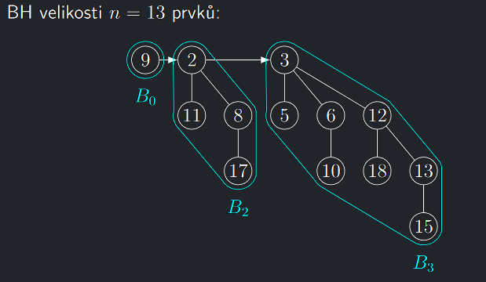
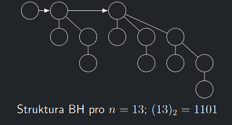

!!! Definition "Definice 5.3 (Binomiální halda)"

    ### Binomiální halda {#def-5.3}

    Binomiální halda (BH) obsahující $n$ prvků je uspořádaná množina binomiálních stromů $T = T_{1}, . . . , T_{ℓ}$, kde platí:
    
    - Stromy $T_{i}$ jsou v $T$ uspořádány vzestupně podle svých řádů.
    - $n = |V (T_{1})| + · · · + |V (T_{ℓ})|.$
    - Pro každé nezáporné $k$ se v množině $T$ vyskytuje nejvýše jeden binomiální strom řádu $k$.
    - Každý vrchol $v$ v každém stromu obsahuje klíč $k(v)$.
    - Pro každý strom $T_{i}$ platí haldové uspořádání klíčů, čili
    - $\forall v \in V (T_{i})$ a pro všechny jeho syny $s_{j} , j = 1, 2, . . . , m,$ platí $k(v) \leq k(s_{j}).$

{ align=center }

---

### Paměťová reprezentace binomiální haldy v počítači

- Pro uložení uspořádané množiny stromů $\mathcal{T}$ BH se používá spojový seznam.
- Seznamy synů jednotlivých vrcholů v binomiálních stromech budeme také udržovat ve spojových seznamech.
- Konkrétní implementaci prvku BH si předvedeme později, až budeme znát požadavky na operace, které s BH budeme provádět.
- Klíč prvku v budeme v pseudokódu značit $k(v)$.

---

## Vlastnosti binomiální haldy

!!! Theorem "Věta 5.4 (o existenci stromu $B_{i}$ v BH)"

    ### Věta o existenci binomiálního stromu Bi v binomiální haldě {#theorem-5.4}

    Binomiální strom $B_{i}$ se vyskytuje v seznamu $\mathcal{T}$ $n$-prvkové BH právě tehdy, když ve dvojkovém zápisu $b_{k}b_{k−1} . . . b_{0}$ čísla $n$ je $b_{i} = 1$.

??? Proof "Důkaz Věty 5.4"

    Protože v BH nelze použít dva binomiální stromy stejného řádu a  každý binomiální strom $B_{i}$ přispěje do $n$-prvkové BH právě svými 
    $|V(B_{i})| = 2^{i}$ vrcholy, je poskládání $n$ prvkové BH z binomiálních stromů ekvivalentní zápisu čísla $n$ ve standardní dvojkové soustavě.

!!! Implication "Důsledek"

    n-prvková BH má až $O(log n)$ binomiálních stromů.

{ align=center }
