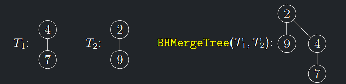
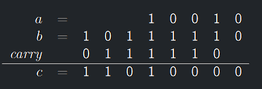
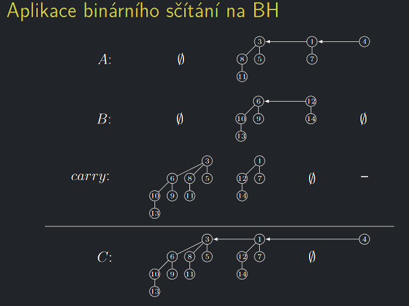
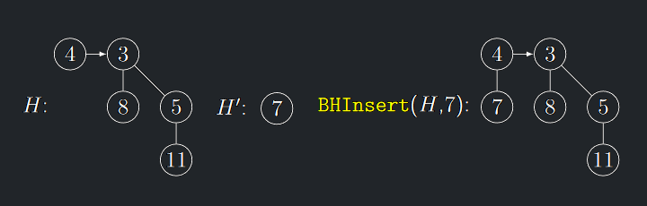
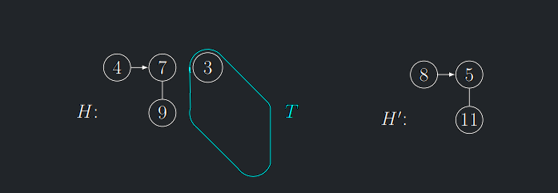
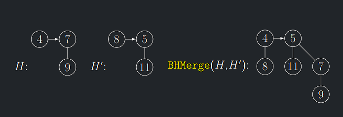

### Nalezení minima – BHFindMin(H):

- Minimum celé **BH** se musí nacházet v jednom z kořenů stromů $T_{i}$.
- Stačí projít seznam $\mathcal{T}$ , což bude trvat čas $O(log n)$.
- Používáme-li tuto funkci často, vyplatí se udržovat ukazatel na tento globálně nejmenší kořen. Operaci **BHFindMin**
  lze pak provést v konstantním čase.

---

## Sloučení dvou **BH** – BHMerge

- Sloučení dvou **BH** popíšeme nejdříve, protože se pomocí něho realizují ostatní operace.
- Operace **BHMerge** ze dvou **BH** vytvoří jedinou, obsahující sjednocení prvků obou vstupních **BH**.
- Nejprve popíšeme operaci **BHMergeTree**, která slije dohromady dva binomiální stromy **stejného řádu** $B_{i}$ a
  vytvoří strom $B_{i+1}$
  (na to lze nahlížet i jako na sloučení dvou **BH** tvořených jediným binomiálním stromem stejného řádu).

---

<a id="algo-5.1"></a>
!!! Algorithm "Algoritmus 5.1 (BHMergeTree)"

    ### Algoritmus BHMergeTree {#algo-5.1}

    !!! Algorithm "Vstup"

        Binomiální stromy $T_{1}, T_{2}$ takové, že řád($T_{1}$) = řád($T_{2}$)

    !!! Algorithm "Výstup"

        Výsledný strom $T_{out}$

    !!! Algorithm "Algoritmus"

        ```math
        Pokud k(kořen(T1)) ≤ k(kořen(T2)):
            Připoj kořen(T2) jako nejpravějšího syna pod kořen(T1).
            Tout := T1
        Jinak:
            Připoj kořen(T1) jako nejpravějšího syna pod kořen(T2).
        Tout := T2
        ```

!!! Implication "Pozorování"

    Algoritmus BHMergeTree$(T_{1}, T_{2})$, kde řád($T_{1}$) $=$ řád($T_{2}$), vytvoří korektní binomiální strom s řádem řád($T_{1}$) $+ 1$

!!! Implication "Tvrzení"

    **BH** lze implementovat tak, že BHMergeTree$(T_{1}, T_{2})$ má časovou složitost $O(1).$

{ align=center }

### Idea algoritmu BHMerge pro sloučení dvou **BH**

- Mějme **BH** $A$ a $B$, kde počet prvků $A$ je $a$ a v binárním zápise $a = a_{k}a_{k−1} . . . a_{0}$ a počet
  prvků $B$ je $b = b_{ℓ}b_{ℓ−1} . . . b_{0}.$
- Výsledná halda $C$ bude mít $c = a + b$ prvků, $c = c_{m}c_{m−1} . . . c_{0}.$
- Řády binomiálních stromů ve všech tří haldách jsou jednoznačně určeny binárním zápisem jejich počtu prvků.
- Připomeňme "školní" algoritmus na sčítání binárních čísel $a$ a $b$ pod sebou: <br>
  jdeme od nejnižších řádů binárního zápisu k nejvyšším a

    - výsledný bit $c_{i} = (a_{i} + b_{i} +$ *carry*$_{i})$ mod $2$, kde *carry*$_{i}$ je tzv. přenos z předchozího
      řádu a
    - následně *carry*$_{i+1}$ := $(a_{i} + b_{i} +$ *carry*$_{i}$) div $2.$

---

### Binární sčítání - příklad

- $c_{i} = (a_{i} + b_{i} +$ *carry*$_{i}$) mod $2$
- *carry*$_{i+1}$ := $(a_{i} + b_{i} +$ *carry*$_{i})$ div $2$

---

{ align=center }

---

### Aplikace binárního sčítání na **BH**

Algoritmus na vytvoření **BH** $C$ nyní zrcadlí předchozí algoritmus sčítání binárních čísel s tím rozdílem, že:

1. Bity $a_{i}, b_{i},$ *carry*$_{i}$ budou nyní binomiální stromy $A_{i}$, $B_{i}$, *carry*$_{i}$ řádu $i$ nebo
   prázdné.
2. Místo sčítání dvou jedničkových bitů voláme **BHMergeTree** na dva binomiální stromy stejného řádu, což vytvoří strom
   vyššího řádu a tedy přenos *carry* do dalšího řádu.
3. Jsou-li všechny tři stromy $A_{i}, B_{i},$ *carry*$_{i}$ neprázdné, sloučíme $A_{i}$ a $B_{i}$ a výsledek se stane
   přenosem do vyššího řádu *carry*$_{i+1}$ a do $C_{i}$ přiřadíme *carry*$_{i}$.
4. Protože udržujeme seznamy binomiálních stromů **BH** uspořádané dle jejich řádů, lze algoritmus realizovat průchodem
   dvou ukazatelů po těchto seznamech a přeskakováním řádů stromů nepřítomných v **BH**.

---

{ align=center }

---

<a id="algo-5.2"></a>
!!! Algorithm "Algoritmus 5.2 (BHMerge)"

    ### Algoritmus BHMerge {#algo-5.2}

    ```math title="BHMerge(A, B)"
    scitanci[0 . . . 2]         //pole aktuálních sčítanců
    carry := null               //přenos
    neprazdnych := 2            //počet zbývajících sčítanců
    akt_rad := 0                //aktuální řád
    Dokud neprazdnych ≥ 2:
        neprazdnych := 0
        pocet := 0              //počet sčítanců v aktuálním řádu
        Pokud A je neprázdná:
            neprazdnych++
            a := strom nejnižšího řádu v A
            Pokud řád(a) = akt_rad:
                scitanci[pocet]:= a
                pocet++
                vyřaď a z A
        Pokud B je neprázdná:
            neprazdnych++
            b := strom nejnižšího řádu v B
            Pokud řád(b) = akt_rad:
                scitanci[pocet]:= b
                pocet++
                vyřaď b z B
        Pokud carry není null:
            neprazdnych++
            scitanci[pocet]:= carry
            pocet++
            carry:= null

        Pokud pocet= 3:
            zapiš scitanci[2] do výstupu C
            carry := BHMergeTree(scitanci[0], scitanci[1])
        Pokud pocet= 2:
            carry := BHMergeTree(scitanci[0], scitanci[1])
        Pokud pocet= 1:
            zapiš scitanci[0] do výstupu C
    akt_rad++
    Přeřaď do C zbytek BH A nebo B (pokud ještě něco zbývá)
    Přepoj ukazatel na minimum na menší z minim z A a B
    ```

<a id="theorem-5.5"></a>
!!! Theorem "Věta 5.5 (o korektnosti a složitosti algoritmu BHMerge)"

    ### Věta o korektnosti a složitosti BHMerge {#theorem-5.5}

    Algoritmus **BHMerge** je korektní a jeho časová složitost je $O(log n).$

??? Proof "Důkaz Věty 5.5"

    1. V každé iteraci se zpracují všechny stromy řádu *akt_rad*.
    2. Následně se *akt_rad* zvýší o jedna.
    3. Všechny operace uvnitř cyklu trvají čas $O(1)$.
    4. Nejvyšší řád je $O(log n)$, celkový čas je tedy $O(log n)$.

---

## Vkládání prvku do BH - BHInsert

<a id="algo-5.3"></a>
!!! Algorithm "Algoritmus 5.3 (BHInsert)"

    ### Algoritmus BHInsert {#algo-5.3}

    ```math title="BHInsert(H,x):"
    Vytvoříme BH H′ s jediným prvkem x.
    BHMerge(H, H′)
    ```

---

{ align=center }

---

<a id="theorem-5.6"></a>
!!! Theorem "Věta 5.6 (o složitosti algoritmu BHInsert)"

    ### Věta o složitosti algoritmu BHInsert {#theorem-5.6}

    Operace **BHInsert** má v nejhorším případě složitost $O(log n).$ Pro na počátku prázdnou **BH** trvá posloupnost $n$ volání operace **BHInsert** čas $O(n).$ 
    **BHInsert** má tedy amortizovanou časovou složitost $O^{*}(1).$

??? Proof "Důkaz Věty 5.6"

    1. Víme, že binomiální stromy tvořící $n$-prvkovou **BH** přesně odpovídají jedničkovým bitům v dvojkovém zápisu čísla $n$.
    2. Operace **BHInsert** je sloučení s jednoprvkovou **BH** a to odpovídá operaci **Inc** binární sčítačky.
    3. Provedení operace **BHMergeTree** s $O(1)$ složitostí během **BHInsert** odpovídá bitové inverzi v operaci **Inc.**
    4. Dle analýzy binární sčítačky má tedy operace **BHInsert** amortizovanou složitost $O^{*}(1)$.

---

## Vytvoření n prvkové **BH** – BHBuild

- Voláním BHInsert $n$ krát po sobě vytvoříme **BH** o velikosti $n.$
- Podle předchozí analýzy bude trvat vytvoření $n$-prvkové **BH**
  čas $O(n).$

---

## Odstranění minima z **BH** – BHExtractMin

<a id="algo-5.4"></a>
!!! Algorithm "Algoritmus 5.4 (BHExtractMin)"

    ### Algoritmus BHInsert {#algo-5.4}

    ```math
    Najdi v BH H strom T , jehož kořen je minimem.
    Odpoj tento strom T z BH H.
    Odtrhni z T jeho kořen.
    Z T vytvoř novou BH H′. -> POZOR
    Proveď BHMerge(H, H′). 
    ```

**(4)  Z T vytvoř novou BH H′** <br>

- Potřebujeme v čase $O(log n)$ vytvořit **BH** ze synů (podstromů) stromu $\mathcal{T}$ .
- Toho potřebujeme dosáhnout při zachování $O(1)$ času pro **BHMergeTree**

---

{ align=center }
{ align=center }
{ align=center }
{ align=center }
{ align=center }

---

<a id="theorem-5.7"></a>
!!! Theorem "Věta 5.7 (o složitosti algoritmu BHExtractMin)"

    ### Věta o složitosti algoritmu BHExtractMin {#theorem-5.7}

    - Časová složitost operace BHExtractMin je $O(log n)$.

??? Proof "Důkaz Věty 5.7"

    1. Krok $(1)$ trvá čas $O(1)$, stačí si udržovat minimový ukazatel na strom a vypojit ho ze seznamu.
    2. Kroky $(2)$ a $(4)$ trvají $O(log n)$, protože kořen binomiálního stromu má nejvýše $O(log n)$ synů.
    3. Sloučení hald trvá $O(log n)$, včetně rekonstrukce minimového ukazatele

