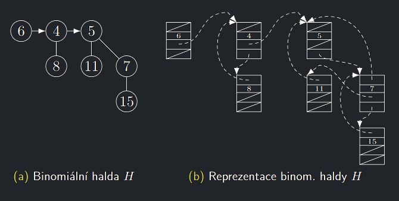

## Paměťová reprezentace prvků BH

Prvek v **BH** bude v počítači reprezentován pomocí následující struktury:

- Ukazatel na otce
- Ukazatel na levého sourozence
- Ukazatel na nejpravějšího syna
- Hodnota $k(v)$

!!! Implication "Tvrzení"

    **BHMergeTree** i vytvoření **BH** ze seznamu synů kořene lze v čase $O(log n)$, kde $n$ je počet prvků ve výsledné **BH**

---

{ align=center }

---

!!! Implication "K Zamyšlení"

    Jak v minimové BH udělat operace:
    
    - BHDecreaseKey v čase $O(log n)$?
    - BHDelete v čase $O(log n)$?
    - BHIncreaseKey v čase $O(log n)$?

    Všechny operace dostanou ukazatel na prvek, se kterým se pracuje

### Srovnání binární a binomiální haldy

| Operace                              | Binární                  | Binomiální           |
|--------------------------------------|--------------------------|----------------------|
| Vložení prvku do haldy velikosti $n$ | $O^{*}(log n), O(log n)$ | $O^{*}(1), O(log n)$ |
| ExtractMin z haldy velikosti $n$     | $O(log n)$               | $O(log n)$           |
| Sloučení 2 hald velikosti $n$        | $O(n)$                   | $O(log n)$           |

Binomiální haldy jsou nejjednodušším řešením tzv. **mergeable heaps**, které dokážou velmi **efektivně provést operaci
sloučení**
a ostatní operace mají na operaci sloučení postavené.
