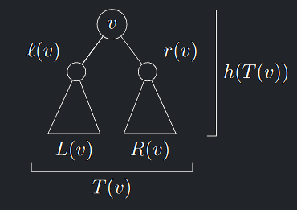
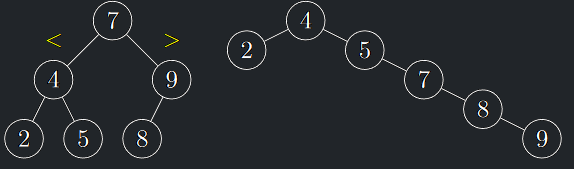

!!! Definition "Binární strom (opakování)"

    Strom nazveme **binární**, pokud

    - je zakořeněný
    - každý vrchol má nejvýše dva syny
    - u synů rozlišujeme, který je **levý** a který **pravý**.

!!! Implication "Značení"

    Pro vrchol v binárního stromu $T$ značíme

    - $ℓ(v)$ a $r(v)$: levý a pravý syn vrcholu $v$
    - $L(v)$ a $R(v)$: levý a pravý podstrom vrcholu $v$
    - $p(v)$: otec vrcholu $v$
    - $T(v)$: podstrom tvořený kořenem v a všechny jeho potomky
    - $h(T(v))$: hloubka stromu $T(v)$ je počet hladin $T(v)$
    - $|T|, |T (v)|, |L(v)|, |R(v)|$: počet vrcholů stromu $T , T(v), L(v)$ a $R(v)$

- Pokud vrchol v nemá levého syna, položíme $ℓ(v) = \emptyset.$
- Podobně pro $r(v)$ a $p(v)$
- Pak dodefinujeme, že $T (\emptyset)$ je prázdný strom a $h(T (\emptyset)) = 0.$

---

{ align=center }
/// caption
Značení binárního stromu
///

---

!!! Implication "Konvence zápisu pseudokódu"

    - Binární strom budeme v paměti počítače reprezentovat pomocí **spojových** struktur.
    - V algoritmech popisujících v pseudokódu operace nad binárními stromy budeme pracovat s ukazateli na jejich vrcholy.

!!! Definition "Definice 6.1 (Binární vyhledávací strom)"

    ### Binární vyhledávací strom (BVS) {#def-6.1}

    **Binární vyhledávací strom** (BVS) je binární strom, v jehož každém vrcholu $v$ je uložen unikátní klíč $k(v)$
    a pro jehož každý vrchol $v$ platí:

    - Pokud $a \in L(v)$, pak $k(a) \lt k(v).$
    - Pokud $b \in R(v)$, pak $k(b) \gt k(v).$

---

{ align=center }
/// caption
Příklady BVS
///

---