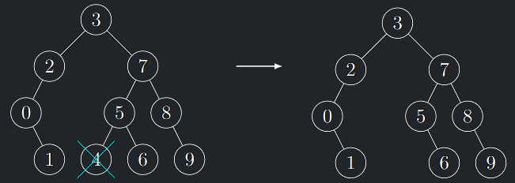
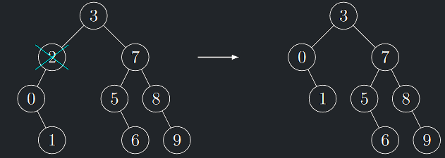
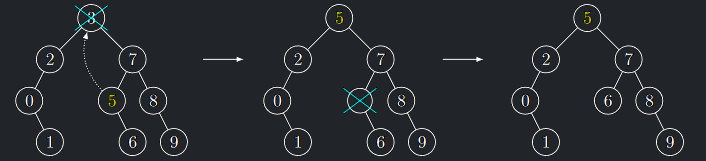

## Přehled operací BVS

| Operace          | Komplexita               | Popis                                                                 |
|------------------|--------------------------|-----------------------------------------------------------------------|
| BVSShow$(v)$     | $O(n)$                   | Vypiš vzestupně uspořádanou posloupnost klíčů všech vrcholů $T (v).$  |
| BVSMin$(v)$      | $O(logn)$                | Vrať vrchol obsahující minimální klíč v $T (v)$                       |
| BVSMax$(v)$      | $O(logn)$                | Vrať vrchol obsahující maximální klíč v $T (v)$                       |
| BVSPred$(v,w)$   | $O(logn), \Theta^{*}(1)$ | Vrať předchůdce vrcholu $w$ v $T(v)$                                  |
| BVSSucc$(v,w)$   | $O(logn), \Theta^{*}(1)$ | Vrať následníka vrcholu $w$ v $T(v)$                                  |
| BVSFind$(v, x)$  | $O(logn)$                | Vrať vrchol v $T(v)$ s klíčem $x$, pokud takový existuje              |
| BVSInsert$(v,x)$ | $O(logn)$                | Vlož do $T(v)$ nový vrchol s klíčem $x$, pokud v něm ještě neexistuje |
| BVSDelete$(v,x)$ | $O(logn)$                | Odstraň z $T(v)$ vrchol s klíčem $x$, pokud takový existuje           |

Komplexita operací v této tabulce uvažuje hloubkově vyvažovaný strom, pro nevyvažovaný strom by byla komplexita všech
operací $O(n)$

---

# Operace BVS

## BVSShow

<a id="algo-6.1"></a>
!!! Algorithm "Algoritmus 6.1 (BVSShow)"

    ### Algoritmus BVSShow {#algo-6.1}

    !!! Algorithm "Vstup"

        Ukazatel na kořen $v$ nějakého BVS $T(v)$

    !!! Algorithm "Výstup"
        
        Vzestupně uspořádaná posloupnost klíčů všech vrcholů v $T(v)$

    !!! Algorithm "Algoritmus"

        ```math title="BVSShow(ukazatel na vrchol v)"
            Pokud v = ∅: return         //T (v) je prázdný
            Zavoláme BVSShow(ℓ(v))
            Vypíšeme k(v)
            Zavoláme BVSShow(r(v))
        ```

!!! Implication "Pozorování"

    BVSShow$(v)$ vypíše vzestupně uspořádané klíče vrcholů BVS $T(v)$ v čase $O(|T(v)|)$

## BVSMin

- Nalezení vrcholu s maximálním klíčem je analogické.

!!! Implication "Pozorování"

    Nejmenší klíč je **první** v posloupnosti vzestupně uspořádaných klíčů vygenerovaných v předchozím algoritmu InOrder průchodem a tudíž
    vrchol s nejmenším klíčem je v daném BVS ten **nejvíce vlevo**. Je to tudíž buď **list** nebo vrchol s **jedním synem**.

<a id="algo-6.2"></a>
!!! Algorithm "Algoritmus 6.2 (BVSMin)"

    ### Algoritmus BVSMin {#algo-6.2}

    !!! Algorithm "Vstup"

        Ukazatel na kořen $v$ nějakého BVS $T(v)$

    !!! Algorithm "Výstup"

        Ukazatel na vrchol obsahující nejmenší klíč v $T(v)$
    
    !!! Algorithm Algoritmus

        ```math title="BVSMin(ukazatel na vrchol v)"
        Pokud ℓ(v) = ∅: vrať ukazatel na vrchol v
        Jinak: vrať BVSMin(ℓ(v))
        ```

## BVSPred

!!! Implication "Pozorování"

    - Klíč předchůdce prvku $w$ v $T(v)$ je ve vzestupném výpisu klíčů algoritmem BVSShow levým sousedem $k(w).$
    - Pokud má $w$ v $T(v)$ levý podstrom $L(w)$, pak je předchůdce w jeho maximem.
    - V opačném případě je předchůdcem $w$ první předek, do kterého vstoupíme **zprava** při průchodu nahoru.
    - Evidentně, prvek s nejmenším klíčem předchůdce nemá, neboť nesplňuje ani jednu podmínku

<a id="algo-6.3"></a>
!!! Algorithm "Algoritmus 6.3 (BVSPred)"

    ### Algoritmus BVSPred {#algo-6.3}

    !!! Algorithm "Vstup"

        Ukazatel na kořen $v$ nějakého BVS $T(v)$ a na nějaký jeho vrchol $w$

    !!! Algorithm "Výstup"
        
        Ukazatel na předchůdce $w$ v $T(v)$

    !!! Algorithm "Algoritmus"

        ```math title="BVSPred(ukazatel na vrchol vrcholy v, w)"
        Pokud w != BVSFind(v, k(w)): vrať (∅)
        Pokud ℓ(w) != ∅: vrať BVSMax(ℓ(w))
        z := p(w)
        Dokud z != ∅ & w = ℓ(z):
            w := z
            z := p(z)
        vrať ukazatel na vrchol z
        ```

!!! Implication "K zamyšlení"

    Ověřte, že pro $w =$ BVSMin($v$) vrací tento algoritmus $\emptyset$

## BVSFind

- Hledání vrcholu BVS s daným klíčem

<a id="algo-6.4"></a>
!!! Algorithm "Algoritmus 6.4 (BVSFind)"

    ### Algoritmus BVSFind {#algo-6.4}

    !!! Algorithm "Vstup"

        Ukazatel na kořen $v$ nějakého BVS $T(v)$ a klíč $x$

    !!! Algorithm "Výstup"

        Ukazatel na vrchol s klíčem $x$, pokud takový v $T(v)$ existuje, jinak $\emptyset$

    !!! Algorithm "Algoritmus"

        ```math title="BVSFind(ukazatel na vrchol v, klíč x)"
        Pokud v = ∅: vrať ∅
        Pokud x = k(v): vrať ukazatel na v
        Pokud x < k(v): vrať BVSFind(ℓ(v), x)
        Pokud x > k(v): vrať BVSFind(r(v), x)
        ```

!!! Implication "Pozorování"

    Korektnost plyne okamžitě z definice BVS: 

    - V libovolném vrcholu $u$ platí, že všechny klíče v $L(u)$ jsou menší než $k(u)$ 
    - Všechny klíče v $R(u)$ jsou větší než $k(u)$

## BVSInsert

- Vložení vrcholu s daným klíčem do BVS

<a id="algo-6.5"></a>
!!! Algorithm "Algoritmus 6.5 (BVSInsert)"

    ### Algoritmus BVSInsert {#algo-6.5}

    !!! Algorithm "Vstup"

        Ukazatel na kořen $v$ nějakého BVS $T(v)$ a klíč $x$

    !!! Algorithm "Výstup"

        Ukazatel na kořen $v$ BVS s prvkem s klíčem $x$

    !!! Algorithm "Algoritmus"

        ```math title="BVSInsert(ukazatel na vrchol v, klíč x)"
        Pokud v = ∅:
            vytvoř nový vrchol v s klíčem x
            vrať ukazatel na v a skončíme
        Pokud x = k(v): nic     //vrchol s klíčem x v T (v) již existuje
        Pokud x < k(v): ℓ(v) := BVSInsert(ℓ(v), x)
        Pokud x > k(v): r(v) := BVSInsert(r(v), x)
        Vrať ukazatel na v
        ```

!!! Implication "Pozorování"

    Operaci **BVSInsert** lze chápat jako hledání daného klíče a
    pokud klíč nenajdeme, vložíme ho na jednoznačně určenou
    pozici jako nový list (předpokládáme unikátní klíče)

!!! Implication "Pozorování (tvar BVS)"

    - Z dosud uvedeného vyplývá, že danou množinu klíčů bude
    existovat více korektních **BVS** lišících se tvarem, protože
    výsledný tvar BVS závisí nejen na hodnotách klíčů, ale i na
    pořadí, v jakém jsou do **BVS** vkládány.
    - Operace **BVSShow** vrátí pro všechny možné **BVS** nad stejnou
    množinou klíčů stejnou uspořádanou posloupnost klíčů.
    - Geometricky tomuto lineárnímu výpisu odpovídá průmět na vodorovnou osu.

---

{ align=center }
/// caption
Tvar BVS
///

---

## BVSDelete

- Odstranění vrcholu s daným klíčem z BVS
- Nejdříve nalezneme vrchol, který obsahuje klíč, který chceme smazat.
- Při mazání vrcholu může nastat několik různých případů:

### Případy BVSDelete

#### 1. Vrchol $v$ není v $T$

- $T$ je ponechán beze změny

#### 2. Vrchol $v$ je listem $T$

- Vrchol $v$ je odstraněn z $T$

{ align=center }
/// caption
Odstranění listu BVS
///

#### 3. Vrchol $v$ má jednoho syna

- Vrchol $v$ nahradíme jeho jediným synem

{ align=center }
/// caption
Odstranění vrcholu s jedním synem
///

#### 4. Vrchol $u$ má dva syny

- Pak $u$ nemůžeme odstranit přímo, protože by nebylo kam připojit jeho syny.
- Využijeme ale faktu, že vrchol $u$ má v **BVS** následníka $w$ = **BVSMin(r(u))**.
- A ten má nejvýše jednoho syna (pravého, kdyby měl levého, tak je následník jeho levý syn)
- Klíč vrcholu $u$ nahradíme klíčem vrcholu $w$
- Aplikací postupu z případu 2) nebo 3) pak odstraníme z **BVS** vrchol $w$.

{ align=center }
/// caption
Odstranění vrcholu se dvěma syny
///

<a id="algo-6.6"></a>
!!! Algorithm "Algoritmus 6.6 (BVSDelete)"

    ### Algoritmus BVSDelete {#algo-6.6}

    !!! Algorithm "Vstup"

        Ukazatel na kořen $v$ nějakého **BVS** a klíč $x$

    !!! Algorithm "Výstup"

        Ukazatel na kořen **BVS**, ze kterého byl odstraněn vrchol s klíčem $x$, pokud takový vrchol existoval.

    !!! Algorithm "Algoritmus"

        ```math title="BVSDelete(ukazatel na vrchol v, klíč x)"
        Pokud v = ∅: vrať ∅
        Pokud x < k(v): ℓ(v) := BVSDelete(ℓ(v), x)
        Pokud x > k(v): r(v) := BVSDelete(r(v), x)
        Pokud x = k(v):
            Pokud ℓ(v)= r(v)= ∅: vrať ∅
            Pokud ℓ(v)= ∅: vrať r(v)
            Pokud r(v)= ∅: vrať ℓ(v)
            w := BVSMin(r(v))       // v má oba syny, w následník
            k(v) := k(w)
            r(v) := BVSDelete(r(v), k(w))
        vrať ukazatel na v
        ```