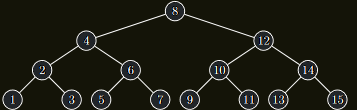

!!! Implication "Pozorování"

    Časová složitost operací **BVSFind**, **BVSMin**, **BVSInsert** a **BVSDelete** nad **BVS** $T(v)$ je:

    $$
    O(h(T (v)))
    $$

!!! Implication "Pozorování"

    Hloubka $h(T(v))$ BVS $T(v)$ je:
    
    - v nejlepším případě $\Omega(log |T (v)|)$
    - v nejhorším případě $O(|T (v)|)$ 
    (např. BVS vytvořený postupným vložením klíčů $1, 2, . . . , n$ v tomto pořadí).

    { align=center }
    /// caption
    Dva BVS se stejnými vrcholy a jinou hloubkou
    ///

---

!!! Definition "Definice 6.2 (Dokonale vyvážený BVS)"

    ### Dokonale vyvážený BVS {#def-6.2}

    BVS nazveme **dokonale vyvážený**, pokud pro každý jeho vrchol $v$ platí

    $$
    ||L(v)| − |R(v)|| ≤ 1
    $$

!!! Implication "Pozorování"

    Dokonale vyvážený **BVS** o velikosti $n$ má $1 + ⌊log n⌋$ hladin a operace **BVSFind**, **BVSMin**, **BVSInsert** a **BVSDelete** na něm tedy mají časovou složitost $O(logn)$

!!! Theorem "Věta 6.1 (o složitosti operací nad dokonale vyváženým BVS)"

    ### Věta o složitosti operací nad dokonale vyváženým BVS {#theorem-6.1}

    Pokud má **BVS** zůstávat po provedení operací **BVSInsert** a
    **BVSDelete** dokonale vyvážený, potom ať použijeme jakoukoli
    implementaci zmíněných operací, bude časová složitost aspoň jedné
    z nich $\Omega (n)$ pro nekonečně mnoho různých $n$

??? Proof "Důkaz Věty 6.1"

    Uvažujme dokonale vyvážený **BVS** s klíči $1, 2, . . . , n$, kde $n = 2k − 1$  
    Ten pak vypadá nutně takto:

    ---

    { align=center }

    ---

    1. Kořen stromu je vždy prostřední z klíčů.
    2. Všechna lichá čísla jsou v listech stromu.
    3. Levý a pravý podstrom mají právě $2k−1 − 1$ vrcholů a jsou tedy opět určeny jednoznačně.
    4. Nyní provedeme následující posloupnost dvojic operací:  
    $Insert(n + 1), Delete(1), Insert(n + 2), Delete(2), . . .$
    5. Po provedení i-té dvojice operací bude strom obsahovat hodnoty $i + 1, . . . , i + n$
    6. Podle toho, zda je $i$ sudé nebo liché, se budou v listech nacházet buď všechna sudá, nebo všechna lichá čísla.
    7. Pokaždé se proto všem vrcholům změní, zda jsou listy, což ale nutně znamená upravit $\Omega (n)$ ukazatelů.
    8. Tedy aspoň jedna z operací **BVSInsert** a **BVSDelete** trvá $\Omega (n)$

