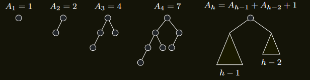
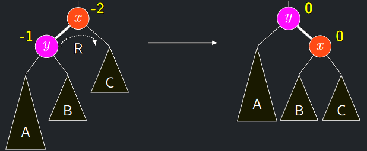
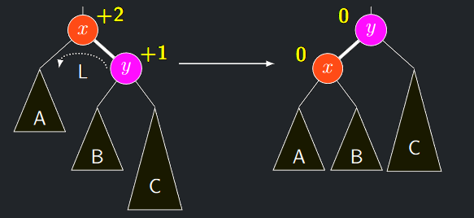
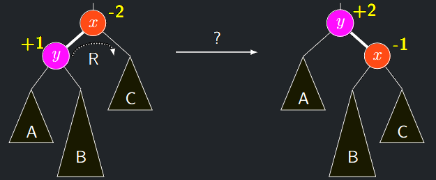
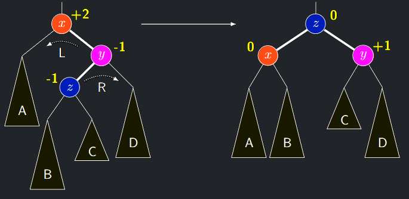

## Hloubkové vyvážení: AVL stromy

- Z předchozího výkladu tedy plyne, že žádné kritérium vyváženosti
  stejně jako příliš přísné kritérium vyváženosti vedou v nejhorším
  případě na lineární složitost alespoň jedné z operací **BVS**.
- Kritérium vyváženosti **BVS** je tedy třeba definovat méně
  restriktivně, stačí udržovat hloubku $O(logn)$.

<a id="def-6.3"></a>
!!! Definition "Definice 6.3 (Hloubkově vyvážený BVS)"

    ### Hloubkově vyvážený BVS {#def-6.3}

    **BVS** je hloubkově vyvážený, pokud pro každý jeho vrchol $v$ platí

    $$
    |h(L(v)) − h(R(v))| \le 1
    $$

- Existuje několik různých řešení, zde si vysvětlíme tzv.
  **AVL-stromy**, které jsou efektivní implementací hloubkově
  vyvážených **BVS**.

<a id="theorem-6.2"></a>
!!! Theorem "Věta 6.2 (o hloubce hloubkově vyvážených stromů)"

    ### Věta o hloubce hloubkově vyvážených stromů {#theorem-6.2}

    Hloubkově vyvážený strom s $n$ vrcholy má hloubku $\Theta (log n)$

??? Proof "Důkaz Věty 6.2"

    1. Definujme $A_{h} =$ min. počet vrcholů **HV** stromu hloubky $h$
    2. Ukážeme, že $A_{h}$ roste exponenciálně s $h$
    3. Nejmenší takové stromy dané hloubky jsou maximálně "hloubkově vyvážené" v mezích definice, čili v každém vnitřním
    vrcholu v platí $|h(L(v)) − h(R(v))| = 1.$
    Pro $h \le 4$ lze nejmenší **HV** stromy hloubky $h$ nalézt přímo:
    { align=center }    
    4. Obecně pak minimální **HV** strom hloubky $h$ musí mít jako
    podstromy minimální **HV** stromy hloubky $h − 1$ a $h − 2$
    5. Musí tedy platit $A_{h} = A_{h−1} + A_{h−2} + 1$
    6. Dokážeme indukcí, že $A_{h+1} \geq 2^{\frac{h}{2}} \stackrel{\cdot}{=} 1.41^{h}$

        - IZ: $A_{1} = 1 \geq 2^{\frac{0}{2}} = 1$ a $A_{2} = 2 \geq 2^{\frac{1}{2}}$
        - IK:
        
        $$
        \begin{align}
        A_{h+1} & = 1 + A_{h} + A_{h-1} \gt \\\\
        & \gt 2^{\frac{h-1}{2}} + 2^{\frac{h-2}{2}} = \\\\
        & = 2^{\frac{h}{2}} \cdot (2^{-\frac{1}{2}} + 2^{-1}) \gt \\\\
        & \gt 2^{\frac{h}{2}} \cdot (\frac{1}{2} + \frac{1}{2}) = \\\\
        & = 2^{\frac{h}{2}}
        \end{align}
        $$
    7. **HV strom** hloubky $h + 1$ má tedy nejméně $\sqrt{2^{h}}$ vrcholů.
    8. Proto **HV strom** o $n$ vrcholech má hloubku nejvýše $log_{\sqrt{2}}(n) + 1$
    9. A protože je binární, nemůže mít hloubku menší než $⌊log_{2} n⌋$
    10. Tedy **hloubka HV stromu** o $n$ vrcholech je $\Theta (log n)$

---

## Udržování hloubkového vyvážení

- Operace **BVSShow**, **BVSMin**, **BVSPred** a **BVSFind** nemění ani tvar
  ani obsah **BVS**, fungují tedy beze změny i pro **AVL** stromy.
- Operace vkládání a mazání prvků ale hloubky podstromů mění.
- Proto operace **AVLInsert** a **AVLDelete** vloží/vyjmou vrchol
  jako u **BVSInsert** a **BVSDelete**, ale pak kontrolují směrem ke
  kořenu hloubkovou vyváženost a při jejím porušení ji opravují

---

### Jak kontrolovat a případně opravit hloubkovou nevyváženost?

1. V každém vrcholu v vždy spočteme číslo
   $\delta(v) = h(R(v)) − h(L(v))$, které nazveme znaménko vrcholu $v$.
2. V korektním AVL stromu může nabývat jen těchto hodnot:

    - $\delta (v) = +1$ (pravý podstrom hlubší) – značíme $+1$
    - $\delta (v) = −1$ (levý podstrom hlubší) – značíme $-1$
    - $\delta (v) = 0$ (oba podstromy stejně hluboké) – značíme $0$

3. Jakmile při kontrole narazíme na jiné $\delta(v)$, strom opravíme pomocí **jednoduchých** nebo **dvojitých** rotací

---

# AVL rotace

## Jednoduché AVL rotace

### Jednoduchá rotace doprava (R)

- Jednoduchá rotace doprava opraví hloubkovou nevyváženost v modelové situaci dle obrázku dole, kdy:
    - $y = ℓ(x)$ a $h = h(B) = h(C) = h(A) − 1$ a tudíž
    - $\delta (y) = \mathbf{-1}$ a $\delta (x) = \mathbf{-2}$
- Po provedení rotace doprava je $\delta (x) = \delta(y) = 0$
- Z definice **BVS** plyne, že přepojení $B$ od $y$ k $x$ zachovává **BVS**

{ align=center }
/// caption
Jednoduchá rotace doprava v AVL stromu
///

### Jednoduchá rotace doleva (L)

- Jednoduchá rotace doleva je zrcadlově symetrická modelová situace:
    - $y = r(x)$ a $h(A) = h(B) = h(C) − 1$ a tudíž
    - $\delta(x) = \mathbf{+2}$ a $\delta(y) = \mathbf{+1}$
- Po provedení rotace doleva je opět $\delta(x) = \delta(y) = 0$

{ align=center }
/// caption
Jednoduchá rotace doleva v AVL stromu
///

<a id="algo-6.7"></a>
!!! Algorithm "Algoritmus 6.7 (rotateLeft)"

    ### Algoritmus rotateLeft {#algo-6.7}

    **Vstup** <br>
    
    - Vrchol $x$ v **BVS**

    ```math title="rotateLeft(x)"
    y := r(x)
    r(x) := ℓ(y)
    ℓ(y) := x
    p(r(x)) := x; p(y) := p(x); p(x) := y;
    h(T (x)) := max(h(L(x)), h(R(x))) + 1;
    h(T (y)) := max(h(R(y)), h(T (x))) + 1
    ```

- Vnější algoritmus poté musí případnou změnu hloubky podstromu propagovat sám.

!!! Implication "Pozorování"

    Pokud je $x$ vrcholem v binárním vyhledávacím stromě, potom po volání **rotateLeft**$(x)$ máme opět binární vyhledávací strom.

!!! Implication "Pozorování"

    - Vše platí symetricky pro **rotateRight**$(x)$


## Dvojité AVL rotace

### Situace, kdy jednoduchá rotace nepomůže

- Lze snadno nahlédnout, že jednoduchá rotace nepomůže v
modelové situaci na obrázku, kdy $h(A) = h(C) = h(B) − 1$
- Ukázáno pro rotaci doprava: místo $\delta(y) = \mathbf{+1}$ a $\delta(x) = \mathbf{-2}$
dostaneme $\delta(y) = \mathbf{+2}$ a $\delta(x) = \mathbf{-1}$

{ align=center }

- V podobných situacích je nutné použít **posloupnost dvou jednoduchých rotací**, buď **LR** nebo **RL**, které nazýváme **dvojité rotace**.

### Dvojitá rotace LR

- Nechť $h(A) = h(B) = h(D) = h(C) + 1$
- A tedy $\delta(x) = \mathbf{-2}, \delta(y) = \mathbf{+1}$ a $\delta(z) = \mathbf{-1}$

{ align=center }
/// caption
LR rotace
///

- Po provedení LR rotace máme $\delta(y) = \delta(z) = \mathbf{0}$ a $\delta(x) = \mathbf{+1}$
- Funguje zjevně i pro situace, kde je na počátku $\delta(z) = \mathbf{+1}$ nebo $\delta(y) = \mathbf{+2}$

### Dvojitá rotace RL

- Nechť opět symetricky $h(A) = h(B) = h(D) = h(C) + 1$
- A tedy $\delta(x) = \mathbf{+2}, \delta(y) = \mathbf{-1}$ a $\delta(z) = \mathbf{-1}$

{ align=center }
/// caption
RL rotace
///

- Po provedení RL rotace máme $\delta(x) = \delta(z) = \mathbf{0}$ a $\delta(y) = \mathbf{+1}$
- Funguje zjevně, i když je na počátku $\delta(z) = \mathbf{+1}$ nebo $\delta(y) = \mathbf{-2}$


    