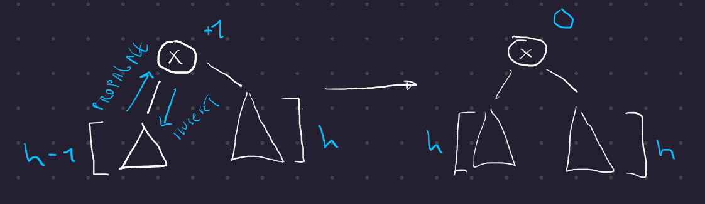
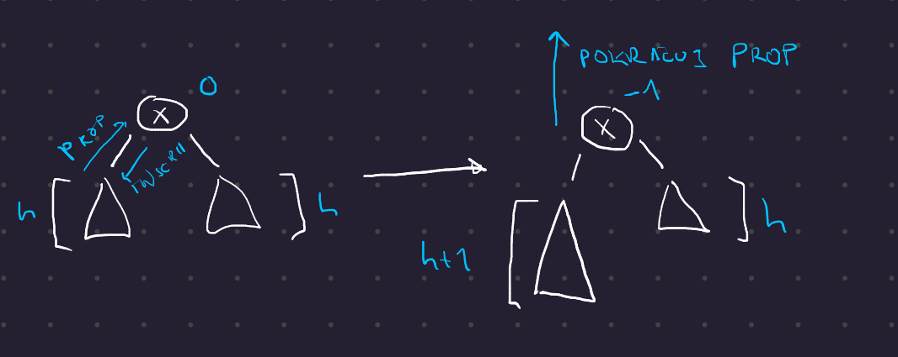
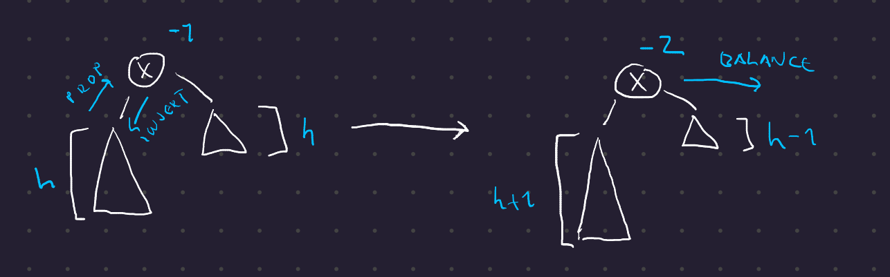
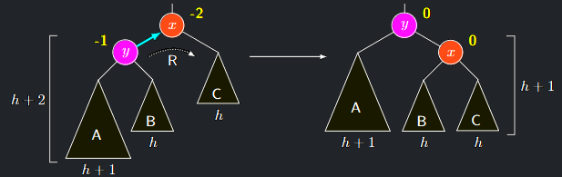
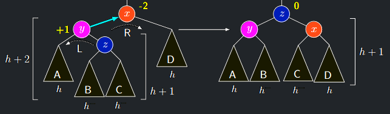
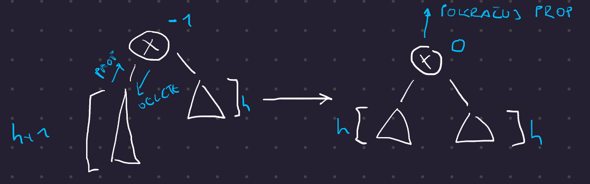
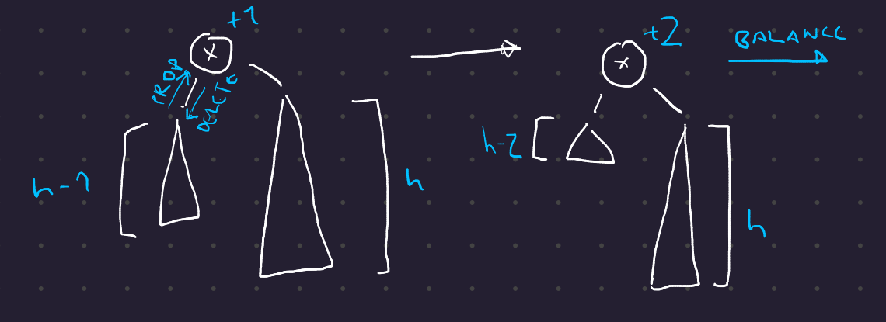
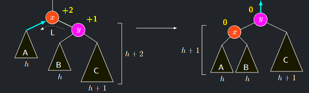
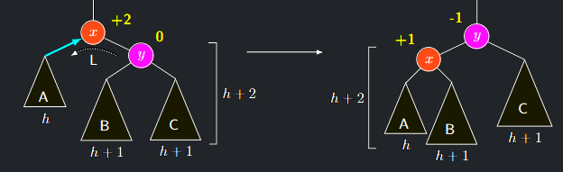
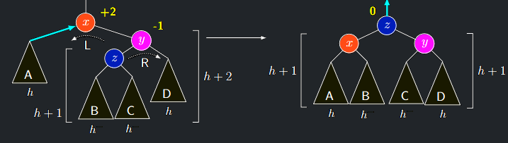

## AVLInsert

### Idea
1. Nový vrchol vložíme standardně jako list se znaménkem $\mathbf{0}$
2. Z prázdného podstromu hloubky $0$ se tak stal jednovrcholový podstrom hloubky $1$
3. Potom je třeba přepočítat hloubky stromů na cestě z jeho rodiče do kořene.
4. Proto budeme propagovat nahoru informaci o tom, že se zvětšila hloubka podstromu.
5. V jednotlivých úrovních se tato informace zpracuje v závislosti na hloubkách příslušných sourozenců.
6. Tuto kontrolu a případné napravení nevyvážeností můžeme elegantně provést během návratu z rekurze v proceduře **AVLInsert**

### Oprava hloubkového vyvážení

Popíšeme propagaci pro jeden vrchol:

1. Nechť do nějakého vrcholu $x$ přišla z jeho syna informace o prohloubení podstromu.
2. Ukážeme pro případ, kdy přišla z levého syna

    - Případ, kdy přišla z pravého syna, se řeší obdobně, jen se vymění význam $\mathbf{+1}$ a $\mathbf{-1}$, levého a pravého podstromu a směr rotací.
3. Rozlišíme **tři** případy podle znaménka vrcholu $x$

### Případ 1 - vrchol x měl znaménko +1

- Hloubka levého podstromu se právě vyrovnala s hloubkou pravého, čili znaménko $x$ se změní na $\mathbf{0}$
- Hloubka podstromu $T(x)$ se ale **nezměnila**, takže propagování informace **zastavíme.**

{ align=center }
/// caption
AVLInsert případ 1
///

### Případ 2 - vrchol x měl znaménko 0

- Znaménko $x$ se změní na $\mathbf{-1}$.
- Hloubka podstromu $T(x)$ se zvětšila o jedna, takže musíme **pokračovat v propagování**

{ align=center }
/// caption
AVLInsert případ 2
///

### Případ 3 - vrchol x měl znaménko -1

tedy teď získá $\delta(x) = \mathbf{-2}$, je třeba **vyvažovat**

- Označme $y$ vrchol, z nějž přišla informace o prohloubení, čili levého syna vrcholu $x$
- Rozebereme opět tři případy podle znaménka vrcholu $y$

{ align=center }
/// caption
AVLInsert případ 3 (obecně)
///

#### Případ 3a - vrchol y má znaménko -1

1. Označíme-li $h$ hloubku podstromu $C$, podstrom $T(y)$ má hloubku $h + 2$, takže podstrom $A$ má hloubku $h + 1$ a podstrom $B$ hloubku $h$.
2. Provedeme jednoduchou rotaci $R$ hrany $\{x, y\}$
3. Tím získá vrchol $x$ znaménko $\mathbf{0}$, podstrom $T(x)$ hloubku $h + 1$, vrchol $y$ znaménko $\mathbf{0}$ a podstrom $T(y)$ hloubku $h + 2$
4. Jelikož před započetím operace **AVLInsert** měl podstrom $T(x)$ hloubku $h + 2$, z pohledu vyšších pater se nic nezměnilo. 5
5. Propagování (červená šipka) tedy **zastavíme**

{ align=center }
/// caption
AVLInsert případ 3a
///

#### Případ 3b - vrchol y má znaménko +1

1. Označíme $z$ pravého syna vrcholu $y$ (musí existovat).
2. Označíme jednotlivé podstromy tak jako na obrázku a spočítáme jejich hloubky.
3. Referenční hloubku $h$ zvolíme podle podstromu $D$
4. Hloubky $h−$ znamenají buď $h$ nebo $h − 1$
5. Provedeme dvojitou **LR rotaci**, která celou konfiguraci překoření za vrchol $z$
6. Vrchol $x$ bude mít znaménko buď $\mathbf{0}$ nebo $\mathbf{+1}$, vrchol $y$ buď $\mathbf{-1}$ nebo $\mathbf{0}$, každopádně oba podstromy $T(x)$ a $T(y)$ získají hloubku $h + 1$
7. Proto vrchol $z$ získá znaménko $\mathbf{0}$
8. Před započetím AVLInsertu činila hloubka celé konfigurace $h + 2$, nyní je také $h + 2$, takže **propagování zastavíme**

{ align=center }
/// caption
AVLInsert případ 3b
///

#### Případ 3c - vrchol y má znaménko 0

- Tento případ nemůže nikdy nastat, neboť z vrcholu se znaménkem $\mathbf{0}$ se informace o prohloubení v žádném z předchozích případů nešíří
  a nově přidaný list má sice znaménko $\mathbf{0}$, ale jeho otec nemůže mít nikdy $\mathbf{-1}$
- Čili zdola z vrcholu se znaménkem $\mathbf{0}$ nemůže informace o prohloubení přijít do vrcholu se znaménkem $\mathbf{-1}$

---

## AVLDelete

### Idea

Obdobně jako AVLInsert.

1. Vrchol smažeme podle **BVSDelete** a po cestě zpět do kořene propagujeme informaci o **snížení** hloubky podstromu.
2. Pokaždé mažeme list nebo vrchol s jediným synem, takže stačí propagovat od místa smazaného vrcholu nahoru.

### Oprava hloubkového vyvážení

Popíšeme propagaci pro jeden vrchol.

1. Nechť do vrcholu $x$ přišla ze syna informace o snížení hloubky podstromu.
2. Ukážeme opět pro případ, kdy přišla z levého syna.

    - Případ, kdy přišla z pravého syna se řeší obdobně, jen se vymění význam $\mathbf{+1}$ a $\mathbf{-1}$, levého a pravého podstromu a směr rotací.
    - Rozlišíme opět tři případy podle znaménka vrcholu $x$.

### Případ 1 - vrchol x má znaménko -1

- Hloubka levého podstromu se právě vyrovnala s hloubkou pravého, znaménko vrcholu $x$ se mění na $\mathbf{0}$
- Hloubka podstromu $T(x)$ se snížila, takže **pokračujeme v propagování**

{ align=center }
/// caption
AVLDelete případ 1
///

### Případ 2 - vrchol x má znaménko 0

- Znaménko $x$ se změní na $\mathbf{+1}$
- Hloubka podstromu $T(x)$ se nezměnila, takže **propagování zastavíme**

{ align=center }
/// caption
AVLDelete případ 2
///

### Případ 3 - vrchol x má znaménko +1

- Tehdy se jeho znaménko změní na $\mathbf{+2}$ a musíme vyvažovat.
- Rozlišíme tři případy podle znaménka pravého syna $y$ vrcholu $x$.

{ align=center }
/// caption
AVLDelete případ 3 (obecně)
///

#### Případ 3a - vrchol y má také znaménko +1

1. Označíme-li $h$ hloubku podstromu $A$, bude mít $T(y)$ hloubku $h + 2$, takže $C$ hloubku $h + 1$ a $B$ hloubku $h$
2. Provedeme jednoduchou rotaci **L** hrany $\{x, y\}$
3. Tím vrchol $x$ získá znaménko $\mathbf{0}$, podstrom $T(x)$ hloubku $h + 1$, takže vrchol y dostane také znaménko $\mathbf{0}$
4. Před započetím **AVLDelete** měl podstrom $T(x)$ hloubku $h + 3$  
   nyní má $T(y)$ hloubku $h + 2$, takže z pohledu vyšších hladin došlo ke snížení hloubky.
5. Proto **pokračujeme v propagování** (červená šipka).

{ align=center }
/// caption
AVLDelete případ 3a
///

#### Případ 3b - vrchol y má znaménko 0

1. Nechť $h$ je hloubka podstromu $A$. Pak $T(y)$ má hloubku $h + 2$ a $B$ i $C$ hloubku $h + 1$.
2. Provedeme jednoduchou rotaci **L** hrany $\{x, y\}$
3. Vrchol $x$ získává znaménko $\mathbf{+1}$, podstrom $T(x)$ hloubku $h + 2$, takže vrchol $y$ obdrží znaménko $\mathbf{-1}$
4. Hloubka podstromu $T(x)$ před začátkem **AVLDelete** činila $h + 3$$, nyní má podstrom $T(y)$ hloubku také $h + 3$, a **propagování zastavíme**

{ align=center }
/// caption
AVLDelete případ 3b
///

#### Případ 3c - vrchol y má znaménko -1

1. Označíme $z$ levého syna vrcholu $y$
2. Označíme podstromy podle obrázku a spočítáme jejich hloubky.
    - Referenční hloubku $h$ zvolíme opět podle $A$
    - Hloubky $h−$ znamenají buď $h$ nebo $h − 1$
3. Provedeme dvojitou **RL** rotaci, která celou konfiguraci překoření za vrchol $z$
4. Přepočítáme hloubky a znaménka.
5. Vrchol $y$ bude mít znaménko buď $\mathbf{0}$ nebo $\mathbf{+1}$, $x$ buď $\mathbf{-1}$ nebo $\mathbf{0}$.
    - Podstromy $T(y)$ a $T(x)$ budou každopádně hluboké $h + 1$
    - Proto vrchol $z$ obdrží znaménko $\mathbf{0}$
6. Původní hloubka podstromu $T(x)$ před začátkem **AVLDelete** činila $h + 3$, nyní hloubka $T (z)$ činí $h + 2$
7. **pokračujeme v propagování** (červená šipka).

{ align=center }
/// caption
AVLDelete případ 3c
///

!!! Theorem "Věta 6.3 (o složitosti operací AVLInsert a AVLDelete)"

    ### Věta o složitosti operací AVLInsert a AVLDelete {#theorem-6.3}

    **AVLInsert** a **AVLDelete** trvají $O(log n)$

??? Proof "Důkaz Věty 6.3"

    1. Hloubka **AVL** stromu je vždy $\Theta(log n)$
    2. Původní implementace operací **BVSFind**, **BVSInsert** a **BVSDelete** tedy pracují v logaritmickém čase.
    3. Při vyvažování se operace vždy vrací po cestě do kořene a v každém vrcholu provede $\Theta(1)$ operací, takže celkově také trvá $\Theta(log n)$