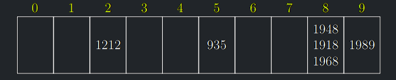

## Slovníky

Nejjednodušší datovou strukturou pro práci s **dynamickými množinami** je **slovník** (tabulka, mapa, asociativní pole).

!!! Definition "Definice 7.1 (Slovník)"

    ### Slovník {#def-7.1}
    
      - **Prvky** slovníku jsou stejně jako v předchozích přednáškách
      dvojice **(klíč,hodnota)**. Klíč prvku x značíme zase k(x).
    
      - **Slovník** je datová struktura, která umožňuje reprezentovat
      dynamickou podmnožinu prvků s klíči $K \subseteq \mathcal{U}$, kde $|K| \ll |\mathcal{U}|$,
      a efektivně podporovat operace
        - **Find**($k$): zjisti, zda prvek $k \in K$ (příp. vrať hodnotu prvku).
        - **Insert**($x$): pokud $k(x) \notin K$, vlož $x$ do slovníku.
        - **Delete**($x$): pokud $k(x) \in K$, vymaž $x$ ze slovníku.

- Prvky se tedy vyhledávají a ukládají podle svých klíčů.
- Klíče jsou **unikátní**, t.j., v daném okamžiku se vyskytuje nejvýše jeden prvek s daným klíčem 
- Množinu všech možných klíčů, které se mohou ve slovníku vyskytnout, nazveme **univerzum** $\mathcal{U}$.

### Implementace slovníků
- Pro menší rozsahy univerza $\mathcal{U}$ lze použít například **bitové pole**.
- Potom časová složitost operací bude zjevně $O(1)$.
- Nicméně paměťové nároky budou $\Theta(|\mathcal{U}|)$.
- V praxi ale bývá velikost univerza $|\mathcal{U}|$ obrovské číslo.
- Podobně **tabulka s přímým adresováním** podle klíčů.
- Klasické slovníky (překladové, výkladové) používají (abecedně) **seřazená pole**: hledání je logaritmické, vkládání
či mazání je lineární.
- V této kapitole se budeme věnovat **hešovacím tabulkám**
(hash tables, alternativně se jim říká **rozptylovací tabulky**).
- Cílem hešování je skloubit nízké paměťové nároky operací, tzn. $O(|K|)$, a přitom zachovat konstantní složitost operací,
i když pouze v průměrném případě.

---

## Hešovací tabulky
- Pro nějaké univerzum klíčů $\mathcal{U}$, zvolme konečné pole **přihrádek** $P = \{0,...,m − 1\}$ **(hešovací tabulku)**
a **hešovací funkci** $h: \mathcal{U} \to P$, která každému klíči univerza přidělí jednu přihrádku.
- Chceme-li uložit množinu prvků s klíči $K \subseteq \mathcal{U}$, rozmístíme její prvky do přihrádek: prvek
s klíčem $k \in K$ umístíme do přihrádky $h(k)$.
- Budeme-li hledat nějaký prvek s klíčem $k \in \mathcal{U}$, víme, že nemůže být jinde než v přihrádce $h(k)$.
- Díky poměru $m$ a $|U|\ (m \ll |\mathcal{U}|)$ se bude stávat, že několik prvků padne do stejné přihrádky.
- Tomu se říká **kolize**
- Cílem je volit $m$ a $h$ tak, aby se počet kolizí minimalizoval.
- To, jak kolize řešit, vysvětlíme později.

### Příklad hešovací tabulky

- Uvažujme univerzum všech celých čísel, hešovací tabulku s $m = 10$ přihrádkami a hešovací funkci $h(k) = k mod 10$.
- Celočíselné klíče budeme tedy rozdělovat do přihrádek podle poslední číslice.
- Předpokládejme, že jsme do tabulky vložili letopočty 1212, 935, 1948, 1918, 1968, 1989

{ align=center }

- Hledáme-li rok 2015, víme, že se musí nacházet v přihrádce 5. Tam je ovšem pouze 935, takže hned odpovíme zamítavě.
- Hledání roku 2017 je ještě rychlejší: přihrádka 7 je prázdná.
- Hledáme-li rok 1618, musíme ho porovnat s 3 prvky.
