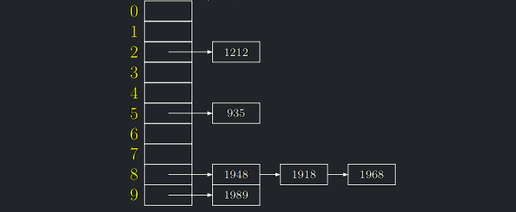
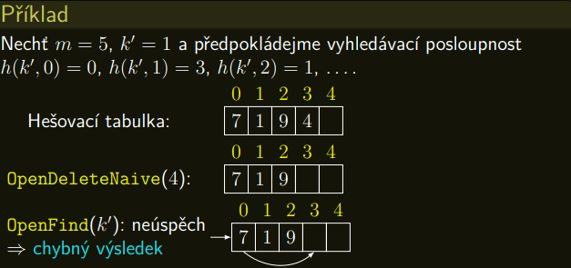
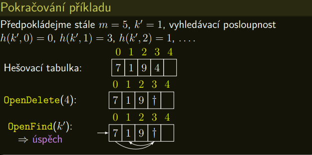

Jelikož $m \ll |U|$, žádná hešovací funkce se nemůže vyhnout kolizím, kdy je několik prvků zahešováno do téže přihrádky.


Existují dvě principiálně odlišné metody řešení kolizí:

1. **Řetězení** (Chaining) = **Otevřené hešování** (Open hashing). Otevřené hešování proto, že ukládané prvky nejsou ukládány
do hešovací tabulky, ale do „otevřeného prostoru“ za ní, do **řetízků**, odkazovaných z tabulky.

2.  **Otevřené adresování** (Open addressing) = **Uzavřené hešování** (Closed hashing). Uzavřené hešování proto, že prvky 
jsou ukládány do „uzavřeného prostoru tabulky“. Otevřené adresování proto, že číslo (index) přihrádky tabulky, kam je 
nakonec hešovaný prvek uložen, je dopředu otevřený, neboť není dán pouze hešovací funkcí, ale i momentální obsazeností tabulky.

---

## Řešení kolizí řetězením

- Hešovací tabulka je **pole** $m$ přihrádek, které jsou buď **prázdné**nebo obsahují **ukazatel** na **řetízky**
(= spojové seznamy) uložených prvků.
- Jedná se o přímočarou implementaci abstraktní struktury hešovací tabulky.
- Naše tabulka bude tedy implementovaná takto:

{ align=center }

!!! Implication "Časová složitost hešování s řetízky"

    * Hledání, vkládání i mazání sestává z výpočtu hešovací funkce aprojití řetízku v příslušné přihrádce.
    * V případě ideální hešovací funkce a pokud jsou vstupní data z univerza $\mathcal{U}$ vybírána nezávisle rovnoměrně
    náhodně, budou mít(skoro) všechny řetízky délku nejvýše $\lceil n/m \rceil$ prvků.
    * Zvolíme-li navíc počet přihrádek $m = \Theta(n)$, vyjde konstantní délka řetízku, a tím pádem i časová složitost
    operací.

---

## Otevřená adresace: Řešení kolizí

- **Hešovací tabulka s otevřenou adresací** je pole s $m$ přihrádkami $A[0],...,A[m − 1]$, jenže tentokrát se do každé přihrádky vejde **pouze jeden prvek**.
- Při pokusu o uložení do obsazené přihrádky budeme postupně zkoušet náhradní přihrádky, dokud nenajdeme prázdnou
- Hešovací funkce tedy každému klíči $k \in \mathcal{U}$ přiřadí jeho vyhledávací posloupnost $h(k,0),h(k,1),...,h(k,m − 1)$,
která je ideálně permutací posloupnosti $\{0,1,...,m − 1\}$.
- Ta určuje pořadí přihrádek, do kterých se budeme postupně snažit vkládat klíč $k$.
- V ideálním případě vyhledávací posloupnost obsahuje všechna čísla přihrádek v dokonale náhodném pořadí
(všechny permutace přihrádek jsou stejně pravděpodobné).

### Find

<a id="algo-7.1"></a>
!!! Algorithm "Algoritmus 7.1 (Otevřená adresace: Hledání)"

    #### Algoritmus OpenFind {$algo-7.1}

    ```math title="OpenFind(k)"
    Pro i = 0,...,m − 1:
        j := h(k, i)
        Pokud k(A[j]) = k: ohlaš nalezení A[j] a skonči
        Pokud je A[j] prázdná: ohlaš neúspěch a skonči
    Ohlaš neúspěch
    ```
### Delete

- Mazání je problematické. Pokud bychom přihrádku smazaného prvku označili jako prázdnou, můžeme způsobit, že
**existující** prvek s nějakým jiným klíčem $k'$ **nebude nalezen**, protože vyhledávací posloupnost, která byla použita
při vkládání $k'$, bude tímto zásahem **přerušena**.

{ align=center }

- Proto budeme mazané prvky pouze označovat za smazané.
- Standardní implementace označení smazaného prvku je pomocí tzv. náhrobku $†$ ($tombstone$).
- Dodefinujeme $k(†)$ jako libovolnou hodnotu mimo $\mathcal{U}$.

{ align=center }


<a id="algo-7.2"></a>
!!! Algorithm "Algoritmus 7.2 (Otevřená adresace: Mazání)"

    #### Algoritmus OpenDelete {#algo-7.2}

    !!! Algorithm "Idea"

        * Prvek nahradíme †.
        * Operace **OpenDelete** je pak následující:


    ```math title="OpenDelete(x)"
    Pro i = 0, . . . , m − 1:
        j := h(k(x), i)
        Pokud je A[j] = x:
            A[j] = †
            skonči
        Pokud je A[j] prázdná:
            skonči
    ```

### Insert


<a id="algo-7.3"></a>
!!! Algorithm "Algoritmus 7.3 (Otevřená adresace: Vkládání)"

    #### Algoritmus OpenInsert {#algo-7.3}

    !!! Algorithm "Idea"

        * Místo po smazaných prvcích můžeme využívat při vkládání
        * Operace **OpenInsert** je pak následující:

    ```math title="OpenInsert(x)"
    Pokud OpenFind(k(x)) nalezne k(x): skonči
    Pro i = 0,...,m − 1:
        j := h(k(x),i)
        Pokud je A[j] prázdná nebo A[j] = †:
            A[j] := x a skonči
    Ohlaš zaplnění hešovací tabulky
    ```
- Pokud se vyhledávací posloupnosti nově vkládaných prvků liší od vyhledávacích posloupností mazaných prvků označovaných
náhrobky, počet náhrobků může snadno přesáhnout zadanou mez (třeba m/4). Pak se obvykle struktura tabulky přebuduje
(přehešuje).
