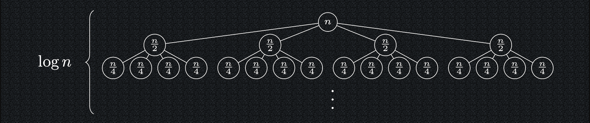
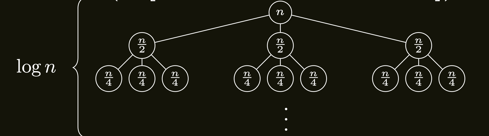

- Ukážeme nejprv, že i násobení celých čísel lze popsat rekurzivně.
- Mějme dvě $n$-ciferná čísla $x$ a $y$, která chceme vynásobit.
- Pro jednoduchost zatím předpokládejme, že $n$ **je mocnina
  dvou**.
- Obě čísla rozdělíme na horních $n/2$ a dolních $n/2$ cifer.
  Platí tedy

  $x = x_U \cdot 10^{n/2} + x_L,$ <br>
  $y = y_U \cdot 10^{n/2} + y_L,$


- kde $x_U, x_L, y_U, y_L$ jsou ($n/2$)-ciferná čísla.
- Výsledný součin dvou n-ciferných čísel $xy$ pak můžeme
  poskládat ze 4 součinů $n/2$ ciferných čísel:

$$x·y= x_U·y_U·10^n + (x_U·y_L + x_L·y_U)·10^{n/2} + x_L·y_L$$

- Rekurzivně tedy spočítáme 4 součiny dvojic čísel poloviční délky:
  $x_U·y_U, x_U·y_L, x_L·y_U$ a $x_L·y_L$.
- Výsledek z těchto dílčích součinů složíme pomocí několik
  $2n$-ciferných sčítání (sčítání má lineární složitost vzhledem k
  počtu cifer) a několika násobení mocninou desítky (doplňování
  nejvýše n nul na konec).
- Řešíme tedy čtyři podproblémy poloviční velikosti a pak
  provedeme několik operací s lineární složitostí vzhledem k n.
- Pro časovou složitost proto platí:

  $T (1) = 1$,<br>
  $T (n) = 4·T (n/2) + Θ(n)$.

---

## Strom rekurzivních volání násobení čísel

- Strom rekurzivních volání má následující vlastnosti:
    - Na jeho $i$-té hladině se nachází $4^i$ vrcholů, které reprezentují
      násobení dvou čísel o $n/2^i$ cifrách.
    - V každém vrcholu této hladiny tedy trávíme čas $Θ(n/2^i)$ a na
      celé hladině $4^i·Θ(n/2^i) = Θ(2^i·n)$.
    - Jelikož hladin je opět $log\ n$, strávíme jenom na poslední hladině
      čas $Θ(2^{log\ n} ·n) = Θ(n^2)$.
- Čili $T (n) = Θ(n^2)$ a oproti běžnému „školnímu“ násobení jsme
  si tedy nepomohli.

---

{ align=center }

---

## Vylepšené násobení čísel: Karacubův algoritmus

- Hlavní nápad rychlejšího násobení dvou čísel pomocí Karacubova
  algoritmu vychází z postřehu, že téhož efektu lze dosáhnout
  **pomocí pouze 3 násobení čísel poloviční délky**.
- Pro výpočet $(x_U·y_L + x_L·y_U)$ jsme potřebovali 2 násobení čísel
  poloviční délky.
- Triviálně platí $x_U·y_L + x_L·y_U = (x_U + x_L)·(y_U + y_L)−x_U·y_U−x_L·y_L$
- Rekurzivní způsob násobení lze tedy přepsat na tvar $x·y=$

$$x_U·y_U·10^n +((x_U +x_L)·(y_U +y_L)−x_U·y_U−x_L·y_L)·10^{n/2} +x_L·y_L$$

- Místo 4 násobení máme pouze 3 a přibyly 2 operace sčítání, ale
  ty mají **pouze lineární složitost**.
- Rekurzivní náhrada 1 nasobení dvěma sčítáními zmenší časovou
  složitost.

<a id="theorem-8.3"></a>
!!! Theorem "Věta 8.3"

    ### Časová složitost Karacubova algoritmu {#theorem-8.3}
    Časová složitost Karacubova algoritmu je $Θ(n^{\log_2{3}}) ≈Θ(n^{1,59})$.

??? Proof "Důkaz Věty 8.3"

    - Počet operací je $T (1) = 1$,
    - $T (n) = 3·T (n/2) + Θ(n)$.
    - Strom rekurzivních volání vypadá takto:
        - Na $i$-té hladině je $3^i$ vrcholů s ($n/2^i$)-cifernými problémy.
        - Na $i$-té hladině nyní dohromady trávíme čas $Θ(n·(3/2)^i)$.
        - Hloubka stromu se nezměnila a zůstává tedy nadále $log\ n$.
        - V součtu přes všechny hladiny dostaneme:
            $T (n) = Θ( n· [(3/2)^0 + (3/2)^1 +···(3/2)^{log\ n}])$
            <br>
            .
            { align=center }
            .
            <br>
            $T (n) = Θ \left( n \cdot \left[ \left( \frac{3}{2}\right)^0 + \left(\frac{3}{2}\right)^1 + ... + \left(\frac{3}{2}\right)^{\log{n}} \right] \right)$
        - Výraz v hranatých závorkách je geometrická řada s
        koeficientem $\frac{3}{2}$
        - Tu můžeme sečíst obvyklým způsobem na
            $\frac{ \left( \frac{3}{2}\right)^{1 + \log{n}} - 1}{\frac{3}{2} - 1}$
        - Když zanedbáme konstanty, obdržíme $(\frac{3}{2})^{\log{n}}$
        - To dále upravíme na
            $(2^{\log{\frac{3}{2}}})^{\log{n}} = 2^{\log{\frac{3}{2} \cdot \log{n}}} = (2^{\log{n}})^{\log{\frac{3}{2}}} = n^{\log{\frac{3}{2}}} = n^{\log{3} - 1}$
        - Časová složitost našeho algoritmu tedy činí 
            $Θ(n·n^{\log{3}−1}) = Θ(n^{\log{3}}) ≈Θ(n^{1,59})$.

## Pseudokód Karacubova algoritmu pro obecné $n$

- Zatím jsme předpokládali, že n je mocnina dvou.
    - Pro obecné, resp. liché $n$, si ze dvou možností, jak dělit lichý
      počet cifer $n$ na horní a dolní polovinu pozic, vybereme
      např. $x = x_U·10^{⌈n/2⌉}+ x_L$ a $y= y_U·10^{⌈n/2⌉}+ y_L$.
      Pak:

<a id="algo-8.3"></a>
!!! Algorithm "8.3 Karacubuv algoritmus"

    ```math title="Karacuba(n, n-ciferná čísla x a y):"
    Pokud n ≤ 42: vrať xy a skonči
    k := ⌈n/2⌉
    xU := ⌊x/10^k⌋
    xL := x mod 10^k
    yU := ⌊y/10^k⌋
    yL := y mod 10^k
    p := Karacuba(⌊n/2⌋, xU, yU)
    q := Karacuba(⌈n/2⌉, xL, yL)
    r := Karacuba(⌈n/2⌉+ 1, xU + xL, yU + yL)
    Vrať p·10^2k + (r−p−q)·10^k + q
    ```


