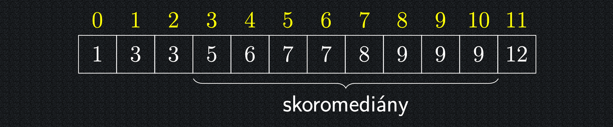

## Hledání k-tého nejmenšího prvku v neseřazené posloupnosti

- Při použití metody Rozděl a Panuj se někdy ukáže, že některé z
  částí, na které jsme vstup rozdělili, nemusíme vůbec zpracovávat.
- Typickým příkladem je rekurzivní popis řešení problému nalezení
  k-tého nejmenšího prvku v neseřazené posloupnosti.

!!! Implication "Problém"

    Na vstupu je neseřazená posloupnost $X$ o velikosti $n$ prvků a číslo $k$,
    $k ≤n$. Cílem je najít $k$-tý nejmenší prvek v $X$.

- Samozřejmě, že lze problém triviálně vyřešit seřazením
  posloupnosti v čase $O(n \log{n}).$
- Elegance následujícího řešení spočívá v tom, že problém řeší
  **řádově rychleji bez nutnosti vstupní posloupnost seřadit**.

---

## Idea rychlého algoritmu výběru QuickSelect

- Vybereme ze vstupní posloupnosti $X$ nějaký prvek, tzv. **pivot**.
- Vstupní posloupnost poté rozdělíme na tři části:
    - na **levou** část $L$, do které přesuneme prvky menší než pivot,
    - na **prostřední** část $S$, do které přesuneme prvky rovné pivotovi,
      a
    - na **pravou** část $P$ , do které přesuneme prvky větší než pivot.
- Kdybychom posloupnost hypoteticky seřadili, bude tvořena
  nejdříve seřazenou částí $L$, pak všemi prvky z $S$ a konečně
  seřazenou částí $P$ . Z toho okamžitě dostáváme algoritmus:

!!! Implication "Pozorování"

    - Je-li $k ≤|L|$, je hledaný prvek $k$-tý nejmenší prvek v části $L$.
    - Je-li $|L|< k ≤|L|+ |S|$, je hledaný prvek roven pivotovi.
    - Je-li $k > |L|+ |S|$, je hledaný prvek $(k −|L|−|S|)$-tý nejmenší
    prvek v části $P$.

<a id="algo-8.4"></a>
!!! Algorithm "8.4 QuickSelect"

    ```math title="QuickSelect(x1, . . . , xn; k):"
    Pokud n = 1: vrať x1 a skonči
    p := některý z prvků x1, . . . , xn //pivot
    L := prvky z x1, . . . , xn, které jsou menší než p
    S := prvky z x1, . . . , xn, které jsou rovny p
    P := prvky z x1, . . . , xn, které jsou větší než p
    Pokud k ≤|L|: vrať QuickSelect(L, k)
    Jinak pokud k ≤ |L| + |S|: vrať p
    Jinak: vrať QuickSelect(P, k − |L| − |S|)
    ```

---

## Volba pivota pro nejhorší časovou složitost

- Rozdělení vstupní posloupnosti na $L, S, P$ trvá lineární čas.
- Pak se QuickSelect rekurzivně zavolá na část $L$ nebo $P$.
- O kolik bude tato část menší než $n$, to závisí zejména na **hodnotách ve vstupní posloupnosti** a na **způsobu výběru
  pivota**.
- Příklad scénáře vedoucího na **nejhorší** časovou složitost:

    - Zvolíme-li pivota jako největší prvek vstupu, bude $\lvert L \rvert = n - 1$.
    - Pokud navíc bude $k = 1$, bude se QuickSelect rekurzivně volat právě na $L$.
    - To se v nejhorším případě může opakovat, takže celková časová složitost v nejhorším případě bude:
      $\Theta(n) + \Theta(n - 1) + \cdots + \Theta(1) = \Theta(n^2).$
    - V dalším si ukážeme, jak můžeme pomocí randomizace pravděpodobnost tohoto scénáře minimalizovat.

---

## Volba pivota pro lepší časovou složitost

- Příklad scénáře vedoucího na **nejlepší** časovou složitosti:
    - Ideální volbou pivota by byl medián dané (pod)posloupnosti.
        - $\lvert L \rvert$ i $\lvert P \rvert$ by byla **nejvýše** $\lfloor n/2 \rfloor$ (
          neboť $\lvert S \rvert \geq 1$) a délky podposloupností by v rekurzi exponenciálně rychle klesaly.
        - Pokud bychom medián dokázali najít v lineárním čase, bude čas:

$$\Theta(n) + \Theta(n/2) + \Theta(n/4) + \cdots + \Theta(1) = \Theta(n).$$

- K tomuto ideálnímu řešení se můžeme **přiblížit** tak, že místo mediánu použijeme tzv. **skoromedián**.

    - Skoromedián je prvek, který leží **kdekoli v prostředních dvou čtvrtinách seřazené** posloupnosti.
    - Skoromedián bude tedy mít nalevo i napravo vždy nejvýše $\frac{3}{4} \cdot n$ prvků.
    - Velikost vstupu bude tedy i v nejhorším případě opět exponenciálně klesat, byť pomaleji:
      $O(n) + O\left(\frac{3}{4} \cdot n\right) + O\left(\left(\frac{3}{4}\right)^2 \cdot n\right) + \cdots + O(1),$
      což je opět geometrická řada se součtem $O(n)$.

---

## Jak hledat skoromedián?

- Pro libovolnou vstupní posloupnost platí z definice, že **nejméně
  polovina** jejích prvků jsou skoromediány, viz malý příklad níže.

{ align=center }

- Pokud budeme pivota vybírat **náhodně**, je **pravděpodobnost
  výběru skoromediánu nejméně 1/2**.
- Pro ověření, že náhodně vybraný prvek je skoromedián, je třeba
  celou posloupnost projít, tedy lineární čas.
- Dostáváme tak hezkou ukázku užitečné a efektivní randomizace
  algoritmu.

---

## Popis QuickSelectu s náhodným výběrem pivota

- Nalezneme skoromedián neseřazené posloupnosti $n$ prvků:<br>
    1) Vybereme **rovnoměrně náhodně** jeden z prvků posloupnosti
       ($O(1)$ čas).<br>
    2) Ověříme, je-li vybraný prvek skoromedián ($Θ(n)$ čas).<br>
    3) Pokud ne, celý postup opakujeme.<br>
- Protože pravděpodobnost, že se náhodným výběrem strefíme do
  skoromediánu, je nejméně $1/2$, potřebujeme k nalezení
  skoromediánu **ve střední hodnotě $2$ pokusy**.
- To vyplývá z **Věty o opakování nezávislých pokusů** z minulé
  přednášky: Uvažujme sérii **nezávislých** pokusů, ve kterých
  sledujeme, zda nastal nějaký jev $J$. Pravděpodobnost, že
  nastane, je v každém pokusu rovna $p$. Pak **pořadí** pokusu, ve
  kterém jev $J$ nastal **poprvé**, je ve střední hodnotě $1/p$.
- Počet pokusů v nejhorším případě samozřejmě neumíme nijak
  omezit, ale pravděpodobnost, že se do skoromediánu **nebudeme**
  opakovaně strefovat, bude s počtem pokusů klesat k nule.

<a id="algo-8.5"></a>
!!! Algorithm "8.5 RandomQuickSelect"

    ```math title="RandomQuickSelect(x1, . . . , xn; k):"
    Pokud n = 1: vrať x1 a skonči
    p := xrandom(1,n) //pivot
        Pokud p není skoromedián v x1, . . . , xn:
    jdi zpět na řádek (2)
    L := prvky z x1, . . . , xn, které jsou menší než p
    S := prvky z x1, . . . , xn, které jsou rovny p
    P := prvky z x1, . . . , xn, které jsou větší než p
    Pokud k ≤ |L|: vrať RandomQuickSelect(L, k)
    Jinak pokud k ≤ |L| + |S|: vrať p
    Jinak: vrať RandomQuickSelect(P, k − |L| − |S|)
    ```

---

## Časová složitost RandomQuickSelect

<a id="theorem-8.5"></a>
!!! Theorem "Věta 8.5 Časová složitost RandomQuickSelect"

    ### Časová složitost RandomQuickSelect {#theorem-8.5}
    Střední hodnota počtu výpočetních operací vykonaných algoritmem
    **RandomQuickSelect$(x_1, . . . , x_n; k)$** s náhodným výběrem pivota je $O(n)$.

??? Proof "Důkaz Věty 8.5"

    - Rozdělíme běh algoritmu **RandomQuickSelect** na fáze podle
    hloubky rekurze.
    - V každé fázi zvolíme náhodně pivota, což zahrnuje ověření v
    lineárním čase, že se jedná o skoromedián. Pak provedeme v
    lineárním čase rozdělení na $L, S, P$ a pokud neskončíme,
    přejdeme do další rekurzivní fáze s $L$ nebo $P$ na vstupu.
    - ...
    - Během každé fáze se vstup zmenší nejméně o čtvrtinu.
    - V $i$-té fázi je tedy na vstupu nejvýše $(3/4)^{i-1} n$ prvků.
    - Definujme náhodnou veličinu $T_i = \text{počet výpočetních operací (přesunů, porovnání, atp)}$ $i$-té fáze.
    - Pak platí: 
        $E[T_i] ≤ (3/4)^{i−1} Θ(n)·E$[# pokusů k nalezení skoromediánu]
        $≤ (3/4)^{i−1} Θ(n)·2$.
    
    - Náhodná veličina celkového počtu operací algoritmu $T$ je tedy:
    $T = T_1 + T_2 + \cdots + T_\ell$, kde $\ell = \Theta(\log n)$.
    
    - Využitím linearity střední hodnoty:
    $E[T] = E[T_1 + \cdots + T_\ell] = E[T_1] + \cdots + E[T_\ell] \leq \sum_{i=1}^\ell (3/4)^{i-1} \Theta(n) = \Theta(n)$.
    
    - Tedy i v nejhorším případě skoromediánu na hranicích vnitřních dvou čtvrtin vstupní posloupnosti je střední hodnota počtu výpočetních operací $O(n)$, což je optimální složitost.

---

## Dva přístupy k randomizaci QuickSelectu

- Algoritmus RandomQuickSelect poskytuje ve střední hodnotě
  optimální časovou složitost pro **libovolné** vstupní posloupnosti
  tím, že pivot se vybírá **náhodně** a při tom o vstupní
  posloupnosti **nic nepředpokládáme**.
- Uvažme obrácený přístup: Předpokládejme, že jako pivota vždy
  volíme **deterministicky** prvek na **fixní** (např. první) pozici, **ale**
  že vstupní pole jsou **dokonale náhodné** posloupnosti, čili každá
  permutace bude vstupem s pravděpodobností $1/n!$.
- Průměrná časová složitost QuickSelectu bude průměrem
  časových složitostí běhu algoritmu přes všech $n!$ vstupů.
- Pro praktickou implementaci bychom potřebovali umět dokonale
  náhodně permutovat vstupní posloupnosti. To zde popsáno
  nebude.
- Naznačíme si teď důkaz, že takto definovaná složitost je opět
  $O(n)$.

<a id="theorem-8.6"></a>
!!! Theorem "Věta 8.6"

    ### Deterministický QuickSelect s náhodnými vstupy {#theorem-8.6}
    Uvažujme na vstupu rovnoměrně náhodnou permutaci ${1, . . . , n}$.
    Jako pivota volíme prvek na první pozici. Potom střední hodnota
    počtu operací vykonaných při jednom běhu algoritmu je $O(n)$.

??? Proof "Hlavní myšlenka důkazu Věty 8.6"

    - Vzhledem k náhodnosti vstupu je první prvek rovnoměrně
    náhodně vybrané číslo z množiny ${1, 2, . . . , n}$.
    - S pravděpodobností $1/2$ se tedy trefíme do skoromediánu vstupu.
    - Po rozdělení vstupu na levou a pravou část budou obě části opět
    náhodné permutace, na nichž se algoritmus chová stejně.
    - Lze tedy použít stejnou analýzu jako u RandomQuickSelectu s
    tím rozdílem, že hloubka zanoření rekurze bude ve střední
    hodnotě dvojnásobná a v průměru každé dvě hladiny sníží
    velikost problému na aspoň $3/4$ předchozí.
