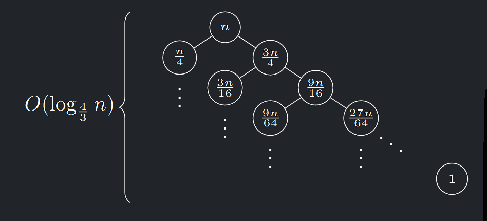
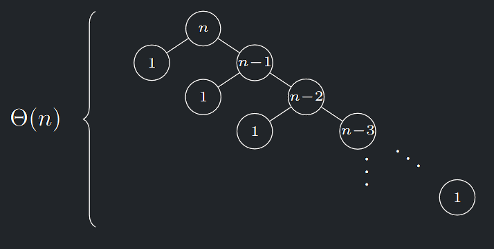

---

### I. Správná volba pivotu

Pokud za pivoty volíme mediány nebo alespoň skoromediány, pak:

- Velikosti podproblémů klesají exponenciálně: na $i$-té hladině
SRV je velikost většího z $L \text{ , } P$ nejvýše $(\frac{3}{4})^{i} · n$
- SRV má tudíž hloubku $O(log_{\frac{4}{3}} n) = O (logn)$
- V součtu přes všechny hladiny proto časová složitost činí $O(n log n)$

{ align=center }
/// caption
Složitost při správné volbě pivotu
///

---

### II. Špatná volba pivotu

Jestliže naopak volíme tím nejhorším způsobem, např. jako
minima podposloupností na každé hladině SRV, pak:

- Se na každé hladině oddělí od vstupu jen úsek o jednom prvku
- Hladin bude $\Theta (n)$
- To povede na **kvadratickou** časovou složitost.

{ align=center }
/// caption
Složitost při špatné volbě pivotu
///

---

## Analýza časové složitosti QuickSortu s náhodnou volbou pivota

- Zanalyzujeme nyní variantu **QuickSortu**, ve které budeme v každé fázi volit pivota **náhodně** jako jeden z prvků na vstupu.
- To uděláme podobně jako u **QuickSelectu**

!!! Implication "Pozorování"

    **QuickSort** porovná jednu dvojici prvků nejvýše jednou.
    Na každé porovnání provede **QuickSort** pouze $O(1)$ dalších operací.
    Proto pro řádový odhad jeho složitosti postačí odhadnout počet
    provedených porovnání.

!!! Theorem "Věta 9.1 (o složitosti QuickSortu s náhodnou volbou pivota)"

    ### Věta o složitosti QuickSortu s náhodnou volbou pivota {#theorem-9.1}

    Střední hodnota časové složitosti **QuickSortu** s rovnoměrně náhodnou volbou pivota je $O(n log n)$

!!! Definition "Definice 9.1 (Indikátory)"

    ### Indikátory {#definition-9.1}

    Náhodným veličinám, které nabývají hodnoty 0 nebo 1 podle toho, zda nějaká událost nastala, se obvykle říká indikátory.

    Pro střední hodnotu indikátoru $X$ tedy platí:

    $$
    EX = 0 · P[X = 0] + 1 · P[X = 1] = P[X = 1]
    $$

!!! Implication "Příklad"

    Vezměme náhodné $b$-bitové binární číslo.
    Pro $i$-tý bit zavedeme náhodnou proměnnou $X_{i}$, nabývající hodnoty tohoto bitu.
    
    Potom $E[X_{i}] = \frac{1}{2}$ a $E[X] = E[X_{1} + · · · + X_{b}] = \frac{b}{2}$

!!! Theorem "Věta 9.2 (o linearitě střední hodnoty)"

    ### Věta o linearitě střední hodnoty {#theorem-9.2}

    Nechť $\alpha$ a $\beta$ jsou reálná čísla a nechť $X$ a $Y$ jsou náhodné veličiny.
    
     
    Potom:
    
    $$
    E[\alpha X + \beta Y ] = \alpha E[X] + \beta E[Y]
    $$

!!! Theorem "Lemma (součet harmonické řady)"

    Pro součet harmonické řady $H_{n} = \frac{1}{1} + \frac{1}{2} + · · · + \frac{1}{n}$ platí $H_{n} = \Theta(log n)$

??? Proof "Důkaz (viz. BI-MA1)"

    $$
    \frac{1}{n} + ln(n) \leq \sum_{k=1}^{n}{\frac{1}{k}} \leq 1 + ln(n)
    $$

---

## Důkaz věty o analýze QuickSortu – shrnutí

- **Vstupní posloupnost** $X = x_{1}, x_{2}, . . . , x_{n}$
- **Výstupní posloupnost** $Y = y_{1}, . . . , y_{n}$ - tedy seřazená posloupnost

Budeme určovat střední počet porovnání v průběhu **Quicksort**

- Protože pivota volíme náhodně, je porovnání $y_{i}$ s $y_{j}$ náhodný jev.
Pro $1 \leq i \lt j \leq n$ zavedeme náhodné veličiny $C_{ij}$ takto:

$$
C_{ij} =
\begin{cases} 
1 & \text{pokud během řazení došlo k porovnání } y_{i} \text{ s } y_{j} \\
0 & \text{jinak}  
\end{cases}
$$

Poté určíme, že: 

$$
P[C_{ij} = 1] = \frac{2}{(j − i + 1)} \text{ a}
$$

$$
E[C] = E[ \sum_{1 \leq i \lt j \leq n}^{n}{ C_{ij}} ] = O(n log n)
$$

Tím bude důkaz hotov.

---

!!! Theorem "Lemma"

    Pro $1 \leq i \lt j \leq n$ platí $E[C_{ij} ] = P[Cij = 1] = \frac{2}{(j − i + 1)}$

??? Proof "Důkaz"

    1. Určeme pravděpodobnost porovnání $y_{i}$ s $y_{j}$ , čili $P[C_{ij} = 1]$
    2. **QuickSort** porovnává prvky pouze s pivotem, takže jeden z prvků $y_{i}$, $y_{j}$ se těsně před porovnáním musí stát pivotem.
    3. Současně ale žádný prvek z $y_{i+1}, . . . , y_{j−1}$ ještě pivotem být nemohl, jinak by $y_{i}$ a $y_{j}$ patřily do různých částí posloupnosti a nemohly by být porovnány.
    4. Jinými slovy, $C_{ij} = 1$ právě tehdy, když se z prvků $y_{i}, y_{i+1}, . . . , y_{j}$ stane pivotem jako první buď $y_{i}$ nebo $y_{j}$
    5. Protože pivota vybíráme náhodně, může být každý z prvků $y_{i}, . . . , y_{j}$ vybrán se stejnou pravděpodobností $\frac{1}{(j − i + 1)}$
    6. Proto $P[C_{ij} = 1] = \frac{2}{(j − i + 1)}$

---

!!! Theorem "Důkaz věty o analýze QuickSortu"

    ### Důkaz věty o analýze QuickSortu {#proof-9.1}
    
    
    Definujme náhodnou veličinu $C$ jako celkový počet všech porovnání provedených během běhu **QuickSortu**  

    Pak $C = \sum_{1 \leq i \lt j \leq n}{C_{ij}}$
    
    Pro střední hodnotu celkového počtu porovnání provedených během běhu QuickSortu tak dostaneme: 

    $$
    E[C] = \sum_{1 \leq i \lt j \leq n}{\frac{2}{j - i + 1}} = 2 \sum_{d=1}^{n-1}{} \sum_{i=1}^{n-d}{\frac{1}{d+1}}
    $$

    substitucí $j − i = d$, čili $1 \leq d \leq n − 1, i \geq 1$ a $i \leq n − d$, a tedy:

    $$
    E[C] \lt 2 \sum_{d=1}^{n-1}{} \sum_{i=1}^{n-1}{\frac{1}{d+1}} = 2(n-1) \cdot \sum_{d=1}^{n-1}{\frac{1}{d+1}} < 2n \cdot \sum_{d^{'} = 2}^{n}{\frac{1}{d^{'}}}
    $$

    Na odhad poslední sumy nyní použijeme lemma o součtu harmonické řady, tedy:

    $$
    E[C] \lt 2n \cdot \Theta (log n) = O(n \cdot log n)
    $$  

---

### Složitost QuickSortu v průměru přes vstupy

- Pokud se bere pivot z pevné pozice (např. prostřední prvek), není **QuickSort** odolný proti zlomyslnému uživateli, který umí konstruovat vstupní posloupnosti, kde na tyto pozice dává nejhorší pivoty (např. minima) a vnutí kvadratickou složitost.
- Bez důkazu uveďme, že i pro pevnou volbu pivota je ale "špatných" vstupů (vedoucích na $\omega (n \cdot log n)$ složitost) málo
- Již jsme si vysvětlili, že tomu se vyhneme **náhodnou** volbou pivota, tedy **randomizací**
- Stejně jako v minulé přednášce u **QuickSelectu**, můžeme i pro **QuickSort** zavést složitost v průměru přes vstupy
- QuickSort bude deterministicky vybírat pivota z pevné pozice.
- Na vstup mu ale budeme **dávat náhodné posloupnosti** a budeme počítat, jak dlouho v průměru poběží.

---

### Deterministický QuickSort s náhodnými vstupy

!!! Theorem "Věta 9.3 (o střední hodnotě počtu operací quicksortu)"

    ### Věta o střední hodnotě počtu operací quicksortu {#theorem-9.3}

    Uvažujme na vstupu rovnoměrně náhodné permutace $\{1, . . . , n\}$
    Jako pivota volíme vždy prvek např. na prostřední pozici. Potom
    střední hodnota počtu operací vykonaných při jednom běhu
    QuickSortu je $O(n \cdot log n)$

!!! Implication "Hlavní myšlenka důkazu"

    Vzhledem k náhodnosti vstupu je prostřední prvek rovnoměrně
    náhodně vybrané číslo z množiny $\{1, 2, . . . , n\}$
    Lze tedy použít obdobnou analýzu jako ve Větě o složitosti
    **QuickSortu** s náhodnou volbou pivota.
