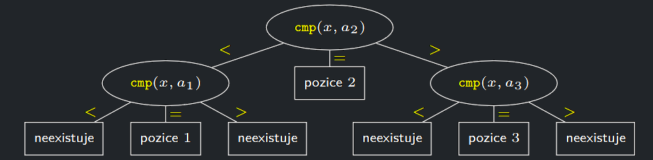

- Nacházení dolních mezí složitosti různých problémů jsou obecně obtížná.
- Dolní meze složitosti si v této přednášce ukážeme na dvou problémech:

    - **problém vyhledávání** v seřazené číselné posloupnosti a
    - **problém řazení** neseřazené číselné posloupnosti.

- Dolní meze složitosti budeme určovat za následujících předpokladů:

    - Algoritmy pracují v porovnávacím modelu **RAM**, kde smějí vstupní prvky pouze vzájemně porovnávat a případně
      přesouvat.
    - Porovnání cmp($a_{i}$, $a_{j}$ ) je binární operace, která v konstantním
      čase pro dva prvky $a_{i}$ a $a_{j}$ odpoví, zda platí $a_{i} \le a_{j}$ , $a_{i} = a_{j}$
      nebo $a_{i} \gt a_{j}$
    - Uvažujeme pouze deterministické algoritmy, které nepoužívají
      žádný zdroj náhody a jejichž každý krok je jednoznačně určen
      výsledky kroků předchozích.

## Dolní mez složitosti vyhledávání

!!! Definition "Definice 9.2 (Problém vyhledávání v seřazené posloupnosti)"

    ### Problém vyhledávání v seřazené posloupnosti {#definition-9.2}

    - Vstupem algoritmu je číslo $n$, vzestupně seřazená posloupnost $A$ $n$ čísel $a_{1}, . . . , a_{n}$ a hledané číslo $x$
    - Úkolem algoritmu je zjistit, zda se $x$ vyskytuje v $A$

!!! Theorem "Věta 9.4 (o složitosti vyhledávání)"

    ### Věta o složitosti vyhledávání {#theorem-9.4}

    Každý deterministický algoritmus v porovnávacím modelu **RAM**,
    který řeší problém vyhledávání v seřazené posloupnosti, použije v
    nejhorším případě $\Omega (log n)$ porovnání.

Jinými slovy: žádný deterministický algoritmus v porovnávacím modelu **RAM**
nemůže v nejhorším případě nalézt dané číslo v $n$-prvkové seřazené posloupnosti použitím $o(log n)$ operací porovnání.
To ale znamená, že známé binární vyhledávání s $O(log n)$ srovnáními je optimální algoritmus pro vyhledávání.

??? Proof "Důkaz věty 9.4"

    1. Dokážeme, že pro libovolný deterministický vyhledávací algoritmus $S$ a pro libovolné n a pro libovolnou vstupní vzestupně seřazenou posloupnost 
    $A = a_{1} \lt a_{2} \lt · · · \lt a_{n}$ existuje $x$ takové, že algoritmus $S$ při hledání $x$ v posloupnosti $A$ provede $\Omega (log n)$ porovnání.
    2. První porovnání, které algoritmus $S$ se vstupem $A$ provede, bude vždy stejné, neboť je deterministický.
    3. Porovnání typu cmp($a_{i}$, $a_{j}$ ) dopadne také vždy stejně. 
    4. Až první porovnání typu cmp($x$, $a_{i}$) může pro různá vstupní $x$ dopadnout různě.
    5. Pro každý z možných výsledků tohoto porovnání pokračuje $S$ deterministicky, takže algoritmem $S$ je pevně dáno, které další porovnání se provede.
    6. A tak dále, až se $S$ zastaví s výsledkem buď $x \in A$ nebo $x \notin A$
    7. Protože $S$ je deterministický algoritmus, můžeme jeho provedení se vstupem $A$ pro všechna možná $x$ popsat takzvaným rozhodovacím stromem $T_{S,A}$
    
        - Každý vnitřní vrchol rozhodovacího stromu $T_{S,A}$ je porovnání typu cmp($x$, $a_{i}$) a má tedy obecně tři syny, kteří odpovídají možným výsledkům tohoto porovnání (<, =, >).
        - Může se stát, že některý z výsledků nemůže vzniknout, protože by byl ve sporu s dříve provedenými porovnáními. V takovém případě příslušný syn neexistuje (je prázdný).
        - V listech $T_{S,A}$ jsou jednotlivé výsledky hledání: buď pozice v $A$, na které se $x$ vyskytuje, nebo odpověď, že $x$ v $A$ neexistuje. Každé možné provedení algoritmu $S$ se vstupem $A$ pro nějaké $x$ odpovídá nějaké cestě z kořene $T_{S,A}$ do listu.
    
    8. Rozhodovací strom $T_{S,A}$ je tedy **ternární** (vrcholy mají nejvýše 3 syny) s nejméně $n + 1$ listy (lze dokázat, že má alespoň $2n + 1$ listů, ale my si vystačíme s $n + 1$ listy).
    9. Protože každý ternární strom hloubky $h$ má nejvýše $3^{h}$ listů, má $T_{S,A}$ hloubku nejméně $log_{3}n$.
    10. V $T_{S,A}$ tedy existuje cesta délky nejméně $log_{3}n$ a proto existuje $x$, které této cestě odpovídá.
    11. A takové $x$ „donutí“ $S$ vykonat nejméně $log_{3}n$ porovnání

{ align=center }
/// caption
Příklad rozhodovacího strom $T_{S,A}$ pro nějaký algoritmus $S$ a nějaký vstup $A$ délky $n = 3$
///

---

## Dolní mez složitosti řazení v porovnávacím modelu

