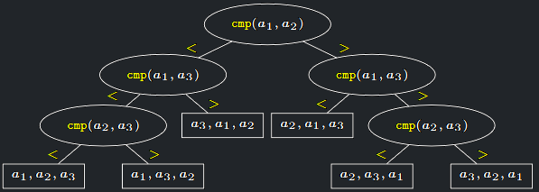

### Dolní mez složitosti řazení v porovnávacím modelu

<a id="def-9.3"></a>
!!! Definition "Definice 9.3 (Problém řazení)"

    ### Problém řazení {#def-9.3}

    - **Vstup**: Číslo $n$ a posloupnost čísel $A = a_{1}, a_{2}, . . . , a_{n}$.
    - **Výstup**: Taková permutace $A^{′} = a_{1}^{′}, a_{2}^{′}, . . . , a_{n}^{′}$ vstupní posloupnosti A, <br>
    že platí $a_{1}^{′} \leq a_{2}^{′} \leq ... \leq a_{n}^{′}$

- Podobně jako u vyhledávání, si v porovnávacím modelu odvodíme **těsnou** dolní mez složitosti problému řazení.
- Tedy asymptoticky nepodkročitelnou složitost řešení, kterou ale některé známé algoritmy (HeapSort, MergeSort,
  QuickSort) asymptoticky dosahují, a jsou tedy **optimální**

<a id="def-9.4"></a>
!!! Definition "Definice 9.4 (Invariant)"

    ### Invariant {#def-9.4}

    Invariant je podmínka v **algoritmu**, která musí být splněna po celou dobu běhu programu.

!!! Implication "Příklad invariantu"

    ```cpp
    int i = 0;
    while( i < 10 ) {
        i++;
    }
    // i = 10
    ```

    Invariantem zde je podmínka $0 \le i \le 10$

---

## Dolní mez složitosti řazení

- Pro účel stanovení dolní meze předpokládáme speciální typ vstupní $n$ prvkové posloupnosti, a to permutaci
  množiny $\{1, . . . , n\}$
- Problém řazení je z pohledu teorie informace ekvivalentní problému rozpoznání, o kterou permutaci z $n!$ možných se na
  vstupu jedná.
- Různé vstupní permutace je přitom třeba řadit různými posloupnostmi porovnání a prohození.
- Víme, že $e \cdot \frac{n^{n}}{e^{n}} \leq n! \leq en \cdot \frac{n^{n}}{e^{n}}$ (viz BI-DML – Stirlingova formule).
- Počet potřebných bitů pro rozpoznání permutace, a tím pádem i potřebných porovnání, tedy musí
  být $log(n!) \geq log(e \cdot \frac{n^{n}}{e^{n}}) = log e + n \cdot (log n − log e) = \Omega (n \cdot log n)$
- Stanovit dolní mez složitosti řazení ale můžeme pomocí rozhodovacích stromů podobně jako u problému vyhledávání.

---

<a id="theorem-9.5"></a>
!!! Theorem "Věta 9.5 (o složitosti řazení)"

    ### Věta o složitosti řazení {#theorem-9.5}

    Každý deterministický algoritmus v porovnávacím modelu **RAM**, který seřadí $n$-prvkovou posloupnost, použije v nejhorším případě $\Omega(n \cdot log n)$ porovnání.

??? Proof "Důkaz věty 9.5"

    1. Zvolme pevné $n$ a uvažujme vstupy $A = a_{1}, . . . , a_{n}$, které jsou permutacemi množiny $\{1, . . . , n\}$
    2. Ukážeme, že pro libovolný řadicí algoritmus $S$ v porovnávacím modelu **RAM existuje** „těžký“ vstup $A$, který „donutí“ $S$ provést $\Omega (n \cdot log n)$ porovnání.
    3. Upravíme $S$ tak, aby nejprve prováděl všechna porovnání a teprve na konec prvky přeindexoval.
    
        - Každý prvek si tedy pouze pamatuje průběžně novou pozici a na výslednou pozici se přesune až nakonec.
    
    4. Sestrojíme rozhodovací strom $T_{S}$ popisující všechny možné průběhy algoritmu $S$, tedy běhy pro všechny možné permutace.
    5. Vnitřní vrcholy $T_{S}$ jsou porovnání cmp($a_{i}$, $a_{j}$ ) se dvěma možnými výsledky (rovnost tentokrát nenastane díky volbě vstupní posloupnosti).
    6. Vynecháme výsledky, které jsou ve sporu s předchozími porovnáními.
    7. V listu stromu algoritmus S provede napočítané prohození a zastaví se.
    8. Pro různé vstupní permutace $A$ musí algoritmus $S$ skončit v různých listech $T_{S}$ (dvě různé permutace nelze seřadit toutéž posloupností přesunů prvků).
    9. $T_{S}$ je tedy binární zakořeněný strom s $n!$ listy, takže musí mít hloubku nejméně $log(n!)$, tedy $\Omega(n \cdot log n)$
    10. Proto musí existovat vstupní permutace A, pro kterou S provede $\Omega(n \cdot log n)$ porovnání

{ align=center }
/// caption
Příklad rozhodovacího stromu TS pro nějaký algoritmus S a n = 3
///

---

## Dolní meze složitosti dalších operací

!!! Implication "Důsledek"

    Každá korektní implementace operace **ExtractMin** v binární haldě(taková, že po provedení **ExtractMin** bude struktura splňovat podmínky haldy)
    s $n$ prvky musí mít časovou složitost $\Omega(log n)$ v nejhorším případě.

??? Proof "Důkaz"

    **Sporem:**
    
    1. Předpokládejme, že existuje algoritmus **ExtractMin** který má v nejhorším případě časovou složitost $O(f (n))$, kde $f (n) = o(log n)$
    2. Mějme prvky $a_{1}, . . . , a_{n}$ a uložme je do pole P
    3. Na toto pole zavolejme funkci **HeapBuild**, která z něj v čase $O(n)$ vytvoří korektní binární haldu.
    4. Potom zavolejme $n$-krát funkci **ExtractMin**, čímž vypíšeme seřazenou posloupnost.
    5. Dostáváme tím algoritmus, který seřadí n čísel v celkovém čase $n \cdot O(f (n)) = o(n log n)$
    6. To je ale spor s předchozí větou o složitosti problému řazení, která dokazuje, že takový algoritmus neexistuje.


