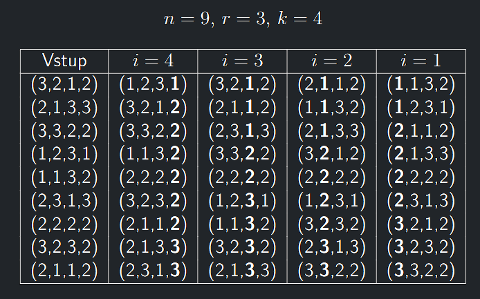

- Nyní si ukážeme dva algoritmy, které dokážou seřadit $n$ čísel v nejhorším případě rychleji než v
  čase $O(n \cdot log n)$
- Při tom to nebude ve sporu s dolní mezí složitosti problému řazení, protože tyto rychlejší algoritmy nepracují v
  porovnávacím modelu **RAM** (nejsou tedy postaveny na operaci porovnání), ale pro řazení využívají s výhodou nějakou
  speciální vlastnost vstupní posloupnosti.
- Nelze je tedy použít na seřazení obecné vstupní posloupnosti $n$ čísel.

---

<a id="def-9.5"></a>
!!! Definition "Definice 9.5 (Porovnávací model RAM)"

    ### Porovnávací model RAM {#def-9.5}

    V porovnávacím modelu RAM lze jen porovnávat a přesouvat prvky.
    Porovnávání je operace **CMP**($x,y$), ta je **konstantní** a **deterministická** a má 3 výstupy: $\lt, \gt, =$

## CountingSort

- CountingSort je algoritmus pro řazení $n$ celých čísel z množiny $\{1, . . . , r\}$
- Omezení rozsahu vstupních hodnot je právě tou speciální vlastností.
- Nejdřív projde vstupní pole a spočítá pro každé číslo z množiny $\{1, . . . , r\}$, kolikrát se ve vstupním poli
  vyskytuje (tedy vypočte histogram).
- Nad tímto polem počtů výskytů pak vypočte prefixovým součtem pozice, kde budou po seřazení začátky oblastí tvořených
  stejnými čísly z množiny $\{1, . . . , r\}$.
- A jako poslední krok prochází podruhé vstupní pole, pro každý jeho prvek určí pozici, na které se má nacházet po
  seřazení a na tuto pozici jej přesune.

Řadí tedy v čase $\Theta (n + r)$ s paměťovou náročností $\Theta(n + r)$

<a id=algo-9.2></a>
!!! Algorithm "Algoritmus 9.2 (CountingSort)"

    ### Algoritmus CountingSort {algo-9.2}

    ```math title="CountingSort(x1, . . . , xn ∈ {1, . . . , r})"
    Pro j := 1, . . . , r:
        pocet[j] := 0
    Pro i := 1, . . . , n:
        pocet[xi] := pocet[xi] + 1 //histogram výskytů
    zacatek[1] := 1
    Pro j := 2, . . . , r: //prefixový součet
        zacatek[j] := zacatek[j − 1] + pocet[j − 1]
    Pro i := 1, . . . , n:
        vystup[zacatek[xi]] := xi //přesun na spočítané pozice
        zacatek[xi] := zacatek[xi] + 1
    Vrať výsledek vystup[1], . . . , vystup[n]
    ```

---

### Vlastnosti algoritmu CountingSort

!!! Implication "Pozorování"

    - Algoritmus **CountingSort** korektně řadí celá čísla z množiny $\{1, . . . , r\}$ a **je stabilní**
    - CountingSort není in-place ani **není datově citlivý**
    - Protože časová složitost je $\Theta (n + r)$, říkáme, že pro $r = O(n)$ má **CountingSort** lineární složitost.

---

## Lexikografické řazení k-tic

- Mějme $n$ uspořádaných $k$-tic $X_{1}, . . . , X_{n}$ prvků z množiny $\{1, . . . , r\}$ (
  čili $X_{i} \in \{1, . . . , r\}^{k})$
- Souřadnice $k$-tic číslujeme zleva doprava od jedné: $X_{i} = (x_{i,1}, x_{i,2}, . . . , x_{i,k})$
- Úkolem je seřadit $k$-tice slovníkově (lexikograficky).
- Využijeme toho, že **CountingSort** je stabilní, a řadíme takto:

<a id=algo-9.3></a>
!!! Algorithm "Algoritmus 9.3 (LexCountingSort)"

    ### Algoritmus LexCountingSort {algo-9.3}

    ```math title="LexCountingSort(k-tice X1, . . . , Xn)"
    S := X1, . . . , Xn
    Pro i := k, . . . , 1:
        S := CountingSort(S) podle souřadnice i
    Vrať S
    ```

- Na stejném principu je založený algoritmus **RadixSort** pro řazení víceciferných čísel (viz cvičení).

---

### Příklad běhu algoritmu LexCountingSort

V jednotlivých sloupcích je pořadí čísel po provedení příslušné iterace $i$-smyčky algoritmu.

{ align=center }
/// caption
Příklad běhu algoritmu LexCountingSort
///

---

### Korektnost algoritmu LexCountingSort

<a id="theorem-9.6"></a>
!!! Theorem "Věta 9.6 (o korektnosti algoritmu LexCountingSort)"

    ### Věta o korektnosti algoritmu LexCountingSort {#theorem-9.6}

    Algoritmus **LexCountingSort** řadí vstupní $k$-tice správně lexikograficky a je **stabilní**

??? Proof "Důkaz věty 9.6"

    Dokážeme indukcí přes číslo souřadnice následující invariant:
    > Po provedení iterace cyklu s číslem $i$ platí, že vstupní pole $k$-tic
    > ořezaných na $i\text{-tou}$ až $k\text{-tou}$ souřadnici je lexikograficky seřazené.
    
    1. **IZ**: Platí evidentně pro první iteraci s $i = k$, kdy v $S$ jsou hodnoty seřazeny podle poslední souřadnice.
    2. **IK**: Předpokládejme, že invariant platí pro všechna $j, i \lt j \leq k$
    3. Řazení v iteraci s číslem $i$ posouvá dopředu v pořadí nejprve $k\text{-tice}$ mající na souřadnici $i$ hodnotu 1, pokud existují.
    4. Protože tyto $k-\text{tice}$ oříznuté na $(i + 1)\text{-tou}$ až $k\text{-tou}$ souřadnici byly v předchozích iteracích seřazeny správně a **CountingSort**
    je stabilní, bude tato skupina $k\text{-tic}$ oříznutých na $i\text{-tou}$ až $k\text{-tou}$ souřadnici také seřazena správně
    5. Pak bude podobným způsobem případně následovat skupina $k\text{-tic}$, majících na souřadnici $i$ hodnotu 2, pak 3, atd
    6. Po skončení iterace cyklu s číslem $i$ budou tedy $k\text{-tice}$ oříznuté na $i\text{-tou}$ až $k\text{-tou}$ souřadnici seřazeny správně

---

### Složitost algoritmu LexCountingSort

!!! Theorem "Věta o složitosti algoritmu LexCountingSort"

    - Časová složitost **LexCountingSort** je $\Theta(k \cdot (n + r))$, což je lineární s délkou vstupu $(k \cdot n)$ pro pevné $k$ a $r$
    - Paměťová složitost činí $\Theta(kn + r)$
