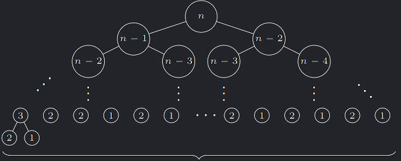
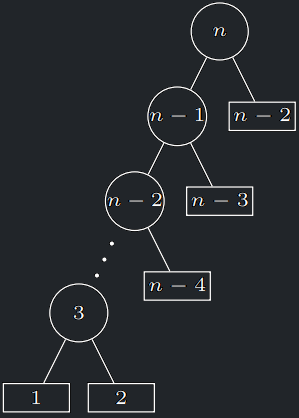

<a id="algo-10.1"></a>
!!! Algorithm "Algoritmus 10.1 (FibRec)"

    ```python
    FibRec(n)
        Pokud n ≤ 2: Vrať 1
        Jinak: Vrať FibRec(n − 1) + FibRec(n − 2)
    ```

!!! Implication "Pozorování"

    Časová složitost volání funkce `FibRec(n)` je $\Theta(F(n))$, kde $F(n)$ je $n$-té Fibonacciho číslo, <br>
    tedy $\Theta(\Phi^{n+1})$, kde $\Phi \approx 1,61$ je hodnota **zlatého řezu**.

??? Proof "Důkaz časové složitosti FibRec"

    - Ve stromu rekurzivních volání (SRV) je každý vrchol buďto list nebo vnitřní vrchol s přesně 2 syny (SRV je **plný binární strom**). 
    - Počet vnitřních vrcholů je tedy nejvýše počet listů.
    - Libovolný vnitřní vrchol vrací součet hodnot ze svých synů, neboli součet hodnot všech listů ležících pod ním.
    - Každý list přitom vrací hodnotu 1.
    - Celkem tedy SRV obsahuje **přesně** $F(n)$ listů.

    {style=display:block;margin-left:auto;margin-right:auto;}

---

## Výpočet Fibonacciho čísla - memoizace

- Použijeme tabulku $T$, na počátku obsahující **nedefinované** hodnoty.
- Hodnotu $F(i)$ zapíšeme do $T[i]$, jakmile na ni při provádění
  rekurzivního algoritmu poprvé narazíme a poprvé ji vypočteme.
- Při každém rekurzivním volání se nejdřív podíváme do políčka $T$,
  odpovídajícího danému podproblému, zda již neobsahuje dříve
  vypočtené řešení.
- Pokud ano, rekurzi nevoláme a vezmeme hodnotu z tabulky.
- Pokud ne, voláme rekurzi.
- Této technice se říká **memoizace**.

<a id="algo-10.2"></a>
!!! Algorithm "Algoritmus 10.2 (FibMem)"

    ```python
    FibMem(n)
        Pokud je T[n] definováno: Vrať T[n]
        Pokud n ≤ 2: T[n] := 1
        Jinak: T[n] := FibMem(n − 1) + FibMem(n − 2)
        Vrať T[n]
    ```

!!! Implication "Pozorování"

    Časová složitost volání funkce `FibMem(n)` je $O(n)$.

??? Proof "Důkaz časové složitosti FibMem"

    - K rekurzivnímu volání nyní dojde jedině tehdy, vyplňujeme-li dosud nedefinované políčko tabulky.
    - Protože na počátku jsou všechna políčka prázdná, stane se toto $n$-krát, z toho dvakrát triviálně pro 
    $F(1)$ a $F(2)$.
    - SRV má tedy $n − 2$ vnitřních vrcholů a tedy $n − 1$ listů.
    - Celkem tedy $O(n)$ vrcholů, kde v každém strávíme $O(1)$ čas

    {style=display:block;margin-left:auto;margin-right:auto;}

--- 

## Výpočet Fibonacciho čísla - iterace

- Všimněme si ale, že pokud tabulku $T$ budeme vyplňovat od
  nejmenších hodnot k největším, vůbec rekurzi nepotřebujeme a stačí
  jednoduchá iterace. (topologické uspořádání)

<a id="algo-10.3"></a>
!!! Algorithm "Algoritmus 10.3 (FibIter)"

    ```python
    FibIter(n)
        T[1] := 1
        T[2] := 1
        Pro k := 3,..., n:
        T[k] := T[k − 1] + T[k − 2]
        Vrať T[n]
    ```

!!! Implication "Pozorování"

    `FibIter(n)` funguje korektně a má časovou složitost $O(n)$.
