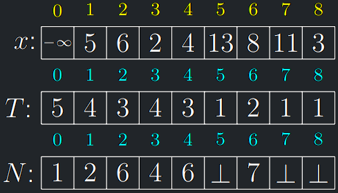
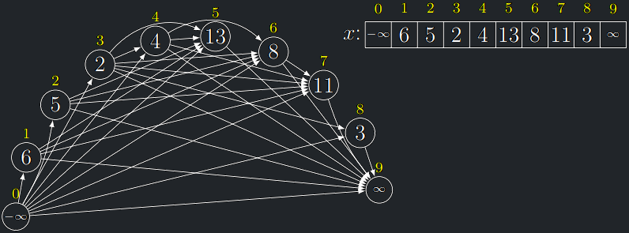

- Vyřešíme nejdřív jednodušší problém `DelkaNrpRec(i)`:
    - Pro dané $i$ vrátí **délku NRP začínající** právě prvkem $x_i$.
- Postupně projdeme všechna $x_j$ **potenciálně navazující** na $x_i$.
- Pro každé takové $x_j$ zavoláme **rekurzivně** totéž <br>
  (čímž vypočítáme délku NRP začínající prvkem $x_j$).
- Ze všech potenciálně navazujících prvků $x_j$ si pak vybereme ten,
  který má svou NRP nejdelší a k délce jeho NRP přičteme
  jedničku.

<a id="algo-10.4"></a>
!!! Algorithm "Algoritmus 10.4 (DelkaNrpRec)"

    ```python
    DelkaNrpRec(i)
        d := 1
        Pro j := i + 1,..., n:
            Pokud x_j > x_i:
                d := max(d, 1 + DelkaNrpRec(j))
    Vrať d
    ```

!!! Theorem "Lemma o časové složitosti DelkaNrpRec"

    Časová složitost `DelkaNrpRec(0)` je $O(2^n)$.

??? Proof "Důkaz časové složisti DelkaNrpRec"

    - Struktura SRV závisí na velikostech prvků vstupní posloupnosti,
    protože se rekurze volá pouze pro potenciálně navazující prvky.
    - Nejvíce se rekurze volá v případě monotonně rostoucí posloupnosti a
    pak má SRV tvar binomiálního stromu $B_n$
    - V obecném případě je SRV podstromem $B_n$

- Délku NRP celé vstupní posloupnosti získáme tak, že zavoláme
  `DelkaNrpRec(i)` postupně pro $i = 1,\dots, n$ a vezmeme maximum z výsledků.
- Elegantnější je ale dodefinovat $x_0 = -\infty$, zavolat pouze
  `DelkaNrpRec(0)` a odečíst z výsledku jedničku, neboť $x_0$ se
  bude v optimálním řešení NRP vždy zaručeně vyskytovat.

---

## Délka NRP - memoizace

- Pro snížení časové složitosti použijeme opět techniku memoizace.
- Zavedeme tabulku $T[0,\dots, n]$, na počátku prázdnou.
- Na konci má být v $T[i]$ uložena **délka nejdelší ze všech
  rostoucích podposloupností začínajících prvkem** $x_i$.

<a id="algo-10.5"></a>
!!! Algorithm "Algoritmus 10.5 (DelkaNrpMem)"

    ```python
    DelkaNrpMem(i)
        Pokud je T[i] definováno: Vrať T[i]
        T[i] := 1
        Pro j := i + 1,..., n:
            Pokud x_j > x_i:
                T[i] := max(T[i], 1 + DelkaNrpMem(j))
        Vrať T[i]
    ```

!!! Theorem "Lemma o časové složitosti DelkaNrpMem"

    - Funkci `DelkaNrpMem` můžeme zavolat pouze pro $n + 1$ různých argumentů.
    - Pokaždé v ní strávíme čas $O(n)$, takže celkový čas je $O(n^2)$.

---

## Délka NRP - iterace

- Pokud začneme vyplňovat tabulku v opačném směru od největšího $i$ k nejmenšímu, rekurze se můžeme zbavit úplně.

<a id="algo-10.6"></a>
!!! Algorithm "Algoritmus 10.6 (DelkaNrpIter)"

    ```python
    DelkaNrpIter(x1,...,xn)
        x_0 := −∞
        Pro i := n, n − 1,...,0:
            T[i] := 1
            Pro j := i + 1,...,n:
                Pokud x_i < x_j a T[i] < 1 + T[j]:
                    T[i] := 1 + T[j]
        Vrať T[0] − 1
    ```

!!! Implication "Pozorování"

    `DelkaNrpIter` má kvadratickou časovou složitost.

!!! Implication "Pozorování"

    Algoritmus se dá vylepšit (řádky 4 - 6) za pomocí augmentace AVL stromu <br> 
    a dostat se na složitost $O(n \cdot log(n))$ 

!!! Theorem "Lemma o korektnosti DelkaNrpIter"

    Po skončení `DelkaNrpIter` je v $T[i]$ uložena délka nejdelší ze všech
    rostoucích podposloupností začínajících prvkem $x_i$.

??? Proof "Důkaz korektnosti DelkaNrpIter"

    - Zpětnou indukcí podle $i$, tj. od $n$ k 1.
    - Pokud je na konci $T[i] = 1$, je $x_i$ maximem v $x_i,\dots, x_n$.
    - Pokud $T[i]$ vzniklo jako $1 + T[j]$ a tedy optimální řešení pro
    $X = x_i,\dots, x_n$ začíná dvojicí $x_i$, $x_j$, pak z něj odebráním $x_i$ 
    vznikne optimální řešení pro kratší vstup $X' = x_j,\dots, x_n$ začínající $x_j$,
    jehož délka je v $T[j]$. 
    - **Sporem:** Kdyby existovalo lepší řešení pro kratší vstup $X'$, 
    mohli bychom ho rozšířit o $x_i$ a získat lepší řešení pro původní $X$.

---

## Konstrukce NRP - iterace

- Během výpočtu délky NRP si stačí při každém nalezení lepšího řešení
  zapamatovat i příslušný navazující prvek.

<a id="algo-10.7"></a>
!!! Algorithm "Algoritmus 10.7 (NrpIter)"

    ```python
    NrpIter(x_1,...,x_n)
        x_0 := −∞
        Pro i := n, n − 1,...,0:
            T[i] := 1
            N[i] := ⊥
            Pro j := i + 1,...,n:
                Pokud x_i < x_j a T[i] < 1 + T[j]:
                    T[i] := 1 + T[j]
                    N[i] := j
    ```

{style=display:block;margin-left:auto;margin-right:auto;height:200px}

!!! Theorem "Lemma"

    NRP je po skončení výpočtu `NrpIter` podposloupnost s indexy
    $N[0], N[N[0]], N[N[N[0]]],\dots$

??? Proof "Důkaz koreknosti NrpIter"

    - Kdykoliv se našlo větší $T[i]$, uložil se do $N[i]$ index druhého
    prvku příslušné delší rostoucí podposloupnosti začínající prvkem $x_i$.
    - Po skončení proto $N[0]$ říká, jaký prvek je v optimálním řešení
    celé úlohy první, N[N[0]] udává druhý a tak dále.
    - Pokud $N[i] = \bot (nil)$, pak xi je maximem v $x_i,\dots,x_n$ a každá
    případná rostoucí podposloupnost zde končí.
    - Pokud existuje více řešení, `NrpIter` vrátí to, které začíná nejvíce vlevo.

---

## NRP - Grafový pohled

- Ukažme si, že konstrukci NRP lze formulovat jako grafový problém.
- Sestrojíme orientovaný graf $G$, kde
    - vrcholy jsou prvky $x_0,\dots,x_{n+1}$, kde dodefinujeme $x_0 = −\infty$ a $x_{n+1} = +\infty$
    - $x_i$ vedou hrany do potenciálně navazujících vrcholů $x_j$
      (pro které platí $j > i$ a $x_j > x_i$),

{style=display:block;margin-left:auto;margin-right:auto;}

- Každá rostoucí podposloupnost odpovídá nějaké **orientované cestě** v $G$.
- Konstrukce NRP je tedy ekvivalentní nalezení **nejdelší
  orientované** cesty, která začíná v $x_0$ a končí v $x_{n+1}$.
- $G$ má $\Theta(n)$ vrcholů a $O(n^2)$ hran.

!!! Implication "Pozorování"

    $G$ je acyklický orientovaný graf a pořadí vrcholů $x_0,\dots,x_{n+1}$ je jeho
    topologické uspořádání.

- Nejdelší cestu v $G$ pak nalezneme v čase $O(n^2)$ algoritmem velmi podobným algoritmu `NrpIter`:
    - Procházíme pozpátku topologickým uspořádáním $x_n,\dots,x_0$.
    - Pro každé $x_i$ sestrojíme nejdelší cestu z $x_i$ do $x_{n+1}$ tak, že
      projdeme všechny hrany <br> ($x_i$, $x_j$) $\in E(G)$ a vybereme takového
      souseda $x_j$ , jehož cesta do $x_{n+1}$ je nejdelší.
- To je poměrně typické: DP je často ekvivalentní s hledáním cesty
  (či s jiným problémem) ve vhodném grafu.
