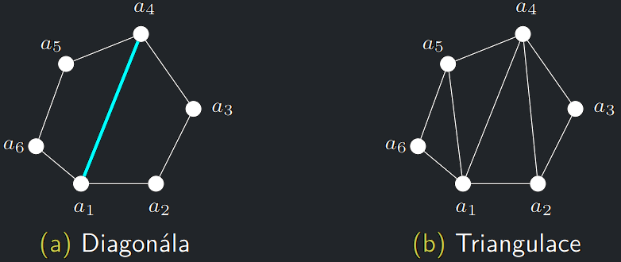
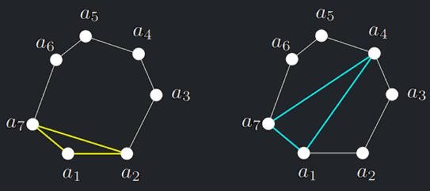
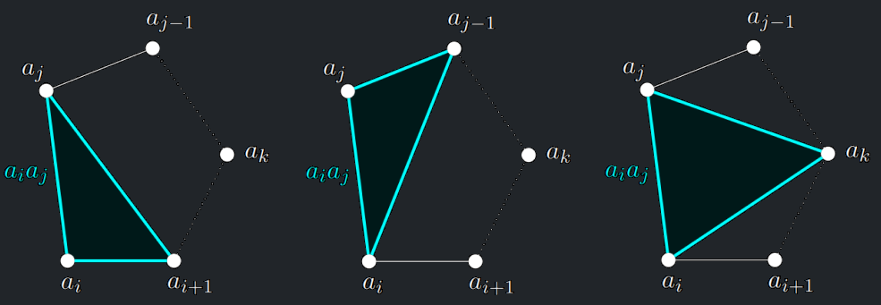
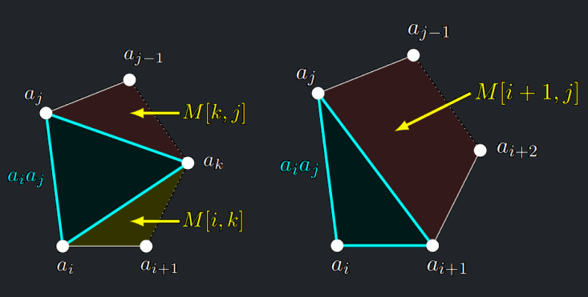

<a id="def-10.1"></a>
!!! Definition "Definice 10.1 (Triangulace)"

    Nechť $U$ je konvexní $n$-úhelník, $n \gt 3$, zadaný kartézskými
    souřadnicemi vrcholů $a_1, a_2,\dots, a_n$ v rovině číslovanými proti směru
    hodinových ručiček. Pak

    - **Diagonála** $a_ia_j$ = úsečka spojující 2 **nesousední vrcholy** $a_i, a_j$. 
    - **Triangulace** $U$ = taková podmnožina jeho diagonál, která
    rozděluje plochu $U$ na trojúhelníky a ve které se žádné dvě
    diagonály neprotínají (až na své koncové vrcholy).


{style=display:block;margin-left:auto;margin-right:auto;max-width:600px}

!!! Implication "Pozorování"

    Každá triangulace $n$-úhelníku sestává z $n − 3$ diagonál a dělí $U$ na
    $n − 2$ trojúhelníků.

<a id="def-10.2"></a>
!!! Definition "Definice 10.2 (Vlastnosti triangulace)"

    - **Délku diagonály** $a_ia_j$ značíme $\Vert a_ia_j \Vert$.
    - **Velikost triangulace** je součet délek jejích diagonál.
    - **Minimální triangulace mnohoúhelníku (MTM)** $U$ je ta z triangulací $U$,
    která má minimální velikost.

--- 

## Problém minimální triangulace mnohoúhelníku

- Na vstupu je konvexní $n$-úhelník $U$ zadaný kartézskými souřadnicemi vrcholů $a_1, a_2,\dots, a_n$ v rovině.
- Úkolem je určit velikost jeho **minimální triangulace**, případně takovou triangulaci vypsat.

## Velikost MTM - myšlenka

- Ke každé hraně mnohoúhelníku v každém řešení „přiléhá“ jeden trojúhelník.
- Speciálně je to pravda pro hranu $a_1a_n$ na kterou se zaměříme.
- Zvolíme-li libovolný takový trojúhelník $T$, rozdělíme mnohoúhelník $U$ na dva menší <br>
  (z nichž některý může být prázdný).

{style=display:block;margin-left:auto;margin-right:auto;height:250px}

- Každá triangulace se skládá z diagonál obsažených v nějakém trojúhelníku $T$ a z triangulace menšího mnohoúhelníka
  nebo obou menších mnohoúhelníků
- Minimální triangulace se tedy skládá z diagonál obsažených v nějakém trojúhelníku $T$ a z minimálních triangulací
  menších mnohoúhelníků. Tyto triangulace najdeme **rekurzivně**.
- Protože dopředu nevíme, **který** trojúhelník patří do minimální triangulace, musíme vyzkoušet všechny.

<a id="algo-10.12"></a>
!!! Algorithm "Algoritmus 10.12 (MtmRec)"

    ```python
    MtmRec(a_1,..., a_n)
        Pokud n = 3: Vrať 0
        M := ∞
        Pro k := 2,...,n − 1:
        // hrana a_1,a_n bude v trojúhelníku a_1,a_n,a_k,
        // ten rozdělí a1,...,a_n na a_1,...,a_k a a_k,...,a_n.
            Pokud k = 2: M_1 := 0
            Pokud k ≥ 3: M_1 := MtmRec(a_1,...,a_k) + ||a_1,a_k||
            Pokud k ≤ n − 2: M2 := MtmRec(a_k,...,a_n) + ||a_k,a_n||
            Pokud k = n − 1: M2 := 0
        M := min(M, M1 + M2)
        Vrať M
    ```

!!! Theorem "Fakt o počtu různých triangulací"

    Počet různých triangulací konvexního $n$-úhelníku je dán $(n − 2)$-tým <br>
    Catalanovým číslem $C(n - 2) = \frac{1}{n-1} \binom{2n-4}{n-2} = 2^{\Theta(n)}$

!!! Implication "Důsledek faktu o počtu triangulací"

    `MtmRec` má exponenciální časovou složitost.

---

## Velikost MTM - memoizace

- Definujeme nyní hodnoty $M[i, j]$ jako
    - velikost minimální triangulace mnohoúhelníku $a_i ,\dots, a_j$.
- Číslo $M[i, j]$ má smysl pro $j \gt i + 2$ (mnohoúhelník je tvořen aspoň třemi vrcholy).
- Zjevně $M[i, i + 2] = 0$.
- Hodnota $M[1, n]$ představuje velikost minimální triangulace celého $a_1,\dots, a_n$, tedy řešení úlohy Velikost MTM.
- Hodnoty $M[i, j]$ budeme počítat postupně podle velikosti mnohoúhelníka, tedy podle rozdílu $j − i$.
- Obecně, při výpočtu $M[i, j]$ je třeba zkusit všechny trojúhelníky $T$, které přiléhají stranou k úsečce $a_ia_j$.
- Jejich třetí vrchol $a_k$ je některý z $a_{i+1}, a_{i+2},\dots, a_{j−1}$, čili $k \in \{i + 1,\dots, j − 1\}$.


{style=display:block;margin-left:auto;margin-right:auto;max-width:600px}

- Pokud třetí vrchol $a_k$ je některý z $a_{i+2},\dots, a_{j−2}$, pak trojúhelník $T$ rozdělí zkoumaný mnohoúhelník na
  dva menší mnohoúhelníky, jejichž optimální triangulace jsme již spočítali dříve.
- Takže hledáme $k$, které vede na minimum výrazu

$$
M[i, j] = \min_{i+2 \le k \le j-2} (M[i, k] + \Vert a_i a_k \Vert + M[k,j] + \Vert a_k a_j \Vert)
$$


{style=display:block;margin-left:auto;margin-right:auto;max-width:600px}

!!! Algorithm "Algoritmus MtmIter"

    ```python
    MtmIter(a_1,..., a_n)
        Pro i := 1,..., n:
        M[i, i + 2] := 0
        Pro s := 4,..., n:  //velikost mnohoúhelníka
            Pro i := 1,..., n − s + 1:
                j := i + s − 1
                M[i, j] := ∞
                Pro k := i + 1,..., j − 1:
                    Pokud k = i + 1: M_1 := 0
                    Pokud k ≥ i + 2: M_1 := M[i, k] + ||a_i,a_k||
                    Pokud k ≤ j − 2: M_2 := M[k, j] + ||a_k,a_j||
                    Pokud k = j − 1: M_2 := 0
                    M[i, j] := min(M[i, j], M_1 + M_2)
        Vrať M[1, n]
    ```

!!! Implication "Pozorování o časové složitosti MtmIter"

    Časová složitost algoritmu `MtmIter` je $O(n^3)$ a paměťová $O(n^2)$.
