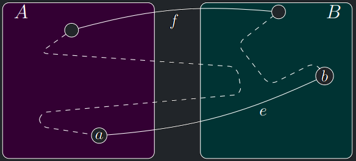

- Nejjednodušší algoritmus pro hledání minimální kostry pochází z roku 1930, kdy ho vymyslel český matematik Vojtěch
  Jarník.
- Tehdy myšlenka zapadla a až později byla několikrát znovuobjevena – proto se algoritmu říká též Primův.

---

<a id="algo-11.1"></a>
!!! Algorithm "Algoritmus 11.1 (Jarníkův)  "

    ### Algoritmus Jarník {#algo-11.1}

    
    !!! Algorithm "Vstup"

        Souvislý hranově ohodnocený graf $G$
    
    !!! Algorithm "Výstup"

        Minimální kostra $G$

    !!! Algorithm "Idea"

        - Začneme se stromem, který obsahuje libovolný jeden vrchol a žádné hrany.
        - Vybereme nejlehčí hranu incidentní s tímto vrcholem.
        - Přidáme ji do stromu i s novým koncovým vrcholem.
        - Postup opakujeme: v každém dalším kroku přidáváme nejlehčí z hran, které vedou mezi vrcholy dosud vytvořeného stromu a zbytkem grafu.
        - Takto pokračujeme, dokud nevznikne celá kostra.


    !!! Algorithm "Algoritmus"

        ```math title="Algoritmus MinKostraJarník (G = (V, E), w: E → R):"
        v0 := libovolný vrchol grafu
        T := strom obsahující pouze vrchol v0 a žádné hrany
        Dokud existuje hrana {u, v} taková, že u ∈ V(T) a v ̸∈ V(T)
            Přidej nejlehčí takovou hranu spolu s v do T
        Vrať T
        ```

{ align=center }

---

## Hladové algoritmy

- Jarníkův algoritmus je typickým příkladem tzv. hladového algoritmu (angl. greedy algorithm).
- V každém okamžiku vybíráme lokálně nejlepší hranu.
- Minimální kostra je jedním z řídkých případů, kdy hladový algoritmus skutečně spočte optimální řešení.
- Dokážeme postupně, že Jarníkův algoritmus skutečně vrátí minimální kostru.

---

## Důkaz korektnosti Jarníkova algoritmu

- Nejprve ukážeme, že se Jarníkův algoritmus spuštěný na souvislém hranově ohodnoceném grafu zastaví a vygeneruje
  kostru.
- Dále budeme pro jednoduchost předpokládat hranově ohodnocený graf s unikátními vahami a dokážeme, že má jedinou
  minimální kostru a Jarníkův algoritmus ji vytvoří.
- K tomu zavedeme pojem elementárního řezu grafu.
- Poté ukážeme, že Jarníkův algoritmus vydá minimální kostru i v případě, že váhy nejsou unikátní (viz graf v předchozím
  příkladu).

### 1. Konečnost Jarníkova algoritmu

<a id="theorem-11.1"></a>
!!! Theorem "Lemma 11.1 (o konečnosti Jarníkova algoritmu)"

    #### Lemma o konečnosti Jarníkova algoritmu {#theorem-11.1}

    Jarníkův algoritmus se po $|V| - 1$ iteracích zastaví a vydá nějakou kostru zadaného grafu $G = (V, E)$.

??? Proof "Důkaz Lemmatu 11.1"

    - Graf $T$ konstruovaný algoritmem vzniká z jednoho vrcholu postupným přidáváním listů.
    - Takže $T$ je v každém okamžiku výpočtu strom.
    - V každé iteraci se $|V(T)|$ zvětší o $1$.
    - Dokud $V(T) \ne V(G)$, musí díky souvislosti $G$ existovat hrana mezi $V(T)$ a $V(G) \setminus V(T)$, kterou může algoritmus přidat do $T$.
    - To znamená, že algoritmus se zastaví, až když $V(T) = V(G)$.
    - Tehdy je ale $T$ kostra.

### 2. Správnost Jarníkova algoritmu

<a id="def-11.2"></a>
!!! Definition "Definice 11.2 (Elementární řezy v grafu)"

    #### Elementární řezy v grafu {#def-11.2}
    
    Nechť A je nějaká podmnožina vrcholů grafu $G = (V, E)$ a $B$ její doplněk, tj. $B = V \setminus A$.
    Množině všech hran, které leží jedním vrcholem v $A$ a druhým v $B$, budeme říkat elementární řez grafu $G$ určený množinami $A$ a $B$.

<a id="theorem-11.2"></a>
!!! Theorem "Lemma 11.2 (o řezech v grafu s unikátními vahami)"

    #### Lemma o řezech v grafu s unikátními vahami {#theorem-11.2}

    Nechť $G$ je souvislý ohodnocený graf s unikátními vahami, $R$ nějaký jeho elementární řez a $e$ nejlehčí hrana tohoto řezu.
    Pak (každá) minimální kostra grafu $G$ obsahuje hranu $e$.

??? Proof "Důkaz Lemmatu 11.2"

    - Dokážeme obměněnou implikaci: Pokud nějaká kostra $T$ neobsahuje hranu $e$, pak není minimální.
    - Označme $A$ a $B$ množiny vrcholů určující elementární řez $R$.
    - Hrana $e = \{a,b\}$, $a \in A$, $b \in B$, je nejlehčí v $R$.
    - Nechť $T$ je kostra neobsahující $e$.
    - Protože $T$ je strom, existuje v něm jediná cesta $P(a,b)$ a ta musí alespoň jednou překročit elementární řez $R$.
    - Nechť $f = \{a^′,b^′\}$, $a^′ \in A$, $b^′ \in B$, je libovolná hrana, kde se to stalo.

    {style=display:block;margin-left:auto;margin-right:auto;height:200px}

    - Nyní z kostry $T$ odebereme hranu $f$.
    - Tím se kostra rozpadne na dva stromy $T_a$, $T_b$, z nichž jedenobsahuje $a$ a druhý $b$.
    - Přidáním hrany $e$ stromy opět propojíme a tím získáme jinou kostru $T^′$.
    - Platí $w(T^′) = w(T) − w(f) + w(e)$.
    - Protože e je nejlehčí hrana v elementárním řezu a váhy jsou unikátní, musí platit $w(f) \gt w(e)$.
    - Proto $w(T^′) \lt w(T)$ a tudíž $T$ není minimální kostra.

!!! Warning "Varování"

    Zmínka existence jediné cesty $P(a,b)$ a následné vybrání hrany $f$, která leží někde na této cestě je důležitá.

    Pouhé vybrání náhodné hrany $f$ (která překračuje elementární řez) a následné prohození $f$ a $e$
    by nevedlo ke správnému závěru.

<a id="theorem-11.3"></a>
!!! Theorem "Věta 11.3 (o minimální kostře Jarník)"

    #### Věta o minimální kostře Jarník {#theorem-11.3}

    Souvislý graf s unikátními vahami má právě jednu minimální kostru a Jarníkův algoritmus tuto kostru vytvoří.

??? Proof "Důkaz Věty 11.3"

    - Jarníkův algoritmus v každém kroku vybere jedinečnou nejlehčí hranu elementárního řezu mezi vrcholy dosud
    vytvořeného stromu a zbytkem grafu, která je vždy dle lemmatu obsažena v každé minimální kostře.
    - To ale znamená, že kostra vytvořená Jarníkovým algoritmem je podgrafem každé minimální kostry.
    - Protože ale všechny kostry daného grafu mají stejný počet hran, znamená to, že vytvořená kostra je všem minimálním kostrám rovna a je tudíž unikátní.

!!! Implication "Důsledek"

    Minimální kostra je jednoznačně určena uspořádáním hran podle vah, na konkrétních hodnotách vah nezáleží.
    Toto platí neboť Jarníkův algoritmus váhy hran mezi sebou pouze porovnává.

- Pokud tedy pro každý elementární řez grafu G existuje právě jedna nejlehčí hrana, pak má G právě jednu minimální
  kostru.
- Protipříklad na obrázku výše ale ukazuje, že neplatí obrácená implikace, tedy: Pokud má graf G právě jednu minimální
  kostru,
  pak pro každý elementární řez grafu G (ne)existuje právě jedna nejlehčí hrana.

---

## Korektnost Jarníkova algoritmu pro neunikátní váhy

- Pokud nejsou váhy unikátní, může v dané iteraci existovat několik nejlehčích
  hran $\{a, b\}$, $a \in V(T)$, $b \notin V(T)$ a Jarníkův algoritmus vždy jednu z nich vybere.
- Lemma o řezech stačí upravit následovně.

<a id="theorem-11.4"></a>
!!! Theorem "Lemma 11.4 (o řezech v grafu s opakujícími se vahami hran)"

    ### Lemma o řezech v grafu s opakujícími se vahami hran {#theorem-11.4}

    Nechť $G$ je souvislý ohodnocený graf, $R$ je elementární řez v $G$ a $e$ je libovolná nejlehčí hrana v $R$.
    Pro každou minimální kostru $T^′$ existuje minimální kostra $T$ taková, že

    - $T^′$ a $T$ se mohou lišit pouze na hranách obsažených v $R$ a
    - $T$ obsahuje $e$

??? Proof "Důkaz Lemmatu 11.4"

    - Označme $A$ a $B$ množiny vrcholů, kterými je určen elementární řez $R$.
    - Nechť $T^′$ neobsahuje $e$ a nechť $e = \{a,b\}$.
    - Buď $P$ unikátní cesta mezi vrcholy $a$ a $b$ v $T^′$.
    - Cesta $P$ prochází elementárním řezem $R$.
    - Nechť $f$ je libovolná hrana v $E(P) \cap R$.
    - Potom $T := T^′ − f + e$ je kostra a platí, že $w(T) \le w(T^′)$.

!!! Implication "Důsledek"

    Pokud G obsahuje více minimálních koster díky existenci hran se stejnou vahou, pak Jarníkův algoritmus jednu z nich zkonstruuje.

---

## Složitost Jarníkova algoritmu

!!! Implication "Pozorování"

    Naivní implementace Jarníkova algoritmu nad grafem $G = (V,E)$, reprezentovaným seznamem sousedů má časovou složitost
    $O(|V| \cdot |E|)$ ($|V|$ krát hledáme nejlehčí hranu v seznamu nejvýše $|E|$ hran) a paměťovou složitost $O(|V| + |E|)$.


