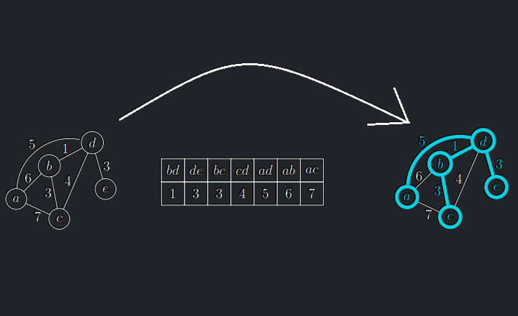

<a id="algo-11.2"></a>
!!! Algorithm "Algoritmus 11.2 (Kruskalův)  "

    ### Algoritmus Kruskal {#algo-11.2}

    
    !!! Algorithm "Vstup"

        Souvislý hranově ohodnocený graf $G = (V,E)$. Nechť $n = |V|$ a $m = |E|$.
    
    !!! Algorithm "Výstup"

        Minimální kostra $G$

    !!! Algorithm "Idea"

        - Kruskalův algoritmus je také založen na hladovém přístupu:začne lesem tvořeným pouze samotnými vrcholy bez hran a 
        zkouší přidávat hrany od nejlehčí po nejtěžší a zahazuje ty, které by vytvořily cyklus.

    !!! Algorithm "Algoritmus"

        ```math title="Algoritmus MinKostraKruskal(G = (V, E), w: E → R):"
        Seřaď hrany podle vah: w(e1) ≤ · · · ≤ w(em)
        T := (V, ∅) //počáteční les bez hran
        Pro i := 1, . . . , m opakuj:
            označ u, v krajní vrcholy hrany ei
            Pokud u a v leží v různých komponentách lesa T:
                E(T) := E(T) ∪ {ei}
        Vrať T
        ```

{align = center}

<a id="theorem-11.6"></a>
!!! Theorem "Lemma (o korektnosti Kruskalova algoritmu)"

    Kruskalův algoritmus se zastaví a vydá minimální kostru.
??? Proof "Důkaz věty 11.6"

    - Konečnost: cyklus se vykoná $m$-krát.
    - Správnost: Ukážeme nejdříve, že pokud algoritmus přidá hranu $e = \{u,v\}$ do $T$, pak $e$ leží v minimální kostře.
    - Pokud algoritmus $e$ přidá, stane se tak v okamžiku, kdy se vrcholy $u$ a $v$ nacházejí v nějakých dvou rozdílných stromech $T_u$ a $T_v$ lesa $T$.
    - Hrana $e$ přitom leží v elementárním řezu oddělujícím strom $T_u$ od zbytku grafu.
    - Hrana $e$ musí být nejlehčí hrana elementárního řezu oddělujícího strom $T_u$ od zbytku grafu, neboť případnou lehčí hranu by algoritmus potkal dříve a přidal by ji do $T$.
    - Hrana $e$ tedy leží v minimální kostře podle lemmatu o řezech.
    - Nyní si ukážeme, že výsledný $T$ je souvislý.
    - Pokud by nebyl, uvažme dva rozdílné stromy $T_u$ a $T_v$ lesa $T$ a elementární řez oddělující strom $T_u$ od zbytku grafu.
    - Protože je graf $G$ souvislý, je tento elementární řez neprázdný a má nějakou hranu $e$.
    - Když algoritmus zkoumal hranu $e$, nemohla tvořit cyklus (netvoří ho ani ve výsledném $T$), takže by ji algoritmus musel přidat, což je spor.
    - Výstupem algoritmu je tedy kostra, která je podgrafem minimální kostry – tedy minimální kostra.


