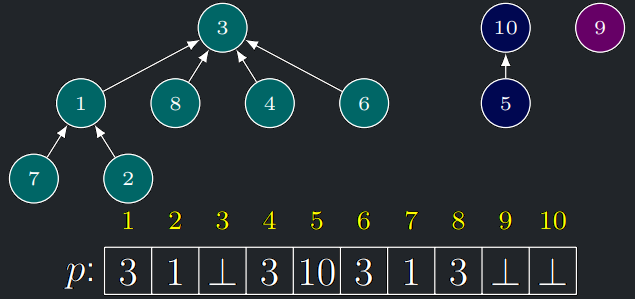

## Implementace struktury Union-Find pomocí pole

- Triviální přístup: použijeme pole, které každému elementu přiřadí číslo jeho množiny.
- **Find** přečte číslo množiny z pole v konstantním čase.
- **Union** při slučování množin projde všechny elementy jedné množiny a přiřadí jim číslo té druhé.

!!! Implication "Pozorování"

    Při reprezentaci polem je časová složitost

    - **Init**$T_i(n) = O(n)$,
    - **Find**$T_f(n) = O(1)$ a
    - **Union**$T_u(n) = O(n)$.

    Časová složitost Kruskalova algoritmu by tedy byla $O(m \log n + n + m + n^2) = O(m \log n + n^2)$.

---

## Implementace struktury Union-Find pomocí keříků

- Každou množinu, budeme reprezentovat stromem orientovaným směrem do kořene – budeme jim říkat **keříky**.
- Založená struktura je les, který má jednovrcholový strom za každý element universa.
- Vrcholy keříku odpovídají elementům příslušné množiny.
- Jako identifikátory množin použijeme element uložený v kořeni daného keříku.
- V paměti budeme keříky reprezentovat úsporně: každý element v si pamatuje „pouze“ identifikátor svého otce $p(v)$.
- Kořeny keříků $v$ mají $p(v) = \bot$.

{style=display:block;margin-left:auto;margin-right:auto;}

### Find s keříky

- Operace Find(u) postupně vystoupá ze zadaného elementu u do kořene keříku a vrátí tento kořen.

<a id="algo-11.4"></a>
!!! Algorithm "Algoritmus 11.4 (Union-Find: Find s keříky)  "

    ```math title="Algoritmus Find(u):"
    Dokud p(u) ̸= ⊥:
        u := p(u)
     Vrať u
    ```

!!! Implication "Pozorování"

    Časová složitost **Find**($u$) je $O($hloubka keříku elementu $u)$.

### Union s keříky

- Do kořene $v$ každého keříku uložíme **hloubku** keříku $H(v)$.
- Na počátku mají všechny keříky hloubku $1$.
- Při slučování různě hlubokých keříků připojíme mělčí keřík pod kořen toho hlubšího a hloubka toho hlubšího se nezmění.
- Jsou-li oba keříky stejně hluboké, rozhodneme se libovolně a výsledný keřík má hloubku o jedna větší.

<a id="algo-11.5"></a>
!!! Algorithm "Algoritmus 11.4 (Union-Find: Union s keříky)  "

    ```math title="Algoritmus Union(u, v):"
    a := Find(u)
    b := Find(v)
    Je-li a = b, skonči
    Pokud H(a) = H(b):
        H(a) := H(a) + 1
    Pokud H(a) < H(b):
        p(a) := b
    Pokud H(a) > H(b):
        p(b) := a
    ```

### Hloubka keříků

<a id="theorem-11.8"></a>
!!! Theorem "Lemma (o hloubce keříků)"

    Výše popsaný algoritmus **Union** zachovává invariant, že keřík s $h$ hladinami obsahuje nejméně $2^{h−1}$ vrcholů.

??? Proof "Důkaz věty 11.8"

    - Indukcí podle počtu operací **Union**.
    - Na počátku algoritmu mají všechny keříky jednu hladinu a $1$ vrchol a $( 1 \ge 2^{1−1} = 1)$.
    - Nechť nyní provádíme **Union**$(u,v)$ a počet hladin obou keříků je různý.
    - Připojením mělčího keříku pod kořen toho hlubšího se počet hladin nezmění a počet vrcholů neklesne, takže nerovnost
      stále platí.
    - Pokud mají oba keříky $h$ hladin, platí z indukčního předpokladu, že každý z nich obsahuje minimálně $2^{h−1}$
    vrcholů.
    - Jejich sloučením tudíž vznikne keřík s $h + 1$ hladinami o alespoň $2 \cdot 2^{h−1} = 2^h$ vrcholech.

!!! Implication "Důsledek"

    Hloubka keříků během provádění výše popsaného algoritmu **Union**$(u,v)$ nepřekročí $\log n$.

??? Proof "Důkaz důsledku"

    Strom s větším počtem hladin by podle invariantu obsahoval více než n vrcholů

### Složitost Kruskalova algoritmu s keříky

- Z předchozího plyne, že v keříkové reprezentaci je časovásložitost operace
    - **Init** $T_i(n) = O(n)$,
    - **Find** $T_f(n) = O(\log n)$ a
    - **Union** $T_u(n) = O(\log n)$ (my dokonce voláme jen na kořeny, takže lze počítat $O(1)$).

- A proto dostaneme

$$O(m \log n + T_i(n) + m \cdot T_f(n) + n \cdot T_u(n)) =$$

$$O(m \log(n) + n + m \cdot log(n) + n \cdot log(n)) \in O(m \log n)$$

!!! Implication "Důsledek  (věty o časové složitosti Kruskalova algoritmu)"

    Kruskalův algoritmus s keříkovou strukturou pro Union-Find vytvoří minimální kostru v čase $O(|E| \log|V|)$.

---

## Struktura Union-Find obecně

- Kruskalův algoritmus je velmi známá aplikace datové struktury Union-Find, ale ne jediná.
- Struktura Union-Find je vhodná a přirozená pro algoritmické (snadno paralelizovatelné) řešení dalších problémů, např.
    - Konstrukce souvislých komponent grafu.
    - Detekce cyklu v grafu.
    - Konstrukce bludiště.
    - Odvozování typu proměnných v dynamických programovacích jazycích.


