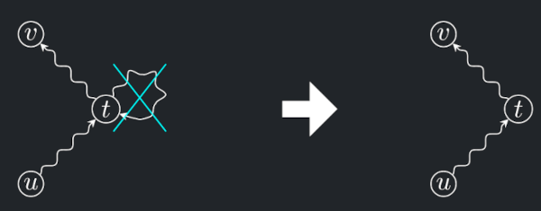
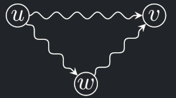

!!! Definition "Definice 12.1 (Ohodnocený orientovaný graf)"

    ### Ohodnocený orientovaný graf {#def-12.1}
    
    - Mějme orientovaný graf $G = (V, E)$.  Každé hraně $e \in E$ přiřadíme číselnou **váhu** $w(e)$,
    kde $w: E \to R$. Takový graf se nazývá **hranově ohodnocený**.
    - Váhovou funkci můžeme přirozeně rozšířit na podgrafy: **Váha** $w(H)$ podgrafu $H \subseteq G$ je součet vah jeho hran.
    - Vstup pro problém nejkratších cest je podobný. Ohodnocení hrany interpretujeme jako její délku, značíme ℓ(e).
    - Délku hrany můžeme přirozeně rozšířit i na cesty: délka cesty je součet délek jejích hran.
    > V přednášce definováno pomocí definice z problému minimální kostry.

!!! Definition "Definice 12.2 (Vzdálenost v ohodnoceném grafu)"

    ### Vzdálenost v ohodnoceném grafu {#def-12.1}

    Pro libovolné dva vrcholy u a v ohodnoceného orientovaného grafu, vzdálenost $d(u, v)$ je minimum z délek všech $uv$-cest (cest z $u$ do $v$), případně +∞, pokud žádná $uv$-cesta neexistuje.

!!! Definition "Definice 12.3 (Nejkratší cesta v ohodnoceném grafu)"

    ### Nejkratší cesta v ohodnoceném grafu {#def-12.3}

    je libovolná $uv$-cesta, jejíž délka je rovná vzdálenosti $d(u, v)$.

!!! Definition "Definice 12.4 (Sled v ohodnoceném grafu)"

    ### Sled v ohodnoceném grafu {#def-12.4}

    Posloupnost ($v_0$, $e_1$, $v_1$, . . . , $e_k$, $v_k$) v orientovaném grafu $G = (V, E)$ se nazývá $v_0v_k$-sled (nebo krátce sled), pokud $vi ∈ V$ pro všechna $i ∈ {0, . . . , k}$ a $e_i = (v_{i−1}, v_i) ∈ E$ pro všechna $i ∈ {1, . . . , k}$.
    
    Délka $ℓ(S)$ sledu $S$ je součet délek jeho hran.

!!! Theorem "Lemma (o zjednodušení sledů)"

    ### Lemma (o zjednodušení sledů) {#theorem-12.1}
    
    Pokud jsou délky hran kladné, pak pro každý $uv$-sled existuje $uv$-cesta stejné nebo menší délky.

    { align=center }

    ??? Proof "Důkaz věty 12.1"
        
        - Pokud sled není cestou, znamená to, že se v něm opakují vrcholy.
        - Označme tedy t první vrchol (v pořadí od u), který se opakuje.
        - Část sledu mezi prvním a posledním výskytem vrcholu $t$ vystřihneme a získáme $uv$-sled stejné nebo menší délky, protože délky hran jsou kladné.
        - Přitom ubyla alespoň jedna hrana, takže opakováním tohoto postupu časem dostaneme cestu.

!!! Implication "Důsledek - Nejkratší cesta"

    Pokud jsou délky hran v $G = (V, E)$ kladné, pak pro libovolné dva vrcholy $u, v ∈ V$ existuje nejkratší $uv$-sled a ten je současně ***nejkratší $uv$-cestou***.
    
    ??? Proof "Důkaz"
        
        - Nejkratší cesta je jedním ze sledů.
        - Pokud by tvrzení neplatilo, musel by existovat nějaký kratší sled. Ten by ovšem, podle předchozího lemmatu, šel zjednodušit na ještě kratší cestu.

!!! Implication "Důsledek - Trojúhelníková nerovnost"

    Jsou-li délky hran kladné, platí pro vzdálenosti **trojúhelníková nerovnost**: $d(u, v) ≤ d(u, w) + d(w, v)$ pro libovolné $u, v, w ∈ V$ .

    { align=center }
    
    ??? Proof "Důkaz"

        - Pokud je $d(u, w)$ nebo $d(w, v)$ nekonečná, nerovnost triviálně platí.
        - V opačném případě uvažme spojení nejkratší $uw$-cesty s nejkratší $wv$-cestou. To je nějaký $uv$-sled délky $d(u, w) + d(w, v)$ a ten, podle předchozího důsledku, nemůže být kratší než nejkratší $uv$-cesta, která má délku $d(u, v)$.

!!! Implication "Důsledek - Vrcholy na nejkratší cestě"

    Nechť jsou délky hran kladné, $P$ je nejkratší $uv$-cesta a $w$ leží na $P$. Označme $P_{uw}$ část $P$ mezi $u$ a $w$ a $P_{wv}$ část $P$ mezi $w$ a $v$. Pak $P_{uw}$ je nejkratší $uw$-cesta a $P_{wv}$ je nejkratší $wv$-cesta.
