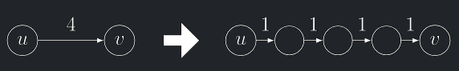

## Hledání nejkratších cest

!!! Implication "Fakt (bez důkazu)"

    Problém nalezení délky nejkratší cesty mezi dvěma vrcholy pro graf ohodnocený **obecnými** (tedy i zápornými) délkami je NP-těžký – proto pro něj neočekáváme existenci efektivního algoritmu.

- Pro některá speciální ohodnocení grafu efektivní algoritmy existují. Dva nejpoužívanější jsou:
    - **Dijkstrův**, který předpokládá kladné délky hran (případně **nezáporné**).
    - **Bellmanův-Fordův**, který připouští záporné délky, ale předpokládá **neexistenci záporných cyklů** v grafu.

<a id="algo-12.1"></a>
!!! Algorithm "Úprava BFS pro přirozené váhy"

    ### Úprava BFS pro přirozené váhy {#algo-12.1}
    
    Každou hranu "podrozdělíme" – nahradíme ji cestou tvořenou tolika jednotkovými hranami, kolik činila délka hrany.
    { align=center }
    
    Tím vznikne neohodneconý graf, ve kterém lze použít **BFS** pro hledání nejkratších cest.

    - Tento algoritmus je funkční, ale neefektivní
        - Označíme-li L maximální délku hrany, podrozdělením vznikne $O(L · m)$ nových vrcholů a hran.
        - Složitost BFS algoritmu tedy bude $Θ(L · m + n)$.

## Dijkstrův algoritmus

Dijkstra je zobecněním průchodu grafu do šířky.

Místo simulace průchodu *BFS* vlny v lineárním čase vzhledem k délce hran, **Dijkstra** zpracuje každou hranu v $O(1)$
čase.

---

**Vstup:** Orientovaný graf $G = (V, E)$ s kladnými délkami hran $ℓ : E → R+$ a počáteční vrchol $v_0$.

**Výstup:**Vzdálenosti z vrcholu $v_0$ do všech vrcholů grafu $G$.

---

### Základní idea Dijkstra

- U každého **původního** vrcholu si udržujeme **"budík"** - kdy by do vrcholu dorazila *BFS* vlna.
- Pokaždé vybereme sousední vrchol s nejmenší hodnotou budíku a podíváme se na jeho následníky.
- Pokud by se některý z nich dostal do vrcholu dříve, aktualizujeme jeho budík.
- Toto opakujeme dokud "nezazvoní budík" všech vrcholů.

---

- Čas na budíku vrcholu $v$ ozn. $h(v)$.
- Počáteční hodnota $h(v_0) = 0$. a $h(v) = ∞$ pro všechny ostatní vrcholy.
- Podobně jako u *BFS* může mít vrchol tři stavy:
    - *Nenalezené*
    - *Otevřené* (budík je nastavený)
    - *Uzavřené* (budík již zazvonil)
- Dále si pamatujeme, který vrchol je předchůdce daného vrcholu na nejkratší cestě.

---

<a id="algo-12.3"></a>
!!! Algorithm "Dijkstrův algoritmus (pseudokód)"

    ### Dijkstrův algoritmus (pseudokód) {#algo-12.3}
        Algoritmus Dijkstra(G, ℓ : E → R+, v0)
         Pro všechny vrcholy v:
             stav(v) := nenalezený
             h(v) := +∞; P (v) := ⊥
         stav(v0) := otevřený
         h(v0) := 0
         Dokud existují nějaké otevřené vrcholy:
             Vyber otevřený vrchol v, jehož h(v) je nejmenší.
             Pro všechny následníky w vrcholu v: //relaxace v
                 Pokud h(w) > h(v) + ℓ((v, w)):
                     h(w) := h(v) + ℓ((v, w))
                     stav(w) := otevřený
                     P (w) := v
             stav(v) := uzavřený
         Vrať pole vzdáleností h a pole předchůdců P

<a id="def-12.5"></a>
!!! Definition "Relaxace vrcholů"

    ### Relaxace vrcholů {#def-12.5}
    - Přepočítání ohodnocení $h(w)$ pro všechny následníky $w$ vrcholu $v$ v Dijkstra na řádcích *(9)&nbsp;–&nbsp;(14)* budeme nazývat relaxace vrcholu $v$
        ```        
            Pro všechny následníky w vrcholu v: //relaxace v
                Pokud h(w) > h(v) + ℓ((v, w)):
                    h(w) := h(v) + ℓ((v, w))
                    stav(w) := otevřený
                    P (w) := v
            stav(v) := uzavřený
        ```

---

## Konečnost a správnost Dijkstra

<a id="theorem-12.2"></a>

!!! Theorem "Věta o konečnosti Dijkstrova algoritmu"

    ### Věta o konečnosti Dijkstrova algoritmu {#theorem-12.2}
    Dijkstra na grafu s kladnými délkami hran se v konečném čase zastaví a po jeho skončení budou všechny dosažitelné vrcholy $v$ uzavřeny s $h(v) = d(v_0, v)$.

Tuto větu dokážeme kombinací 4 vlastností Dijkstra:

- **Vlastnost O** (Ohodnocení)
- **Vlastnost M** (Monotonie)
- **Vlastnost D** (Dosažitelnost)
- **Vlastnost V** (Vzdálenost)

<a id="def-12.6"></a>
!!! Definition "Vlastnost O (Ohodnocení)"

    ### Vlastnost O (Ohodnocení) {#def-12.6}
    Ohodnocení $h(v)$ v průběhu *Dijkstra* nikdy neroste a je-li konečné, rovná se délce nějakého sledu z $v_0$ do $v$.

    ??? Proof "Důkaz vlastnosti O"
        - Indukcí podle doby běhu Dijkstra.
        - Na počátku výpočtu tvrzení určitě platí, protože jediné konečné ohodnocení je $h(v_0) = 0$.
        - Kdykoliv Dijkstra snižuje ohodnocení $h(w)$, stane se tak relaxací otevřeného vrcholu $v$ s konečným $h(v)$, jehož následníkem je $w$.
        - Podle indukčního předpokladu tedy existuje $v_0-v$-sled délky $h(v)$.
        - Jeho rozšířením o hranu $vw$ vznikne $v_0w$-sled délky $h(v) + ℓ((v, w))$, což je přesně nová konečná hodnota $h(w)$.     

<a id="def-12.7"></a>
!!! Definition "Vlastnost M (Monotonie)"

    ### Vlastnost M (Monotonie) {#def-12.7}
    V každém kroku výpočtu platí, že $h(z) ≤ h(o)$ pro $z$ uzavřený vrchol a $o$ otevřený vrchol. Speciálně pak platí, že Dijkstra nikdy neotevře již uzavřený vrchol.


    ??? Proof "Důkaz vlastnosti M"
        - Vždy vybereme otevřený vrchol $v$ s nejmenším $h(v)$.
        - Před relaxací $v$ tedy musí platit $h(z) ≤ h(v) ≤ h(o)$ pro libovolný $z$ uzavřený a $o$ otevřený.
        - Nyní vrchol $v$ relaxujeme:
            - Pokud $w$ byl uzavřený, nemůže se jeho hodnota změnit, neboť již před relaxací platilo $h(w) ≤ h(v)$.
            - Pokud $w$ byl otevřený nebo nenalezený, jeho hodnota se sice může snížit na $h(v) + ℓ(v, w)$, ale nikdy ne pod $h(v)$, takže ani pod $h(z)$ žádného uzavřeného $z$.
        - Kdybychom otevřeli již uzavřený vrchol $z$, muselo by platit $h(v) + ℓ(v, z) ≤ h(z)$, což nelze.

<a id="def-12.8"></a>

!!! Definition "Vlastnost D (Dosažitelnost)"

    ### Vlastnost D (Dosažitelnost) {#def-12.8}
    Když se *Dijkstra* zastaví, uzavřené jsou právě vrcholy dosažitelné z $v_0$. 
    

    ??? Proof "Důkaz vlastnosti D"
        - Dokážeme stejně jako obdobnou vlastnost ***BFS***.
        - První otevřeným a následně uzavřeným vrcholem je $v_0$.
        - Vrchol je otevřen, právě když je do té doby nenalezeným následníkem dříve otevřeného vrcholu a tudíž je dosažitelný z $v_0$.
        - Protože Dijkstra dle Vlastnosti M, nikdy neotevře již uzavřený vrchol, zbytek důkazu je totožný s ***BFS***:
            - Kdyby tedy existoval nějaký dosažitelný, ale neuzavřený vrchol, existoval by ten „nejbližší“ (co do počtu hran na nejkratší cestě) a to by vedlo ke sporu.

<a id="def-12.9"></a>

!!! Definition "Vlastnost V (Vzdálenost)"

    ### Vlastnost V (Vzdálenost) {#def-12.9}
    Když se Dijkstra zastaví, je $h(w) = d(v_0, w)$ pro všechny $w ∈ V$.

    ??? Proof "Důkaz vlastnosti V"
         Vrchol $w$ dosažitelný z $v_0$ nazveme **špatný**, pokud $h(w) \ne d(v0, w)$. Z **Vlastnosti O** víme, že $h(w)$ odpovídá délce nějakého $v_0w$-sledu a tedy $h(w) > d(v_0, w)$.

        - Pro spor předpokládejme, že existuje nějaký špatný vrchol $w$ (Podobně jako u *BFS*).
        - Víme, že v0 není špatný, protože $h(v_0) = 0 = d(v_0, v_0)$.
        - Buď $w$ špatný vrchol takový, že nejkratší cesta v $G$ z $v_0$ do $w$ používá nejmenší možný počet hran.
        - Buď $v$ předchůdce $w$ na této cestě z $v_0$.
        - Kdyby $v$ byl špatný, volili bychom $v$ namísto $w$. Tedy platí  $h(v) = d(v_0, v)$.
        - Vrchol $v$ byl jistě někdy otevřený a později relaxovaný. Při jeho relaxaci byla aktuální hodnota $h(w)$ větší než $d(v_0, w)$ (neboť toto platí dokonce až po zastavení Dijkstra).
        - V tom případě ale po relaxaci $v$ muselo platit $h(w) = d(v_0, v) + ℓ((v, w)) = d(v_0, w)$. Spor.

---

## Vlastnost sledů v Dijkstra

!!! Theorem "Lemma"

    Je-li po uzavření vrcholu v algoritmu Dijkstra $h(v)$ konečné pro nějaký vrchol $v$, rovná se délce nejkratší $v_0v$-cesty, která jako vnitřní vrcholy používá pouze uzavřené vrcholy.
   
    ??? Proof "Důkaz vlastnosti sledů v Dijkstra"

        - Indukcí podle počtu uzavřených vrcholů.
        - Pro $k = 0$ platí, neboť jediné konečné je $h(v_0) = 0$.
        - Pro indukční krok, kdy relaxujeme a tedy uzavíráme $v$, uvážíme dva případy:
            - Relaxace $v$ nezměnila $h(w)$. Pak z IP tvrzení platí.
            - Relaxace $v$ změnila $h(w)$. Pak dle Vlastnosti O $h(w)$ odpovídá délce nejkratší $v_0v$-cesty protažené o hranu $(v, w)$.
            - Protože nyní ale je $v$ uzavřený a $v_0v$-cesta (dle IP) používala jako vnitřní vrcholy jen uzavřené vrcholy, platí tato vlastnost i pro $w$.

## Složitost Dijkstra bez binární haldy (priority queue)

Pokud jsou délky hran kladné, potom Dijkstra nad souvislým grafem o $n$ vrcholech běží v čase $O(n^2)$.

V grafech s malým počtem hran je odhad $O(n^2)$ zbytečně nadhodnocený. Celkový počet operací na řádku (11) je
pouze $O(m)$, ale brzdí nás hledání minima: $O(n)$.

??? Proof "Důkaz složitosti Dijkstrova algoritmu"

    - Inicializace trvá $O(n)$.
    - Každý vrchol uzavřeme nejvýše jednou.
    - Vnějším cyklem projdeme nejvýše $n$-krát.
    - Pokaždé hledáme minimum až z $n$ ohodnocení vrcholů a procházíme až $n$ následníků.

---

## Dijkstra s binární haldou

Podobně jako u Jarníkova algoritmu, použijeme (binární) haldu, klíčem $v$ bude hodnocení $h(v)$.

<a id="algo-12.4"></a>
!!! Algorithm "Dijkstra s binární haldou"

    ### Dijkstra s binární haldou {#algo-12.4}
    
    ```plaintext
    Algoritmus DijkstraHalda(G, ℓ : E → R+, v0)
    Pro všechny v ∈ V:
        h(v) := +∞; P(v) := ⊥
    h(v0) := 0
    H := HeapBuild(V) uspořádanou podle klíčů h
    Dokud H neprázdná:
        v := HeapExtractMin(H)
        Pro všechny následníky w vrcholu v:
            Pokud w ∈ H & h(w) > h(v) + ℓ((v, w)):
                P(w) := v
                HeapDecreaseKey(H, w, h(v) + ℓ((v, w)))
    Vrať P a h
    ```

<a id="theorem-12.3"></a>
!!! Theorem "Věta o časové složitosti Dijkstra s binární haldou"

    ### Věta o časové složitosti Dijkstra s binární haldou {#theorem-12.3}

    Časová složitost DijkstraHalda je $O(|E| \log |V|)$.

    ??? Proof "Důkaz"
        - Řádky (2)-(5) trvají $O(|V|)$.
        - Celková složitost na řádku (7) je $O(|V| \log |V|)$.
        - Celková složitost na řádku (11) je $O(|E| \log |V|)$, neboť počet volání operace `HeapDecreaseKey` je nejvýše $|E|$.
